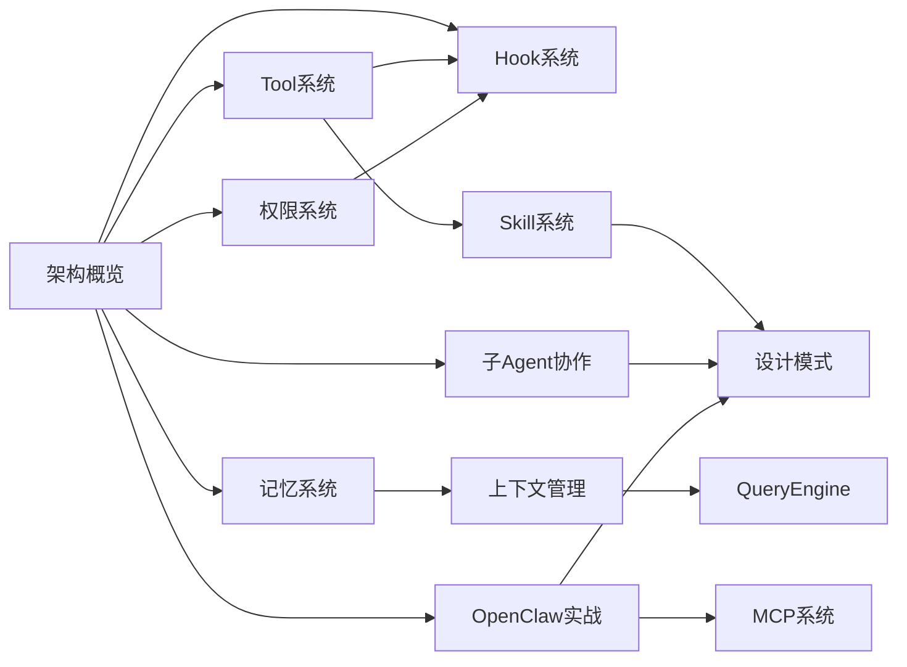

# 🎓 Claude Code 源码学习知识库

> 基于 7 个 GitHub 仓库分析 + lintsinghua/claude-code-book 体系化学习方案
> 目标：harness coding 开发 | 中小型项目 | AI 知识库建设
> 适合：已有 3-4 个小项目经验的中级开发者

---

## 🚀 新手入门（先看这个！）

刚接触 Claude Code？以下是日常使用最频繁的基础命令：

### 日常必备命令

```bash
# 启动对话（最常用方式）
claude .

# 指定具体项目
claude /path/to/your/project

# 简洁模式（减少输出）
claude . --print

# 安全的计划模式（不执行，只规划）
claude . --print --dangerously-skip-permissions
```

### 核心交互命令

| 命令 | 作用 | 示例 |
|-----|------|------|
| `Ctrl+C` | 中断当前操作 | 放弃正在执行的任务 |
| `Ctrl+D` | 结束会话 | 正常退出 Claude Code |
| `/help` | 查看可用命令 | 显示所有 slash 命令 |
| `/resume` | 继续被中断的任务 | 恢复之前的对话 |

### 文件操作快捷键

在对话中直接使用自然语言：
- "读取这个文件" → 自动调用 Read
- "帮我改一下这段代码" → 自动调用 Edit
- "运行这个命令" → 自动调用 Bash

### 常用参数速查

| 参数 | 作用 | 新手建议 |
|-----|------|---------|
| `--print` | 只输出最终回复，不交互 | 学习时关闭流式输出，更易阅读 |
| `--dangerously-skip-permissions` | 跳过权限检查 | ⚠️ 危险！仅理解原理时使用 |
| `--verbose` | 显示详细日志 | 调试时开启 |
| `-y` | 自动确认权限提示 | 熟悉后可减少确认 |

### 第一次使用建议

1. **先读不看**: 用 `--print` 运行，看它如何分析
2. **小任务开始**: 从改一个 bug 开始，不要一开始就重构
3. **查看日志**: 出问题时加 `--verbose` 看到更多细节
4. **信任但验证**: 关键操作前自己检查一下

---

## 🚀 快速入口

| 学习路径 | 适合场景 | 推荐起点 |
|---------|---------|---------|
| [[01-架构总览/01-01-📐-架构概览]] | 理解全局 | ★★★ 必须 |
| [[01-架构总览/01-02-📖-Claude-Code源码导读]] | 源码导读 | ★★★ 必读 |
| [[02-Tool系统/02-01-🔧-Tool系统]] | 写harness核心 | ★★★ 必须 |
| [[03-权限系统/03-01-🔐-权限系统]] | 安全边界设计 | ★★★ 必须 |
| [[04-Hook系统/04-01-🪝-Hook系统]] | 扩展机制 | ★☆☆ 选学 |
| [[05-记忆系统/05-01-🧠-记忆系统]] | 知识库建设 | ★★☆ 推荐 |
| [[05-记忆系统/05-03-🧭-Instinct本能系统]] | Instinct系统 | ★★★ NEW |
| [[06-上下文管理/06-01-📦-上下文管理]] | 上下文优化 | ★★☆ 推荐 |
| [[07-OpenClaw实战/07-01-🚀-环境搭建指南]] | CC+OC 搭建 | ★★★ 新手必看 |
| [[08-Skill系统/08-01-📚-Skill系统]] | 能力扩展 | ★★☆ 推荐 |
| [[09-子Agent与协作/09-01-🤝-子Agent与协作]] | 多Agent协作 | ★☆☆ 选学 |
| [[10-设计模式/10-01-♻️-核心设计模式]] | 设计思路 | ★★☆ 推荐 |
| [[11-QueryEngine/11-01-⚙️-QueryEngine]] | 核心引擎 | ★★☆ 推荐 |
| [[12-质量保证/12-01-🧪-ultraqa循环]] | 质量保证 | ★☆☆ 选学 |
| [[13-OMC完全指南/13-01-🏁-OMC入门]] | OMC框架 | ★★☆ 推荐 |
| [[13-OMC完全指南/13-05-📒-OMC-Notepad内部机制]] | Notepad机制 | ★★★ NEW |
| [[14-方法论/14-01-🎯-Skill选择决策树]] | 方法论 | ★★☆ 推荐 |
| [[15-ClaudeCode最佳实践/15-01-⚡-ClaudeCode插件推荐]] | 插件推荐 | ★★☆ 推荐 |
| [[15-ClaudeCode最佳实践/15-02-💫-隐藏命令与效率技巧]] | 隐藏命令 | ★★★ 必读 |
| [[15-ClaudeCode最佳实践/15-07-📄-CLAUDE-md高级模式]] | CLAUDE.md高级 | ★★★ 生产必读 |
| [[16-OpenCode与开源Agent/16-01-🚀-OpenCode与开源Agent指南]] | OpenCode | ★★★ 推荐 |
| [[17-Superpowers/17-01-🚀-Superpowers入门]] | Superpowers | ★★☆ 推荐 |
| [[18-MCP系统/18-01-📚-MCP系统]] | MCP扩展 | ★★★ 推荐 |

---

## 📊 学习路径图


```

---

## 📈 Dataview 入口

```dataview
TABLE file.ctime as 创建时间, type, description
FROM "00-入口"
SORT file.ctime DESC
```

---

## 🎯 按目标选择

### 如果你想写自己的 harness
1. [[02-Tool系统/02-01-🔧-Tool系统]] - 最重要
2. [[03-权限系统/03-01-🔐-权限系统]] - 安全第一
3. [[04-Hook系统/04-01-🪝-Hook系统]] - 扩展机制
4. [[10-设计模式/10-01-♻️-核心设计模式]] - 设计思路

### 如果你在建设 AI 知识库
1. [[05-记忆系统/05-01-🧠-记忆系统]] - 核心
2. [[06-上下文管理/06-01-📦-上下文管理]] - 上下文
3. [[11-QueryEngine/11-01-⚙️-QueryEngine]] - 检索机制

### 如果你想理解 Agent 架构
1. [[01-架构总览/01-01-📐-架构概览]] - 必须先看
2. [[01-架构总览/01-02-📖-Claude-Code源码导读]] - 源码导读 ⭐NEW
3. [[09-子Agent与协作/09-01-🤝-子Agent与协作]] - 多Agent
4. [[08-Skill系统/08-01-📚-Skill系统]] - 能力扩展

### 如果你想搭建 Claude Code + OpenClaw 全家桶
1. [[07-OpenClaw实战/07-01-🚀-环境搭建指南]] - 从零搭建
2. [[07-OpenClaw实战/07-02-🤝-CC-OC协同工作流]] - 协同工作流
3. [[07-OpenClaw实战/07-03-🔐-安全最佳实践]] - 安全加固
4. [[07-OpenClaw实战/07-04-🐳-Docker部署]] - 生产部署

### 如果你想深入 OMC 框架
1. [[13-OMC完全指南/13-01-🏁-OMC入门]] - OMC入门
2. [[13-OMC完全指南/13-02-🎯-OMC核心概念]] - 核心概念
3. [[13-OMC完全指南/13-03-🔄-OMC工作流]] - 工作流

### 如果你想提升开发效率
1. [[15-ClaudeCode最佳实践/15-02-💫-隐藏命令与效率技巧]] - 隐藏命令 | ★★★ 必读
2. [[15-ClaudeCode最佳实践/15-01-⚡-ClaudeCode插件推荐]] - 插件推荐
3. [[15-ClaudeCode最佳实践/15-03-🪝-自定义Hook配置]] - Hook配置
4. [[15-ClaudeCode最佳实践/15-06-📋-Step-by-Step教程]] - 搭建教程

### 如果你想掌握 Superpowers 方法论
1. [[17-Superpowers/17-01-🚀-Superpowers入门]] - 入门
2. [[17-Superpowers/17-02-🧠-Superpowers核心Skill]] - 核心Skill
3. [[17-Superpowers/17-03-🎯-Superpowers方法论]] - HARD-GATE等方法论

### 如果你想扩展 Claude Code 能力
1. [[16-OpenCode与开源Agent/16-01-🚀-OpenCode与开源Agent指南]] - OpenCode 项目
2. [[16-OpenCode与开源Agent/16-02-🤖-oh-my-openagent全解析]] - 多模型编排
3. [[16-OpenCode与开源Agent/16-03-🐍-claw-code-Python重写]] - Python 重写
4. [[18-MCP系统/18-01-📚-MCP系统]] - MCP协议
5. [[08-Skill系统/08-01-📚-Skill系统]] - Skill系统
6. [[15-ClaudeCode最佳实践/15-04-🎯-自定义Skill开发]] - 自定义Skill

---

## 📚 推荐阅读顺序

| 周次 | 内容 | 产出 |
|-----|------|-----|
| 第1周 | 架构概览 + Tool系统 | 理解整体结构 |
| 第2周 | 权限系统 + Hook系统 | 核心系统掌握 |
| 第3周 | 记忆系统 + 上下文管理 | 知识库设计思路 |
| 第4周 | Skill + OpenClaw实战 | 能力扩展 |
| 第5周 | 子Agent协作 + 设计模式 | 多Agent与设计 |
| 第6周 | QueryEngine + 质量保证 | 深入核心 |
| 第7周 | OMC框架 + 方法论 | 框架方法论 |
| 第8周 | Superpowers + ClaudeCode最佳实践 | 效率提升 |
| 第9周 | MCP系统 + 复盘 | 扩展与总结 |

---

## 🔗 相关资源

### GitHub 高Star学习项目

| 项目 | Stars | 描述 |
|------|-------|------|
| [anthropics/claude-code](https://github.com/anthropics/claude-code) | 102K+ | 官方仓库 |
| [instructkr/claw-code](https://github.com/instructkr/claw-code) | 50K+ | Python架构重写，2小时破50K stars纪录 |
| [claude-code-best/claude-code](https://github.com/claude-code-best/claude-code) | 8,712 | 企业级可运行版本 |
| [lintsinghua/claude-code-book](https://github.com/lintsinghua/claude-code-book) | 1,190 | 42万字深度剖析，15章系统学习Claude Code架构 |
| [liuup/claude-code-analysis](https://github.com/liuup/claude-code-analysis) | 537 | 源码分析文档集，含安全分析、组件拆解、竞品对比 |
| [chauncygu/collection-claude-code](https://github.com/chauncygu/collection-claude-code) | - | Claude Code源码集合与深度分析报告 |
| [mylxsw/claude-code](https://github.com/mylxsw/claude-code) | - | 源码解读，架构与设计理念分析 |

### 知识库内链

- [[01-架构总览/01-01-📐-架构概览]]
- [[10-设计模式/10-01-♻️-核心设计模式]]
- [[09-子Agent与协作/09-01-🤝-子Agent与协作]]