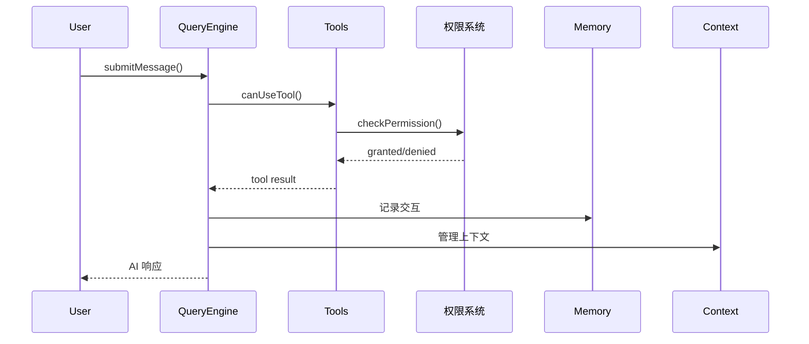
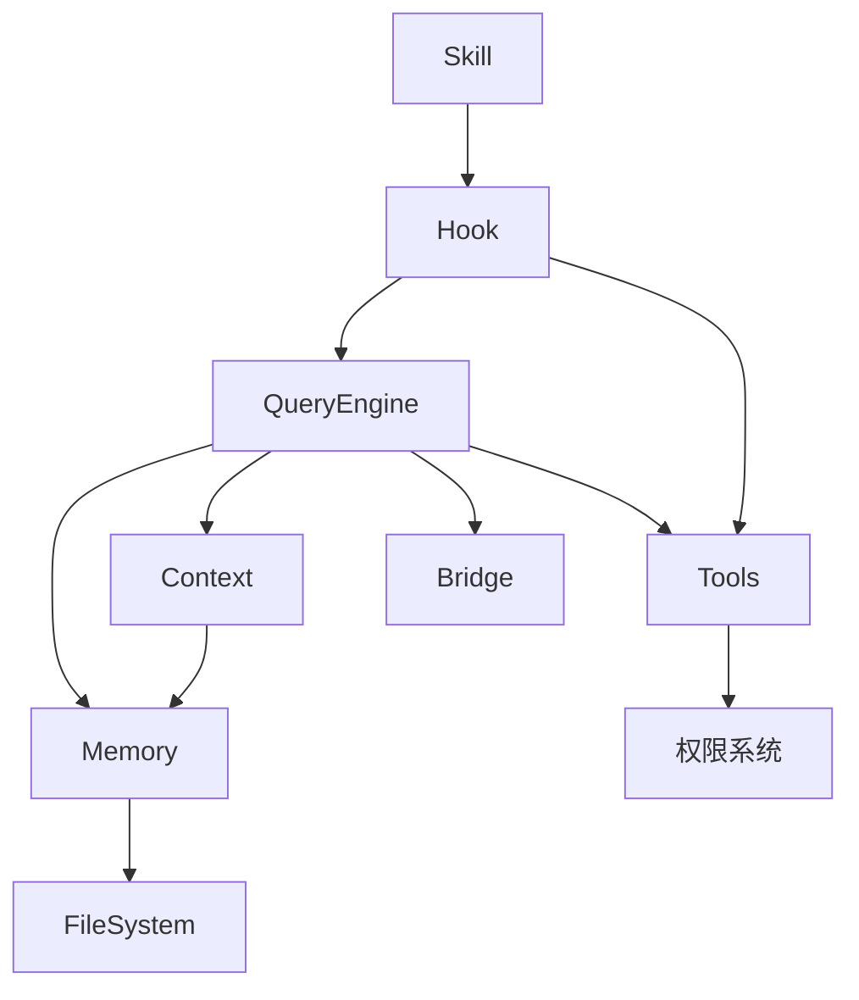

# 📐 Claude Code 架构概览

## 1. 你应该从这里开始！

> 如果你是第一次学习 Claude Code 源码，这部分是**必读**的入门章节。

Claude Code 是一个 CLI 工具，它的本质是：**你告诉它要做什么，它通过调用工具来帮你完成**。

### 核心工作流程（极简版）

```
你说话 → Claude 理解 → 调用工具 → 返回结果 → 继续对话
```

### 六大核心系统

| 系统 | 作用 | 你需要知道 |
|-----|------|---------|
| **QueryEngine** | AI 大脑，调度所有操作 | 它控制整个流程 |
| **Tool 系统** | 45+ 工具，做具体事情 | Read/Edit/Bash 最常用 |
| **权限系统** | 安全检查，防止做坏事 | 每次操作都会检查 |
| **记忆系统** | 记住对话历史 | 自动保存，不用手动 |
| **Hook 系统** | 扩展机制，高级功能 | 新手可以先跳过 |
| **Skill 系统** | 封装好的能力集 | 按需学习 |

---

## 2. 整体架构

Claude Code 是一个基于 **Agent 编程范式** 的 CLI 工具，核心是一个异步生成器驱动的对话循环。

### 核心组件

| 组件 | 职责 | 关联 |
|-----|------|-----|
| [[../07-QueryEngine/⚙️-QueryEngine]] | AI 对话核心引擎 | 所有系统的中枢 |
| [[../02-Tool系统/🔧-Tool系统]] | 能力扩展接口 | 被 QueryEngine 调用 |
| [[../03-权限系统/🔐-权限系统]] | 安全边界 | 包装 Tool 调用 |
| [[../05-记忆系统/🧠-记忆系统]] | 长期记忆存储 | 被 QueryEngine 使用 |
| [[../04-Hook系统/🪝-Hook系统]] | 生命周期扩展 | 嵌入各系统 |
| [[../08-Skill系统/📚-Skill系统]] | 顶层能力封装 | 基于 Hook 构建 |

---

## 3. 简单流程图（不用 mermaid）

```
┌─────────────────────────────────────────────────────┐
│                    你 (用户)                         │
│                       │                             │
│                       ▼                             │
│  ┌─────────────────────────────────────────────┐    │
│  │           QueryEngine (AI 大脑)             │    │
│  │  • 理解你的需求                              │    │
│  │  • 决定用什么工具                            │    │
│  │  • 生成回复内容                              │    │
│  └──────────────┬──────────────────────────────┘    │
│                 │                                    │
│         ┌───────┴───────┐                           │
│         ▼               ▼                           │
│  ┌─────────────┐   ┌─────────────┐                  │
│  │ Tool 系统   │   │ 权限系统    │                  │
│  │ 45+ 工具    │   │ 安全检查    │                  │
│  └──────┬──────┘   └──────┬──────┘                  │
│         │                │                          │
│         ▼                ▼                          │
│  ┌─────────────────────────────────────────────┐    │
│  │              执行实际操作                     │    │
│  │  • 读写文件  • 运行命令  • 搜索网络          │    │
│  │  • Git 操作  • 编辑代码  • ...              │    │
│  └─────────────────────────────────────────────┘    │
└─────────────────────────────────────────────────────┘
                         │
                         ▼
                  返回结果给你
```

---

## 4. 入口流程

```
CLI 入口
  ├─> 权限初始化
  ├─> QueryEngine 创建
  │    ├─> Tools 注册
  │    ├─> Commands 注册
  │    ├─> MCP 连接
  │    └─> Agent 定义加载
  ├─> Bridge 连接 (IDE-CLI 通信)
  └─> 主循环启动
```

---

## 5. 核心数据流



---

## 6. 模块依赖图



---

## 7. 关键数字

| 指标 | 数值 |
|-----|-----|
| 工具数量 | 45+ |
| 分隔命令 | 50+ |
| UI组件 | 140+ |
| 源码规模 | ~513K 行 |
| 源文件数 | ~1,902 |

---

## 8. 设计哲学

> **"让 AI 成为协作者，而非工具"**

Claude Code 的核心设计原则：
1. **安全优先** - 权限系统贯穿始终
2. **渐进式压缩** - 四级上下文压缩
3. **文件化记忆** - Markdown 存储，持久可读
4. **事件驱动** - Hook 覆盖 26 个生命周期事件
5. **工厂模式** - Tool 通过 buildTool 工厂创建

### 五大设计原则深度解析

| 原则 | 说明 | 为什么重要 |
|-----|------|-----------|
| **异步流式优先** | AsyncGenerator作为对话循环核心载体 | 流式输出需要逐token处理、可取消性、背压控制。Callback回调地狱 → Promise链只能resolve一次 → RxJS依赖沉重。AsyncGenerator：原生支持+零额外依赖+类型安全 |
| **安全边界内嵌** | 权限检查分散在架构各层而非集中拦截 | 不是"在门口检查"，而是"每层都检查"。工具注册时声明权限，调用时多重验证 |
| **缓存感知设计** | 系统提示稳定性、子智能体缓存共享 | 任一字符差异（空格、换行）→ 缓存不命中。Fork模式通过字节级复用最大化缓存命中 |
| **渐进式能力扩展** | Tool→Skill→Plugin→MCP四级扩展 | 不是一次性全部加载，按需加载，lazy require |
| **不可变状态流转** | State整体替换而非逐字段修改 | 读：在迭代开始时通过解构一次性读取（快照语义）。写：在迭代结束时通过构造新对象一次性写入（原子更新语义）

### 三大核心差异化优势

Claude Code 区别于"模型 API 加壳工具"的核心，在于三点同时成立：

| 差异化优势 | 说明 |
|-----------|------|
| **统一执行内核** | 同一套 query/tool/permission 闭环支撑所有运行形态（REPL/SDK/subagent/background/bridge/remote） |
| **文件化 Memory** | 所有记忆做成文件系统上可读写的 Markdown 文件，可审计、可分发、可治理 |
| **Local-first 扩展** | 本地独立运行，可平滑扩展到 remote/bridge/swarm |

> **核心洞察**：Claude Code 的本质是"面向代码工作流的本地 Agent 平台"，不是"命令行聊天工具"。它的长期协作属性明显，能力极强，平台感很重。

---

## 9. 六层配置优先级

Claude Code 使用六层配置优先级链：

```
plugin → userSettings → projectSettings → localSettings → flagSettings → policySettings
```

| 优先级 | 来源 | 用途 |
|-------|------|-----|
| 1 | plugin | 插件设置 |
| 2 | userSettings | 用户全局设置 |
| 3 | projectSettings | 项目设置（安全检查时排除） |
| 4 | localSettings | 本地机器设置 |
| 5 | flagSettings | 功能开关 |
| 6 | policySettings | 远程策略 |

---

## 10. 状态管理 Store

```typescript
// 34行的核心状态管理
const store = createStore({
  state: initialState,
  updater: (prev, next) => ({ ...prev, ...next })
});

// Set-based 监听者管理（自动去重）
store.subscribe(listener, selector);
```

### AppState DeepImmutable
超过 50 个状态字段，使用 `useSyncExternalStore` 精确订阅。

---

## 11. 启动优化时间线

```mermaid
gantt
    title 启动时间线
    dateFormat X
    section 阶段
    MDM/Keychain预取    :0ms
    核心模块加载         :50ms
    插件/分析加载        :100ms
    就绪可输入          :200ms
```

优化效果：160ms → 65ms（节省59%）

---

## 12. 十种设计模式速查

| 模式 | 应用位置 |
|-----|---------|
| AsyncGenerator | 对话主循环 |
| 工厂方法 | buildTool |
| 注册表 | 工具/技能/插件注册 |
| 插件 | 插件架构 |
| 观察者 | 状态订阅 |
| 策略 | 压缩策略/权限检查 |
| 层级架构 | 分层设计 |
| 异步生成器 | 流式输出 |
| 层级Agent | Fork/Coordinator |
| 功能标志 | feature() 编译时开关 |

---

## 13. 五大设计原则（lintsinghua第一篇）

基于对 Claude Code 架构的深度分析，总结出五大核心设计原则：

| 原则 | 说明 | 实践 |
|-----|------|-----|
| **异步流式优先** | `AsyncGenerator` 提供流式输出 + 可取消 + 背压控制 | 流式工具执行、即开即用取消 |
| **安全边界内嵌** | 权限检查分四个阶段，纵深防御 | 四阶段权限管道 |
| **缓存感知设计** | 系统提示字节一致才能命中 prompt cache | Fork模式字节级继承 |
| **渐进式能力扩展** | 工具→技能→插件→MCP 四级扩展 | 分层加载机制 |
| **不可变状态流转** | 每次 continue 创建新 State 对象，状态不可变 | 状态机设计 |

## 14. 技术栈与规模

| 指标 | 数值 |
|-----|-----|
| TypeScript 文件 | 1,884 个 |
| 代码行数 | 512,664 行 |
| 工具数量 | 45+ |
| 分隔命令 | 50+ |
| React组件 | 140+ |
| 运行时 | Bun |
| UI框架 | React + Ink (TUI) |
| 类型校验 | Zod v4 |

## 15. 核心模块速查

| 文件 | 职责 |
|-----|------|
| `main.tsx` | CLI 入口，~800KB |
| `QueryEngine.ts` | AI 查询循环，~46KB |
| `Tool.ts` | 工具基类，~30KB |
| `commands.ts` | 命令注册，~25KB |
| `cost-tracker.ts` | Token 消耗追踪 |

---

## 14. 相关章节（推荐阅读顺序）

学习建议：**先读 02 和 03，再回头理解其他章节**

- [[../02-Tool系统/🔧-Tool系统]] - 工具如何工作（最常用）
- [[../03-权限系统/🔐-权限系统]] - 安全如何保证（必须了解）
- [[../04-Hook系统/🪝-Hook系统]] - 扩展机制（进阶可选）

---

## 📚 关键概念速查

| 术语 | 含义 | 简单理解 |
|-----|------|---------|
| **QueryEngine** | 核心引擎 | 它的职责是"调度"：决定用什么工具 |
| **Tool** | 工具 | 45+ 个内置能力，如读文件、运行命令 |
| **Permission** | 权限 | 安全守门员，阻止危险操作 |
| **Hook** | 钩子 | 生命周期事件，可用来扩展功能 |
| **Skill** | 技能 | 封装好的复杂能力，如 git commit |
| **Memory** | 记忆 | 存储对话历史到文件 |
| **Context** | 上下文 | 管理 token 限制，自动压缩 |
| **MCP** | 模型上下文协议 | 扩展 Claude 能力的标准接口 |

> 初学建议：先记住 **QueryEngine = 大脑**，**Tool = 手**，**Permission = 门卫** 这三个比喻即可。