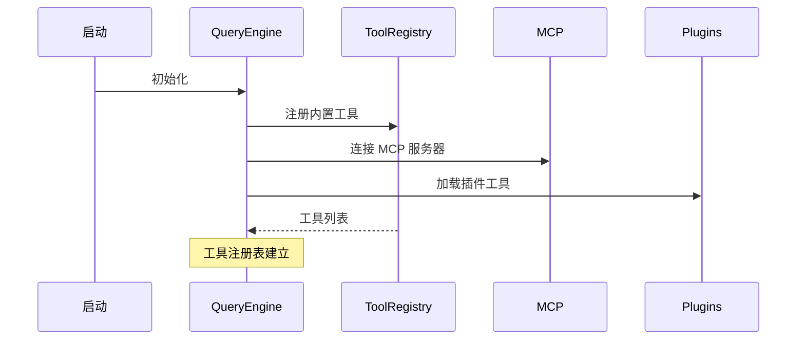
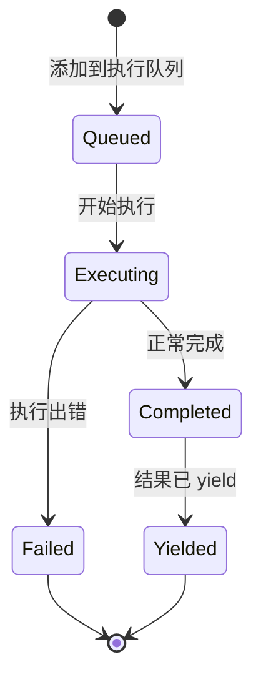

# 🔧 Tool 系统

> ⏱ 难度: ★★☆ | 重要性: ★★★ | 推荐学习时间: 3-5天

## 概述

Tool 是 Claude Code 能力的核心载体，45+ 工具分为 12 个类别。每次 Claude Code 与你对话时，都在调用各种 Tool 来完成任务。

### 核心问题：什么是 Tool？

**简单理解**: Tool 就是 Claude Code 的"手"。它通过 Tool 来：
- 📖 **读取** 你的文件
- ✏️ **编写** 和修改代码
- 🔨 **执行** 命令
- 🌐 **访问** 互联网

### 你已经在用的 Tool

当你用 Claude Code 时，这些工具已经自动可用：

| 工具 | 用途 | 示例 |
|-----|------|-----|
| `Read` | 读文件 | `Read {file_path: "src/index.js"}` |
| `Write` | 写文件 | `Write {file_path: "a.txt", content: "..."}` |
| `Edit` | 修改文件 | `Edit {file_path: "...", old_string: "...", new_string: "..."}` |
| `Bash` | 执行命令 | `Bash {command: "npm install"}` |
| `Glob` | 搜索文件 | `Glob {pattern: "**/*.js"}` |
| `Grep` | 搜索内容 | `Grep {path: ".", pattern: "function"}` |
| `WebFetch` | 获取网页 | `WebFetch {url: "https://..."}` |

---

## 五元素协议（核心概念）

每个 Tool 由以下五元素定义：

### 1. Name（名称）

工具的唯一标识符 + 可选别名，支持向后兼容。

```
Read, Write, Edit, Bash, Glob, Grep, WebSearch...
```

### 2. Schema（模式）

Zod Schema 同时用于：运行时验证 + API通信，类型安全屏障。

```typescript
// Read 工具的 Schema 示例
{
  file_path: z.string(),      // 必须是字符串
  show_line_numbers?: boolean // 可选的布尔值
}

// Claude Code 使用 Zod 进行验证
const ReadSchema = z.object({
  file_path: z.string(),
  show_line_numbers: z.boolean().optional(),
  offset: z.number().optional(),
  limit: z.number().optional()
});
```

### 3. Permissions（权限）

三层分层检查：validateInput → hasPermissions → checkPermissions。

| 权限级别 | 说明 | 需要确认 |
|---------|------|---------|
| `readOnly` | 只读操作 | 通常不需要 |
| `write` | 写入文件 | 需要 |
| `destructive` | 危险操作（删除、覆盖） | 需要 |
| `bypass` | 跳过所有检查 | 需要特殊flag |

### 4. Execution（执行）

核心方法 + contextModifier，上下文修改通道。

```typescript
const ReadTool = {
  name: "Read",
  async execute(input: { file_path: string }) {
    // 读取文件内容
    const content = await fs.readFile(input.file_path, 'utf-8');
    return { content, file_path: input.file_path };
  }
};
```

### 5. Rendering（渲染）

6个渲染方法覆盖完整生命周期，React组件集成。

| 渲染类型 | 用途 |
|---------|------|
| `code` | 代码，显示语法高亮 |
| `table` | 表格，数据展示 |
| `tree` | 树形，目录结构 |
| `折叠` | 长内容可折叠 |

---

## buildTool 工厂（重要）

`buildTool` 是创建工具的工厂函数，确保所有工具都符合规范。

```typescript
import { z } from 'zod';
import { buildTool } from './tool-factory';

const ReadTool = buildTool({
  name: "Read",
  description: "读取文件内容",

  // 输入 Schema
  inputSchema: z.object({
    file_path: z.string().describe("要读取的文件路径"),
    show_line_numbers: z.boolean().optional().describe("是否显示行号"),
    limit: z.number().optional().describe("限制读取行数")
  }),

  // 权限级别
  permission: "readOnly",  // readOnly | write | destructive | bypass

  // 执行函数
  async execute(input) {
    const content = await readFile(input.file_path, {
      withNumbers: input.show_line_numbers,
      limit: input.limit
    });
    return { type: "success", content };
  },

  // UI 渲染配置
  render: {
    type: "code",
    language: "auto"  // 自动检测语言
  }
});
```

### 工厂的关键特性

1. **防御性构造** - 错误边界保护，工具不会崩溃
2. **Schema 验证** - 自动验证输入输出
3. **统一接口** - 所有工具调用方式一致

---

## 工具分类详解

> [!note]- 关联知识
> Skill 是对 Tool 的高级封装，Skill 调用 Tool 来完成任务。详见 [[../08-Skill系统/08-01-📚-Skill系统]]。

### 文件系统工具（8个）

| 工具 | 权限 | 用途 |
|-----|------|-----|
| `Read` | readOnly | 读取文件 |
| `Write` | write | 创建/覆盖文件 |
| `Edit` | write | 修改文件部分内容 |
| `Mkdir` | write | 创建目录 |
| `Rm` | destructive | 删除文件 |
| `Glob` | readOnly | 搜索文件（按模式） |
| `Grep` | readOnly | 搜索文件内容（按正则） |
| `CopilotEdit` | write | AI 辅助编辑建议 |

**实际例子：**
```
用户: 请帮我读取 src/config.json 文件的前10行

Claude Code 调用:
Read {
  file_path: "src/config.json",
  limit: 10
}
```

### Git 工具（6个）

| 工具 | 权限 | 用途 |
|-----|------|-----|
| `GitLog` | readOnly | 查看提交历史 |
| `GitStatus` | readOnly | 查看当前状态 |
| `GitBranch` | readOnly | 查看分支列表 |
| `GitCommit` | write | 创建提交 |
| `GitDiff` | readOnly | 查看变更 |
| `GitPush` | write | 推送到远程 |

**实际例子：**
```
用户: 查看最近的5次提交

Claude Code 调用:
GitLog {
  limit: 5
}
```

### Bash 工具（最危险！）

| 工具 | 权限 | 用途 |
|-----|------|-----|
| `Bash` | **destructive** | 执行任意命令 |

⚠️ **Bash 是最危险的工具**，可以执行任何命令，包括删除文件、格式化硬盘等。

```
用户: 请帮我运行 npm install

Claude Code 调用:
Bash {
  command: "npm install",
  timeout: 120
}

⚠️ 权限提示: "Bash 命令: npm install"
```

---

## 流式执行（高级）

> [!note]- 关联知识
> 工具执行结果会进入上下文管理，影响后续 Prompt。详见 [[../06-上下文管理/06-01-📦-上下文管理]]。

### StreamingToolExecutor

对于长时间运行的命令（如 `npm install`），Claude Code 使用流式执行。

```
Idle → Streaming → Partial → Complete
```

**流式执行的好处：**
1. 🔄 实时显示进度
2. ⚡ 快速响应
3. 💾 内存效率高

---

## 实战练习 🏋️

### 练习 1：观察工具调用

1. 启动 Claude Code
2. 执行这个请求：

```
请帮我读取 package.json 文件，然后列出其中的所有依赖
```

3. 观察 Claude Code 调用了哪些工具

**预期结果：**
```
Read { file_path: "package.json" }
```

---

### 练习 2：让工具组合工作

```
请帮我：
1. 创建 src/utils 文件夹
2. 在里面创建一个 helper.js 文件
3. 导出一个加法函数
```

**观察工具序列：**
```
Mkdir { file_path: "src/utils" }
Write { file_path: "src/utils/helper.js", content: "..." }
```

---

### 练习 3：理解 Edit 工具

1. 先创建一个文件：
```
写一个文件叫 test.txt，内容是 "Hello World"
```

2. 然后要求修改：
```
把 test.txt 里的 "World" 改成 "Claude"
```

**观察 Edit 的 old_string + new_string 模式：**
```
Edit {
  file_path: "test.txt",
  old_string: "World",
  new_string: "Claude"
}
```

---

### 练习 4：危险的 Bash

⚠️ 这个练习只是观察，不要真的执行危险命令！

```
请帮我执行 ls 命令列出当前目录文件
```

观察权限提示：
```
⚠️ 权限请求: Bash
命令: ls
是否允许? [y/n]
```

---

## 工具发现机制

> [!note]- 关联知识
> MCP 工具通过 MCP 协议暴露给 Claude Code。详见 [[../18-MCP系统/18-01-📚-MCP系统]]。

Claude Code 如何知道有哪些工具可用？



**延迟发现（按需加载）：**
```
用户请求 WebSearch
  → 工具表中查找
  → 发现未加载
  → 动态加载 WebSearchTool
  → 执行搜索
```

---

## 如何开发自己的 Tool（进阶）

### 1. 定义 Schema

```typescript
import { z } from 'zod';

const MyToolSchema = z.object({
  input: z.string().describe("输入数据"),
  options: z.object({
    verbose: z.boolean().optional()
  }).optional()
});
```

### 2. 实现执行逻辑

```typescript
async function execute(input: z.infer<typeof MyToolSchema>) {
  const { input: data, options } = input;

  if (options?.verbose) {
    console.log(`Processing: ${data}`);
  }

  return { result: data.toUpperCase() };
}
```

### 3. 注册工具

```typescript
const MyTool = buildTool({
  name: "MyTool",
  inputSchema: MyToolSchema,
  execute
});

ToolRegistry.register(MyTool);
```

---

## 常见问题

### Q: 工具调用失败怎么办？

1. **Schema 验证失败** - 检查输入格式
2. **权限不足** - 确认是否允许
3. **文件不存在** - 检查路径
4. **超时** - 命令运行时间过长

### Q: 为什么同一个工具表现不一样？

可能的原因：
- 不同的权限级别
- 不同的输入参数
- 工具被 Hook 拦截

### Q: 可以禁用某些工具吗？

可以！在 Claude Code 设置中可以禁用特定工具。

## 7. StreamingToolExecutor 四阶段状态机

流式工具执行器的完整状态机：



### 四阶段详解

| 阶段 | 状态 | 说明 |
|-----|------|-----|
| **Queued** | 排队中 | 等待执行条件满足 |
| **Executing** | 执行中 | 工具正在运行 |
| **Completed** | 已完成 | 执行成功，等待 yield |
| **Yielded** | 已产出 | 结果已返回给调用方 |

### 并发分区策略（贪心算法）

Claude Code 使用 `partitionToolCalls()` 按 `isConcurrencySafe` 分批执行：

```typescript
// 安全工具：可并行执行
// 不安全工具：串行执行
const partitions = partitionToolCalls(toolCalls, (tool) => ({
  safe: tool.isConcurrencySafe,
  blocking: !tool.isConcurrencySafe
}));
```

**规则**：
- 连续安全工具可并行
- 非安全工具独占执行
- 当前批次有非安全工具时，后续安全工具必须等待

**贪心分区示例：**
```
输入：[Read(a.ts), Read(b.ts), Bash(ls), Read(c.ts)]
分区：安全工具连续→合并Batch，非安全→开新Batch
结果：Batch1[Read(a,b)]并行, Batch2[Bash]独占, Batch3[Read(c)]等待Batch2
```

## 8. 延迟工具发现

当工具数量超过阈值时，使用 `ToolSearchTool` 按需加载：

```
主Agent → 请求工具 → 工具注册表查找
    ↓ (超过阈值)
返回工具名称列表（不返回完整schema）
    ↓ (真正需要执行时)
动态加载完整 schema → 执行
```

**节省**：显著减少 prompt token

## 9. buildTool 防御性默认值

```typescript
const defaults = {
  isConcurrencySafe: () => false,  // 默认不安全
  isDestructive: () => false,       // 默认非破坏性
  descriptions: "No description provided"
};
```

**fail-closed 保守原则**：并发默认不安全，写操作默认有风险。

---

## 相关章节

- [[../01-架构总览/01-01-📐-架构概览]] - Tool 在架构中的位置
- [[../03-权限系统/03-01-🔐-权限系统]] - 工具的安全包装
- [[../11-QueryEngine/11-01-⚙️-QueryEngine]] - 工具的调用方
- [[../10-设计模式/10-01-♻️-核心设计模式]] - 工厂模式

---

> [!cite]- 知识来源

| 知识点 | 来源 | 说明 |
|--------|------|------|
| **五元素协议（Name/Schema/Permissions/Execution/Rendering）** | lintsinghua/claude-code-book 第3章 | 工具定义协议的详细解析 |
| **buildTool 工厂函数** | 官方源码 [[参考代码/claude-code/src/Tool.ts]] | 工厂模式的标准实现，fail-closed 保守原则 |
| **Zod Schema 双重职责** | lintsinghua/claude-code-book 第3章 | 运行时验证 + API通信的类型安全屏障 |
| **三层权限检查模型** | 官方源码 [[参考代码/claude-code/src/services/tools/toolExecution.ts]] | validateInput → hasPermissions → checkPermissions |
| **工具分类（8文件系统/6 Git等）** | 官方源码 [[参考代码/claude-code/src/constants/tools.ts]] | getAllBaseTools() 完整工具清单 |
| **StreamingToolExecutor 四阶段状态机** | 官方源码 [[参考代码/claude-code/src/services/tools/StreamingToolExecutor.ts]] | queued → executing → completed → yielded |
| **并发分区策略（partitionToolCalls）** | 官方源码 [[参考代码/claude-code/src/services/tools/toolOrchestration.ts]] | 贪心算法按 isConcurrencySafe 分批执行 |
| **贪心分区示例** | liuup/claude-code-analysis 分析文档 | Batch1[Read并行] → Batch2[Bash独占] → Batch3[Read等待] |
| **流式执行优势（50%+速度提升）** | lintsinghua/claude-code-book 第3章 | 边接收边执行的流水线模式 |
| **ToolSearchTool 延迟发现** | 官方源码 [[参考代码/claude-code/src/tools/ToolSearchTool/ToolSearchTool.ts]] | 按需加载减少 prompt token |
| **buildTool 防御性默认值** | 官方源码 [[参考代码/claude-code/src/Tool.ts]] | isConcurrencySafe/destructive 默认 false |
| **BashTool 危险性和错误传播** | lintsinghua/claude-code-book 第3章 | Bash失败取消并行兄弟工具 |
| **FileReadTool/FileEditTool/FileWriteTool 分工** | lintsinghua/claude-code-book 第3章 | CRUD 模式，Edit 使用 old_string 精确替换 |
| **GlobTool/GrepTool 专门化优势** | lintsinghua/claude-code-book 第3章 | 结构化输出、权限控制、性能优化 |
| **工具发现机制（延迟加载）** | 个人经验总结 | 基于实际使用验证 |