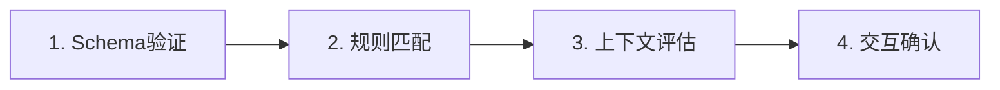
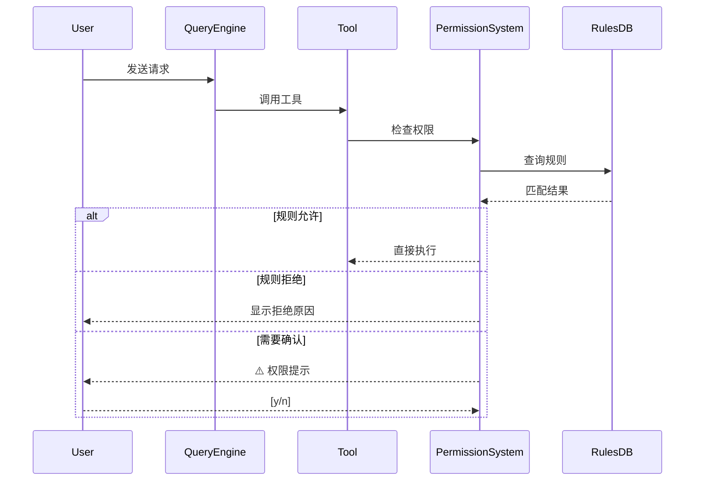

# 🔐 权限系统

> ⏱ 难度: ★★☆ | 重要性: ★★★ | 推荐学习时间: 2-3天

## 概述

权限系统是 Claude Code 的安全核心。它确保 AI 不会在你不知情的情况下执行危险操作。

### 什么是权限系统？

**简单理解**: 就像手机的「是否允许访问相机/麦克风」提示。Claude Code 在执行敏感操作前会问你。

### 你每天都会遇到的权限提示

当你用 Claude Code 时，这些情况会触发权限提示：

| 场景 | 权限类型 | 示例 |
|-----|---------|-----|
| 修改文件 | Write | "是否允许写入 src/index.js？" |
| 执行命令 | Bash | "是否允许运行 npm install？" |
| 删除文件 | destructive | "是否允许删除 node_modules？" |
| 访问网络 | network | "是否允许访问 https://api.example.com？" |

---

## 四阶段管道（核心机制）

每次权限请求都经过 4 个阶段的检查：



### 第1阶段：Schema 验证

**检查内容**: 输入输出的数据结构是否正确

```typescript
// 如果 Schema 验证失败，直接拒绝
if (!tool.inputSchema.parse(input)) {
  return { status: "denied", reason: "invalid_schema" };
}
```

### 第2阶段：规则匹配

**检查内容**: 是否符合已配置的权限规则。deny>ask>allow铁律。

```
# ~/.claude/settings.json 中的信任规则
{
  "allowedBash": ["npm install", "git *", "python *"],
  "allowedWrite": ["./src/**", "./tests/**"],
  "deniedBash": ["rm -rf /*", "format *"]
}
```

**passthrough vs ask 语义：**
- `passthrough`：工具无意见，交给后续决定（可被allow规则覆盖）
- `ask`：工具认为需要用户确认（不可被allow规则覆盖）

### 第3阶段：上下文评估

**检查内容**: 评估当前会话的风险级别

| 风险级别 | 说明 | 行为 |
|---------|------|------|
| 🔵 低 | 常规操作 | 自动允许 |
| 🟡 中 | 需确认 | 显示提示 |
| 🔴 高 | 危险操作 | 强制确认 |

### 第4阶段：交互确认

**检查内容**: 用户是否明确允许

```
⚠️ 权限请求: Bash
命令: npm install
描述: 安装项目依赖

[y] 允许 [n] 拒绝 [a] 全部允许 [p] 永久允许
```

---

## 权限模式光谱

Claude Code 提供了不同级别的信任模式：

```
bypass ←──────────────────────────────→ default
（完全信任）                    （完全控制）
```

### 模式详解

| 模式 | 说明 | 何时使用 |
|-----|------|---------|
| `default` | 标准权限检查（默认） | 日常工作 |
| `plan` | 仅读取，不写入 | 代码审查 |
| `auto` | 低风险操作自动批准 | 信任环境 |
| `bubble` | 非阻塞通知 | 观察模式 |
| `bypass` | 跳过所有检查 | ⚠️ **危险!** 仅测试用 |

### auto模式YOLO分类器三层优化

| 优化层 | 说明 | 效果 |
|--------|------|------|
| **acceptEdits快速路径** | 先检查是否在acceptEdits下放行 | 跳过分类器 |
| **安全工具白名单** | Read/Grep/Glob等跳过分类器 | 直接允许 |
| **拒绝追踪** | 连续拒绝多次后自动回退到交互式提示 | 防止死循环 |

### 如何切换模式

```bash
# 启动时指定模式
claude --dangerously-skip-permissions  # ⚠️ 危险！

# 会话中切换
/plan    # 进入只读模式
/default # 恢复正常
```

---

## 日常权限配置

### 设置信任的工作区

```bash
# 信任当前工作区
/trust

# 信任特定目录
/trust ~/my-projects

# 查看已信任的目录
/settings trust
```

### 配置权限规则

在项目根目录创建 `.claude/settings.json`：

```json
{
  "permissions": {
    "allow": [
      "Read **/*",
      "Write src/**",
      "Glob **/*.ts",
      "Bash npm *",
      "Bash git status"
    ],
    "deny": [
      "Bash rm -rf /*",
      "Write /etc/**",
      "Bash curl *"
    ]
  }
}
```

### Bash 命令规则匹配

| 匹配类型 | 示例 | 说明 |
|---------|-----|-----|
| 精确匹配 | `npm install` | 只有这个命令 |
| 前缀匹配 | `npm ` | 所有 npm 命令 |
| 通配符 | `git *` | 所有 git 命令 |
| 正则 | `^rm.*rf` | rm -rf 系列 |

---

## 危险命令警告 ⚠️

### 最高危命令（永远不要允许）

| 命令 | 危险原因 |
|-----|---------|
| `rm -rf /*` | 删除整个系统 |
| `rm -rf /` | 同上 |
| `:(){ :|:& };:` | Fork 炸弹 |
| `mkfs.ext4 /dev/sda` | 格式化硬盘 |
| `dd if=/dev/zero of=/dev/sda` | 覆写硬盘 |

### 高危命令（谨慎允许）

| 命令 | 危险原因 |
|-----|---------|
| `rm -rf node_modules` | 可能误删 |
| `git push --force` | 覆盖远程历史 |
| `npm publish` | 发布到 npm |
| `chmod 777` | 开放所有权限 |

### 安全建议

1. **永远不要** 使用 `y a`（全部允许）
2. **永远不要** 使用 `--dangerously-skip-permissions`
3. **优先使用** `/plan` 模式进行只读操作
4. **定期审查** 你的权限设置

---

## 权限系统工作原理

### 权限检查流程图



### 权限与 Tool 的关系

```
你的请求
    ↓
Tool.execute()
    ↓
权限系统.checkPermission()
    ↓
    ├─→ Schema 验证 ──→ 规则匹配 ──→ 上下文评估
    │                                            ↓
    └──────── 拒绝 ←─── 交互确认 ←────────────┘

允许 → 执行工具 → 返回结果
拒绝 → 记录 denial → 返回错误
```

---

## 断路器机制（容错设计）

### 什么是断路器？

当权限检查连续失败 3 次时，断路器会「跳闸」，暂停权限检查，防止问题恶化。

### 断路器的作用

**引入前的问题：**
- 每天浪费约 250K 次 API 调用
- 级联失败导致系统不可用

**引入后的效果：**
- 快速失败，不再重试
- 减少 API 调用
- 提高系统稳定性

```typescript
class CircuitBreaker {
  private failures = 0;
  private readonly threshold = 3;

  async check(permission: Permission): Promise<Result> {
    if (this.failures >= this.threshold) {
      throw new CircuitOpenError('Permission check circuit open');
    }

    try {
      return await this.doCheck(permission);
    } catch (e) {
      this.failures++;
      throw e;
    }
  }
}
```

---

## 实战：配置你的第一个权限规则

### 场景

你正在开发一个 Node.js 项目，希望 Claude Code 能够：
- ✅ 读取所有文件
- ✅ 运行 `npm install` 和 `npm run dev`
- ✅ 写入 `src/` 目录
- ❌ 不执行 `rm -rf` 命令
- ❌ 不写入系统目录

### 步骤 1：创建配置文件

在项目根目录创建 `.claude/settings.json`：

```json
{
  "permissions": {
    "allow": [
      "Read **/*",
      "Write src/**",
      "Bash npm install",
      "Bash npm run dev",
      "Bash npm run build",
      "Bash node *"
    ],
    "deny": [
      "Bash rm -rf",
      "Bash chmod 777",
      "Write /etc/**",
      "Write ~/.ssh/**"
    ]
  }
}
```

### 步骤 2：验证配置

```bash
claude
/settings verify-permissions
```

### 步骤 3：测试

```
请帮我删除 src/utils 文件夹
```
→ 应该被拒绝 ❌

```
请帮我安装依赖
```
→ 应该自动允许 ✅

---

## 常见问题

### Q: 为什么有时候不需要确认？

可能原因：
1. 命令匹配了「允许」规则
2. 使用了 `/plan` 模式（只读）
3. 设置了 `auto` 权限级别

### Q: 「永久允许」和「全部允许」有什么区别？

| 选项 | 范围 | 危险度 |
|-----|------|-------|
| `p` (永久允许) | 当前工具+当前命令 | ⚠️ 中 |
| `a` (全部允许) | 所有工具+所有命令 | ⚠️⚠️⚠️ 极高 |

**永远不要使用 `a`！**

### Q: 权限设置在哪里？

| 设置位置 | 作用范围 |
|---------|---------|
| `~/.claude/settings.json` | 全局 |
| `~/.claude/projects/<project>/settings.json` | 项目级 |
| `./.claude/settings.json` | 本地 |

---

## 三级权限模型（Claude Code）

Claude Code 采用**三级权限模型**精确控制 AI 的操作边界：

| 级别 | 行为 | 适用操作 |
|------|------|---------|
| **Allow** | 直接执行，无需确认 | Read, Glob, Grep |
| **Ask** | 执行前需用户确认 | Edit, Write, Bash |
| **Deny** | 完全禁止 | 危险命令、敏感路径 |

### 三级配置层次

```
全局    ~/.claude/settings.json        ← 个人偏好（宽松）
项目    .claude/settings.json          ← 团队共享（严格）
本地    .claude/settings.local.json    ← 个人覆盖（不入库）
```

---

## 沙箱配置 (Sandbox)

> [!note] OS 级隔离
> 通过 `/sandbox` 命令启用，限制 AI 的文件系统访问范围。

```json
{
  "sandbox": {
    "filesystem": {
      "allowWrite": ["/tmp", "./src"],
      "allowRead": ["./", "/usr/lib"],
      "denyRead": [".env", "credentials.json"]
    }
  }
}
```

**优先级**：`denyRead` > `allowRead` > 默认

> [!warning] Sandbox 不是安全边界
> - sandbox 配置是**辅助工具**，不是安全边界——恶意构造的命令仍可能绕过限制
> - `denyRead` 优先级最高，但要防止**路径遍历绕过**（如 `../.env`、符号链接）
> - **Windows 路径分隔符差异**：配置中用 `/`，系统可能用 `\`，建议统一使用正斜杠
> - sandbox 限制对硬链接和 junction point 可能不生效，敏感文件建议使用文件系统权限额外保护

---

## --dangerously-skip-permissions

> [!danger] 高危参数
> **高风险操作，需要格外谨慎！**
> - 仅在个人项目 + Git 已提交环境下使用
> - 配合 `allowedTools` 白名单降低风险
> - 公司项目**永远别加**

```bash
# 安全使用方式
cd ~/my-personal-project
git add -A && git commit -m "backup"     # 先提交！
claude --dangerously-skip-permissions    # 再跳过权限
```

---

## 进阶：生产环境权限策略

### 专家经验：权限配置反模式

| 反模式 | 为什么错 | 正确做法 |
|--------|---------|---------|
| `"allow": ["Bash"]` | 允许所有 Bash 命令 = 裸奔 | 精确匹配如 `Bash(npm test *)` |
| deny 中只写路径不写工具 | AI 可以用 Edit 读 .env 内容 | 同时 deny Read 和 Edit |
| 全局宽松 + 项目宽松 | 安全校验形同虚设 | 全局宽松 + 项目严格 |
| sandbox 只配 allowWrite | 忘记限制读取范围 | 同时配置 denyRead |
| 不配置 allowedTools 就跳过权限 | 相当于 root 权限给 AI | 必须配合白名单 |

### 权限配置模板（按场景）

> [!tip] 个人项目（宽松）
> 允许常用工具，仅 deny 危险命令

```json
{
  "permissions": {
    "allow": [
      "Read", "Glob", "Grep", "LS",
      "Edit", "Write",
      "Bash(npm *)", "Bash(git *)", "Bash(node *)",
      "mcp__*"
    ],
    "deny": [
      "Bash(rm -rf *)",
      "Bash(sudo *)",
      "Bash(curl * | bash)",
      "Read(.env)",
      "Edit(.env)"
    ]
  }
}
```

> [!warning] 团队项目（严格）
> 只允许只读 + 测试，deny 生产文件路径

```json
{
  "permissions": {
    "allow": [
      "Read", "Glob", "Grep", "LS",
      "Edit(src/**)", "Write(src/**)",
      "Bash(npm test *)", "Bash(npm run lint *)",
      "Bash(git diff *)", "Bash(git log *)"
    ],
    "deny": [
      "Read(.env.production)",
      "Read(.env.staging)",
      "Edit(.env.*)",
      "Write(.env.*)",
      "Bash(npm publish *)",
      "Bash(git push *)",
      "Bash(Docker *)",
      "Bash(kubectl *)"
    ]
  }
}
```

> [!danger] CI/CD 环境（最严格）
> 仅允许极少工具，deny 几乎全部

```json
{
  "permissions": {
    "allow": [
      "Read(src/**)",
      "Glob",
      "Grep",
      "Bash(npm test *)",
      "Bash(npm run build *)"
    ],
    "deny": [
      "Edit(*)",
      "Write(*)",
      "Bash(*)",
      "Read(.env.*)",
      "Read(credentials.*)",
      "Read(*.pem)",
      "Read(*.key)"
    ]
  }
}
```

---

## 8. 七层规则优先级

权限规则来源有严格的优先级体系：

```
session > command > cliArg > policy > flag > local > project > user
```

| 优先级 | 来源 | 说明 |
|-------|------|-----|
| 1 | session | 当前会话设置 |
| 2 | command | slash 命令指定 |
| 3 | cliArg | CLI 参数 |
| 4 | policy | 远程策略 (MDM/API) |
| 5 | flag | feature flag |
| 6 | local | 本地配置 |
| 7 | project | 项目配置 |
| 8 | user | 用户配置 |

### 安全关键：projectSettings 被排除

在安全敏感检查中，`projectSettings` 被有意排除，防止恶意仓库的供应链攻击。

## 9. ResolveOnce 原子竞争解决

用户点击"允许"的同时，分类器也在返回结果——如何避免竞争？

```typescript
class ResolveOnce {
  private claimed = false;

  claim(): boolean {
    if (this.claimed) return false;
    this.claimed = true;
    return true;
  }
}

// 使用：先到先得
const resolver = new ResolveOnce();
if (userClickedAllow) {
  if (resolver.claim()) {
    // 用户赢得决定权
    return PermissionResult.ALLOW;
  }
}
```

## 10. 双层更新机制

```typescript
// 1. 同步更新（内存，立即生效）
applyPermissionUpdates(changes);

// 2. 异步持久化（文件系统，稍后生效）
persistPermissionUpdates(changes);
```

## 11. Bash 精细权限控制

```typescript
// 精确匹配
"Bash(npm test)"

// 前缀匹配
"Bash(npm:*)"    // 所有 npm 子命令
"Bash(npm *)"    // npm 后跟任意参数

// 通配符匹配
"Bash(git commit *)"
```

## 相关章节

- [[../02-Tool系统/🔧-Tool系统]] - 被权限保护的对象
- [[../04-Hook系统/🪝-Hook系统]] - Hook 也能介入权限
- [[../10-设计模式/♻️-核心设计模式]] - 管道模式