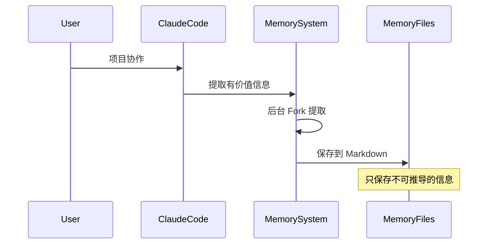
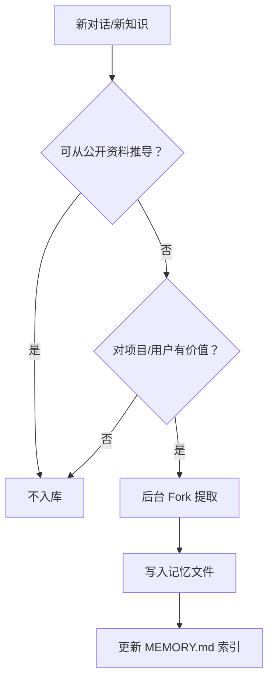
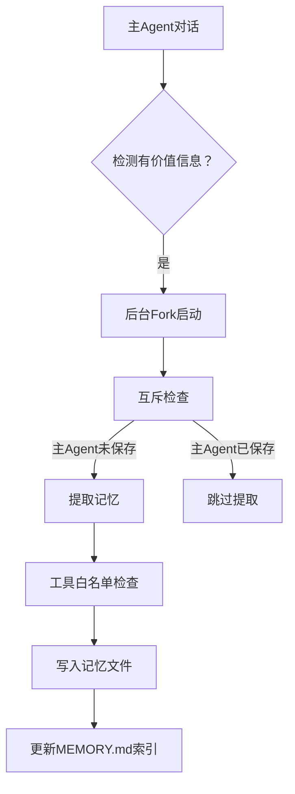

# 🧠 记忆系统

> ⏱ 难度: ★★☆ | 重要性: ★★★ | 推荐学习时间: 3-4天
> 💡 **特别推荐**: 这章对 AI 知识库建设最有帮助！

---

## 概述

Claude Code 采用**文件化多层记忆系统**，而非单一数据库。四种记忆类型各有独立目录、独立 prompt、独立更新策略。

### 核心问题：为什么需要记忆系统？

Claude Code 是如何记住"上次我们做了什么"的？

```
没有记忆: 每次对话都是全新的开始
有记忆:    跨会话保持上下文
```

---

## 四种记忆类型

| 类型 | 作用域 | 存储位置 | 用途 |
|------|--------|----------|------|
| **Auto Memory** | 用户/项目 | `~/.claude/projects/<project>/memory/` | 长期协作信息沉淀 |
| **Session Memory** | 当前会话 | Session Memory 目录 | 长会话摘要与 compact 稳定性 |
| **Agent Memory** | Agent 类型 | 根据 scope 决定 | 某类 Agent 的专属长期记忆 |
| **Team Memory** | 团队 | 团队共享目录 | 团队共享知识同步 |

> [!note]- 关联知识
> Team Memory 用于多 Agent 协作场景下的知识共享。详见 [[../09-子Agent与协作/09-01-🤝-子Agent与协作]]。

### Auto Memory 工作原理



---

## Agent Memory 三种 Scope

```
user:     <memoryBase>/agent-memory/<agentType>/
project:  <cwd>/.claude/agent-memory/<agentType>/
local:    <cwd>/.claude/agent-memory-local/<agentType>/
```

| Scope | 用途 | 持久化 |
|-------|-----|-------|
| `user` | 用户的全局偏好 | 跨项目 |
| `project` | 项目特定信息 | 仅本项目 |
| `local` | 本地机器设置 | 仅本机器 |

---

## 记忆文件格式

### 目录结构

```
~/.claude/projects/<sanitized-git-root>/memory/
├── MEMORY.md (索引, 限200行/25KB)
└── *.md (独立记忆文件, YAML frontmatter)
```

### MEMORY.md 索引格式

```markdown
---
name: memory-index
description: 记忆索引入口
type: index
---

- [Title](file.md) — one-line hook
- [User Preferences](../user-preferences.md) — 用户偏好设置
- [Project Context](../project-context.md) — 项目关键上下文
```

### 记忆文件格式

```markdown
---
name: user-preferences
description: 用户的代码风格偏好
type: user
created: 2024-01-15
tags: [preferences, code-style]
---

# 用户代码风格偏好

## 缩进
- 使用 2 空格缩进
- 不使用 Tab

## 命名
- 变量使用 camelCase
- 组件使用 PascalCase
- 常量使用 UPPER_SNAKE_CASE

## 注释风格
- 使用中文注释
- JSDoc 格式的函数说明
```

---

## 核心原则

> [!note]- 关联知识
> 记忆系统直接影响 QueryEngine 的 Prompt 构建。详见 [[../11-QueryEngine/11-01-⚙️-QueryEngine]]。

> **"记忆是线索，而非结论"**

Claude Code 的记忆使用三原则：

| 原则 | 说明 | 例子 |
|-----|------|-----|
| **验证** | 记忆可能过时 | 文件路径 → 检查是否存在 |
| **追溯** | 可推导信息不记 | 代码内容 → 不如直接读文件 |
| **更新** | 记忆需要维护 | 偏好变化 → 更新记忆文件 |

### 验证检查表

```typescript
async function useMemory(memory: Memory) {
  if (memory.type === "file_path") {
    // 验证：文件是否存在
    const exists = await checkFileExists(memory.value);
    if (!exists) {
      throw new Error("记忆中的文件已不存在");
    }
  }

  if (memory.type === "function") {
    // 验证：函数是否还存在
    const exists = await grep(memory.value);
    if (!exists) {
      throw new Error("记忆中的函数已不存在");
    }
  }

  return memory.value;
}
```

---

## 闭合四类型原则（重要）

Claude Code 只保存**不可从代码推导的信息**：

| 保存 ✓ | 不保存 ✗ |
|-------|---------|
| 用户偏好（不推导） | 代码内容（可直接读） |
| 项目上下文（不推导） | 文件结构（可直接列） |
| 跨会话知识（不推导） | 函数位置（可直接搜） |
| 决策历史（不推导） | 导入关系（可直接分析） |

### 实用判断标准

```
如果能从代码/文件系统中直接获取 → 不需要记
如果需要用户告诉才能知道   → 需要记忆
```

---

## 对知识库建设的启示（重点！）

Claude Code 的记忆系统设计**可以直接借鉴到你的知识库**：

### 设计对比

| Claude Code 记忆 | 你的知识库 |
|-----------------|-----------|
| MEMORY.md 索引 | 知识库首页 |
| Markdown 记忆文件 | 知识条目 |
| YAML frontmatter | 元数据标签 |
| Fork 后台提取 | 定期知识入库 |
| 闭合四类型原则 | 入库标准 |

### 知识库架构示例

```
你的知识库/
├── 知识库首页.md        # = MEMORY.md
├── 用户/
│   ├── 偏好设置.md
│   └── 工作习惯.md
├── 项目/
│   ├── 项目A/
│   │   ├── 上下文.md
│   │   └── 决策记录.md
│   └── 项目B/
└── 团队/
    └── 共享知识.md
```

### 知识入库流程



---

## 实战：构建你的 Obsidian 知识库

### 步骤 1：创建基础结构

```
知识库/
├── MEMORY.md              # 首页索引
├── 01-用户/
│   └── 偏好设置.md
├── 02-项目/
│   ├── 项目上下文.md
│   └── 决策记录.md
└── 03-团队/
    └── 共享知识.md
```

### 步骤 2：定义入库标准

```markdown
## 知识入库标准

可入库：
- 用户偏好和习惯
- 项目特定上下文
- 团队共享知识
- 重要决策和原因

不入库：
- 代码内容（可直接读）
- 文件结构（可直接列）
- 公开文档（已有来源）
```

### 步骤 3：设置定期回顾

```markdown
## 知识回顾计划

- 每周：更新 MEMORY.md 索引
- 每月：清理过时记忆
- 每季度：审视入库标准
```

---

## 常见问题

### Q: 记忆太多会怎样？

- MEMORY.md 限制 200 行 / 25KB
- 超出会触发自动摘要
- 建议定期手动精简

### Q: 记忆文件可以手动编辑吗？

**可以！** 这正是文件化记忆的优势——人类可读、可编辑。

### Q: 如何查看当前记忆？

```
/memory list    # 列出所有记忆
/memory read    # 读取特定记忆
/memory edit    # 编辑记忆
```

---

## 8. 四种记忆类型详解

### Session Memory 关键参数
- 初始化阈值：10K token
- 增量更新：5K token

### Agent Memory 三种 Scope
```
user:     <memoryBase>/agent-memory/<agentType>/
project:  <cwd>/.claude/agent-memory/<agentType>/
local:    <cwd>/.claude/agent-memory-local/<agentType>/
```

## 9. 闭合四类型（最核心原则）

Claude Code 只保存**不可从代码推导的信息**：

| 类型 | 保存 ✓ | 不保存 ✗ |
|-----|-------|---------|
| **user** | 用户画像、偏好 | - |
| **feedback** | 反馈指导（规则+Why+How to apply） | - |
| **project** | 项目状态（决策、进行中工作、团队约定） | - |
| **reference** | 外部引用（Linear/Grafana/Slack） | - |

### 必须转换为绝对日期
相对日期必须转换为绝对日期，否则会失去意义。

## 10. Fork模式后台提取



### 工具白名单
- 只读工具：无限制
- Bash：仅只读命令
- Edit/Write：仅记忆目录内

### 自动提取Fork模式的互斥机制

```
主Agent保存记忆 → 设置互斥标志
后台Agent检测到标志 → 跳过本次提取
```

**目的**：避免主Agent和后台Agent重复写入同一记忆

---

## 相关章节

- [[../06-上下文管理/06-01-📦-上下文管理]] - 短期上下文 vs 长期记忆
- [[../01-架构总览/01-01-📐-架构概览]] - 记忆在架构中的位置
- [[00-02-🚀-快速上手指南]] - 新手入门
- [[00-03-📋-学习进度追踪]] - 学习计划

---

> [!cite]- 知识来源
>
> 本文档核心内容来源：
>
> | 知识点 | 来源 |
> |-------|------|
> | **四种记忆类型** (Auto/Session/Agent/Team Memory) | [lintsinghua/claude-code-book](https://github.com/lintsinghua/claude-code-book) 主教材 |
> | **闭合四类型原则** (user/feedback/project/reference) | [liuup/claude-code-analysis](https://github.com/liuup/claude-code-analysis) 源码分析 |
> | **Fork 模式后台提取机制** | [claude-code-best/claude-code](https://github.com/claude-code-best/claude-code) 企业级参考实现 |
> | **Agent Memory 三种 Scope** (user/project/local) | Claude Code 官方文档 + 源码 |
> | **记忆文件格式** (MEMORY.md 索引 + YAML frontmatter) | Obsidian 知识库最佳实践 |
>
> ### 推荐阅读顺序
> 1. [lintsinghua/claude-code-book](https://github.com/lintsinghua/claude-code-book) — 系统学习
> 2. [liuup/claude-code-analysis](https://github.com/liuup/claude-code-analysis) — 深入源码
> 3. [claude-code-best/claude-code](https://github.com/claude-code-best/claude-code) — 企业级实践