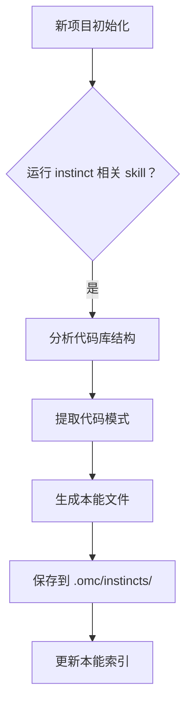
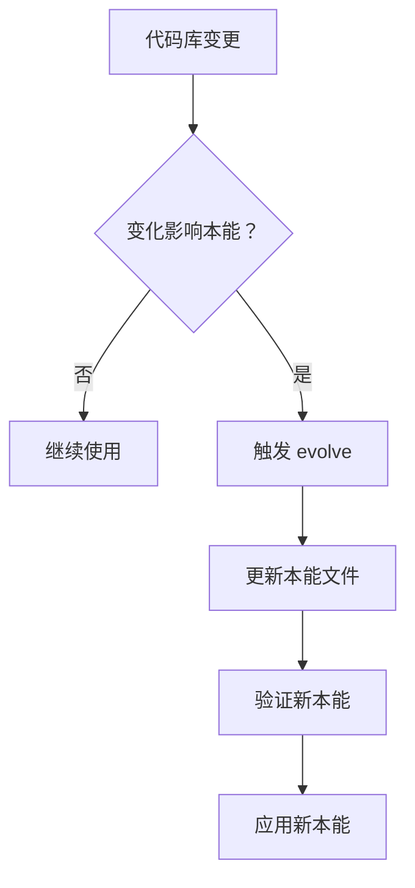

# 🧭 Instinct 本能系统

> ⏱ 难度: ★★☆ | 重要性: ★★★ | 推荐学习时间: 2-3天

---

## 概述

Instinct 是 OMC (oh-my-claudecode) 的**本能学习系统**，用于从代码库中自动提取和沉淀 AI 模式。与传统 RAG 不同，Instinct 不仅仅是检索，而是让 AI **学习** 如何在特定代码库中表现得更好。

### 核心问题：为什么需要 Instinct？

```
传统 RAG:    检索 → 拼接 → 生成（被动响应）
Instinct:    学习 → 内化 → 主动适应（主动进化）
```

---

## 核心概念

### 什么是 Instinct？

Instinct 是从代码库中提取的**AI 行为模式**，包括：
- 代码组织的隐含规则
- 项目特有的命名约定
- 团队偏好的实现模式
- 架构决策背后的原因

### 与传统 RAG 的区别

| 维度 | 传统 RAG | Instinct |
|------|----------|----------|
| **目的** | 信息检索 | 模式学习 |
| **内容** | 文档片段 | 行为模式 |
| **更新** | 静态索引 | 动态进化 |
| **应用** | 被动检索 | 主动适应 |
| **粒度** | 文档级别 | 代码模式级别 |

### 学习 vs 检索

```
检索 (Retrieval):
  用户问 → 找文档 → 返回片段
  适用于：已知问题查文档

学习 (Learning):
  AI 读代码 → 提取模式 → 内化为直觉
  适用于：适应特定代码库风格
```

---

## 可用 Skill

### `instinct-import` - 导入本能

将外部分享的本能导入到当前项目。

```bash
/omc:instinct-import <本能文件>
```

**使用场景**：
- 导入团队共享的代码规范本能
- 使用社区最佳实践本能
- 恢复误删除的本能

### `instinct-export` - 导出本能

将当前项目的本能导出为可分享文件。

```bash
/omc:instinct-export <输出路径>
```

**使用场景**：
- 分享给团队成员
- 备份重要本能
- 跨项目迁移本能

### `instinct-status` - 查看状态

查看当前项目所有已学习的本能状态。

```bash
/omc:instinct-status
```

**输出信息**：
- 本能列表和状态
- 最后更新时间
- 使用频率统计

### `evolve` - 本能进化

基于新的代码变更自动更新本能。

```bash
/omc:evolve
```

**进化触发条件**：
- 检测到新的代码模式
- 原有模式被重构
- 项目架构调整

---

## 使用流程

### 如何创建本能



**创建本能的方法**：

1. **自动提取**：`continuous-learning-v2` skill 自动分析代码库
2. **手动创建**：通过 `skill-create` 从 git 历史提取
3. **外部导入**：从其他项目导入已有的本能

### 如何在项目中使用

本能创建后，OMC Agent 会在以下场景自动应用：

```
代码编写时 → 参考本能中的模式规范
问题诊断时 → 调用本能中的项目知识
架构决策时 → 遵循本能中的架构约定
```

### 维护和更新



---

## 实际应用场景

### 1. 代码库模式学习

**场景**：新加入大型项目，需要快速了解代码风格

**Instinct 解决方案**：
```
运行 continuous-learning-v2
→ 自动分析代码模式
→ 生成项目风格本能
→ AI 自动遵循项目规范
```

**效果**：无需手动学习，AI 天然符合项目风格

### 2. 项目规范提取

**场景**：团队有隐性规范，新成员难以发现

**Instinct 解决方案**：
```
分析 git 历史中的模式
→ 提取团队的隐含规则
→ 生成规范本能
→ 新成员自动遵守
```

**效果**：隐性知识显性化，规范传承自动化

### 3. 团队知识沉淀

**场景**：资深成员的经验难以传递给团队

**Instinct 解决方案**：
```
分析资深成员的代码
→ 提取决策模式
→ 生成经验本能
→ 全团队共享
```

**效果**：经验可复制，知识不再流失

---

## 相关章节

- [[05-01-🧠-记忆系统]] - 记忆系统（Instinct 构建于记忆系统之上）
- [[../14-方法论/14-01-🎯-Skill选择决策树]] - Skill选择（本能相关的 Skill 选择指南）

---

> [!cite]- 知识来源
>
> 本文档核心内容来源：
>
> | 知识点 | 来源 |
> |-------|------|
> | **Instinct 概念** | OMC 原生设计 |
> | **Skill 列表** | oh-my-claudecode skills registry |
> | **应用场景** | 知识库建设方法论 |
>
> ### 推荐阅读顺序
> 1. [[05-01-🧠-记忆系统]] — 先理解记忆系统基础
> 2. [[../14-方法论/14-01-🎯-Skill选择决策树]] — 了解本能相关 Skill
> 3. [[../13-OMC完全指南/📖-OMC完全指南]] — 深入 OMC 框架
