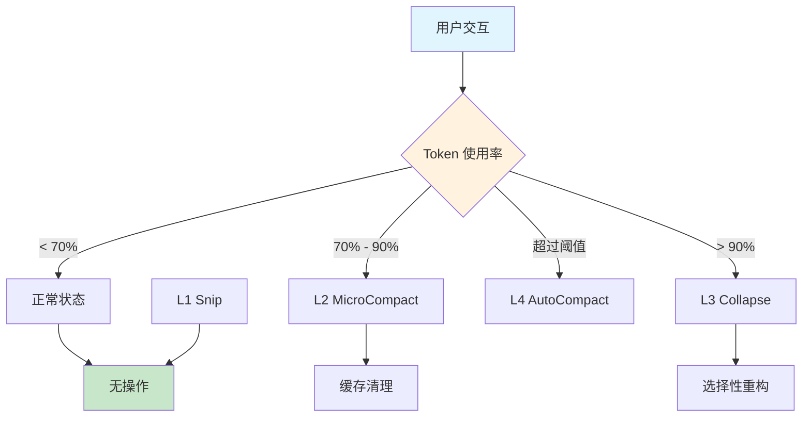
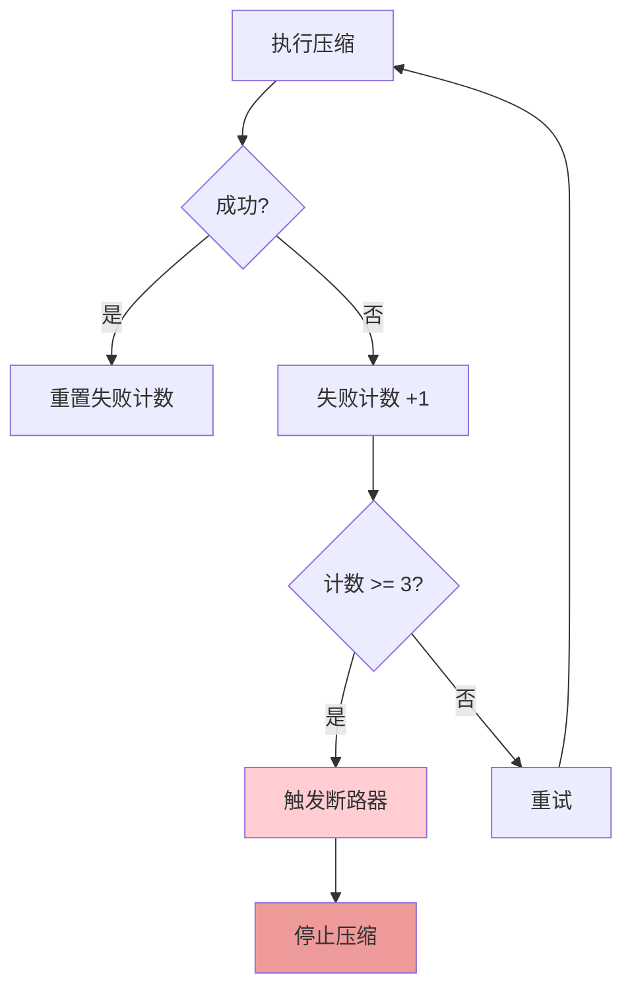
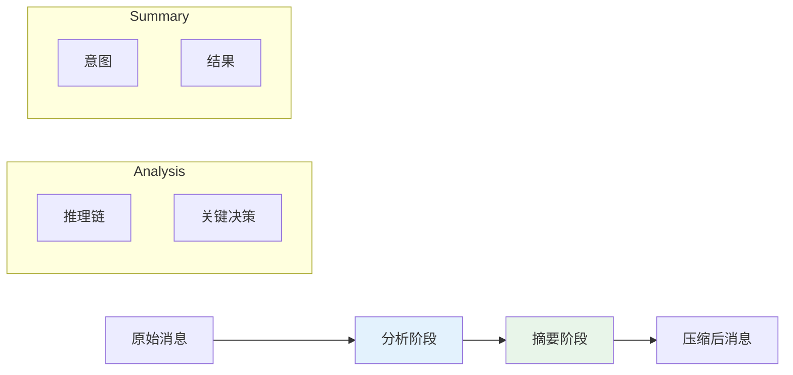
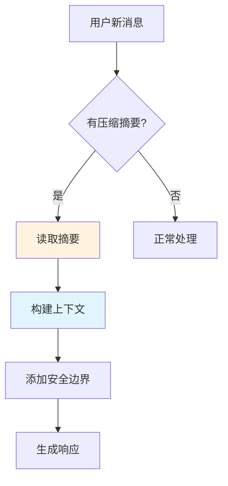
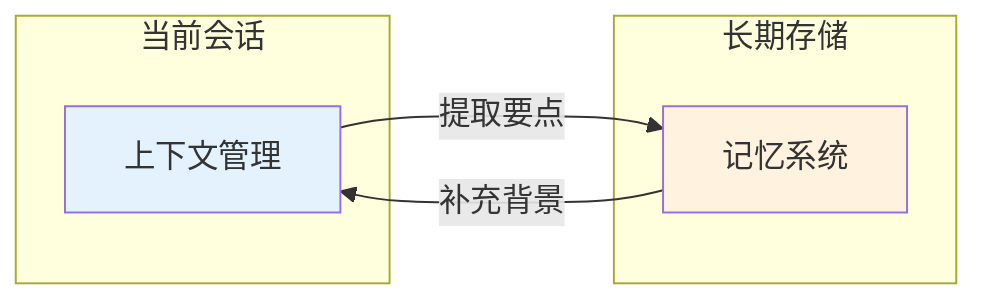

# 📦 上下文管理

> 本文档详细解释 Claude Code 的上下文管理系统，包括四级压缩策略、触发条件、断路器设计等核心机制。

---

## 1. 概述

### 1.1 什么是上下文管理？

上下文管理（Context Management）是 Claude Code 用来**管理对话历史**的系统。在与 Claude 交互时，每条消息、每个工具调用、每次响应都会消耗 **Token**（令牌）。由于大语言模型有固定的上下文窗口限制（如 100K Token），如何在有限空间中高效利用资源成为关键问题。

### 1.2 为什么上下文管理重要？

| 问题 | 影响 | 解决方案 |
|------|------|----------|
| 上下文溢出 | 对话无法继续 | 压缩历史 |
| 关键信息丢失 | 回答质量下降 | 智能选择保留内容 |
| 资源浪费 | 成本增加 | 渐进式压缩 |

Claude Code 采用**四级渐进压缩策略**，在**保留关键信息**与**释放 token 空间**之间取得平衡。

---

## 2. 有效窗口公式

### 2.1 基础公式

```
有效窗口 = 模型窗口 - 预留输出令牌
预留空间 = min(最大输出令牌, 20,000)
```

**示例（200K模型）：**
```
有效窗口 = 200,000 - 16,384 = 183,616令牌
```

### 2.2 详细计算

```
┌─────────────────────────────────────────────────────────────┐
│                      模型上下文窗口                          │
├────────────────────────────┬────────────────────────────────┤
│                            │         预留空间               │
│      可用输入空间           │     (输出缓冲 + 安全边界)       │
│                            │        最多 20,000 Token       │
└────────────────────────────┴────────────────────────────────┘
```

**示例：**
- 模型窗口：`200,000` Token
- 预留输出：`20,000` Token
- **有效输入窗口：`180,000` Token**

### 2.3 七步预处理管线

Claude Code 的上下文处理遵循严格的七步管线（从轻量到重量）：

```
① 工具结果预算 → ② Snip压缩 → ③ Microcompact →
④ Context Collapse → ⑤ 系统提示组装 → ⑥ Autocompact → ⑦ Token阻断检查
```

| 步骤 | 名称 | 作用 |
|------|------|------|
| ① | 工具结果预算 | 计算工具结果所需空间 |
| ② | Snip压缩 | 用户手动裁剪工具结果 |
| ③ | Microcompact | 缓存过期时轻量清理 |
| ④ | Context Collapse | 选择性重构消息组 |
| ⑤ | 系统提示组装 | 组装最终上下文 |
| ⑥ | Autocompact | LLM生成摘要 |
| ⑦ | Token阻断检查 | 确保不超限 |

### 2.4 预留空间的作用

| 预留原因 | Token 数量 | 目的 |
|----------|------------|------|
| 输出缓冲 | ~10,000 | 确保完整响应不被截断 |
| 安全边界 | ~5,000 | 应对突发大响应 |
| 工具调用 | ~5,000 | 工具结果返回空间 |

---

## 3. 四级压缩策略

Claude Code 采用**四级渐进压缩**，从轻量到重量级，逐级深入。

### 3.1 压缩级别总览



### 3.2 L1 - Snip（轻量裁剪）

| 属性 | 说明 |
|------|------|
| **触发方式** | 用户手动触发 |
| **压缩成本** | 0（无 LLM 调用） |
| **作用** | 清除工具结果（Tool Results）内容，保留工具调用本身 |
| **适用场景** | 用户知道某些历史信息不再需要 |

**示例：**
```
压缩前：
┌──────────────────────────────────────┐
│ Tool: Read file (file_path: "/a.txt")│
│ Result: [大量文件内容...]            │
└──────────────────────────────────────┘

压缩后：
┌──────────────────────────────────────┐
│ Tool: Read file (file_path: "/a.txt")│
│ Result: [已裁剪]                     │
└──────────────────────────────────────┘
```

### 3.3 L2 - MicroCompact（微压缩）

| 属性 | 说明 |
|------|------|
| **触发条件** | 缓存过期 |
| **压缩成本** | 极低 |
| **机制** | 基于缓存策略清除工具结果 |
| **特点** | 仅清理，不改变消息结构 |

**触发场景：**
- MCP 服务器缓存过期
- 工具结果超过缓存有效期

### 3.4 L3 - Collapse（中度压缩）

| 属性 | 说明 |
|------|------|
| **触发条件** | Token 利用率达到 **90%** |
| **压缩成本** | 中等 |
| **机制** | 选择性重构消息组（Message Groups） |
| **特点** | 保留关键信息，合并相似内容 |

**工作流程：**
1. 识别可合并的消息组
2. 提取关键信息（如文件名、函数名、错误类型）
3. 用摘要替换原始消息
4. 保持对话结构完整性

### 3.5 L4 - AutoCompact（深度压缩）

| 属性 | 说明 |
|------|------|
| **触发条件** | 超过 **硬阈值** |
| **压缩成本** | 高（需要 LLM 生成摘要） |
| **机制** | 调用 LLM 生成完整对话摘要 |
| **特点** | 全面重构，压缩率最高 |

**压缩效果：**
- 原始对话：约 50,000 Token
- 压缩后：约 2,000 - 5,000 Token
- **压缩比：约 10:1**

---

## 4. 触发条件与阈值

### 4.1 阈值详解

```mermaid
gantt
    title Token 使用率与压缩级别
    dateFormat X
    axisFormat %s

    section 正常区域
    0-70% : crit, 0, 70

    section L2 触发
    70%-90% : active, 70, 90

    section L3 触发
    90%-阈值 : 90, 95

    section L4 触发
    超过阈值 : 95, 100
```



### 4.2 详细阈值表

| 区间 | 级别 | 动作 | 说明 |
|------|------|------|------|
| **0% - 70%** | 正常 | 无 | 安全区域，可正常交互 |
| **70% - 80%** | L2 | MicroCompact | 缓存清理准备 |
| **80% - 90%** | L3 | Collapse | 选择性重构消息组 |
| **90% - 阈值** | L3+ | 增强 Collapse | 更激进的压缩 |
| **超过阈值** | L4 | AutoCompact | LLM 生成摘要 |

### 4.3 阈值计算示例

```
假设模型窗口: 200,000 Token
预留空间: 20,000 Token
有效窗口: 180,000 Token

90% 阈值 = 180,000 × 0.9 = 162,000 Token
硬阈值 = 175,000 Token (约 97%)
```

---

## 5. 断路器设计

> [!note] Fork 复制上下文
> 子 Agent 通过 Fork 机制复制当前上下文，实现并行执行。详见 [[../09-子Agent与协作/09-01-🤝-子Agent与协作]]。

### 5.1 什么是断路器？

断路器（Circuit Breaker）是 Claude Code 防止**压缩失败级联**的机制。当压缩操作连续失败时，系统会触发断路器，避免问题扩大。

### 5.2 断路器参数

| 参数 | 值 | 说明 |
|------|-----|------|
| **连续失败次数** | 3 次 | 触发断路器的阈值 |
| **效果** | 彻底消除级联失败 | 停止压缩尝试 |
| **恢复** | 手动或自动 | 需检查后恢复 |

### 5.3 断路器真实数据效果

**引入前的问题：**
- 1,279个会话出现50次以上连续压缩失败
- 最高记录：3,272次连续失败

**引入后效果：**
- 级联失败被彻底消除
- 断路器触发后自动停止无效重试

### 5.4 断路器工作流程



### 5.4 断路器的意义

1. **防止资源浪费**：避免反复尝试失败的操作
2. **保护用户体验**：确保对话可以继续
3. **提供恢复机会**：让系统有时间修复问题

---

## 6. 压缩算法详解

### 6.1 LLM 压缩的工作原理

当触发 L4（AutoCompact）时，Claude Code 会：

1. **提取关键信息**
   - 用户意图
   - 关键决策
   - 文件修改
   - 工具使用结果

2. **调用 LLM 生成摘要**
   ```
   系统提示：
   "请为以下对话历史生成简洁摘要，
    保留关键信息和意图。
    忽略冗余的交互细节。"
   ```

3. **替换原始内容**
   - 用摘要替换原始消息
   - 保持消息数量（用于追踪）
   - 标记为已压缩

### 6.2 压缩示例

**压缩前：**
```
用户: 帮我看看 src/index.js
助手: [读取文件，分析代码...]
用户: 这个函数能改成箭头函数吗？
助手: [修改代码...]
用户: 再看看修改后的文件
助手: [再次读取...]
```

**压缩后：**
```
[压缩摘要]
用户查看了 src/index.js，
将某函数改为箭头函数，
并检查了修改结果。
```

---

## 7. 双阶段输出结构

### 7.1 Analysis vs Summary

Claude Code 的压缩输出采用**双阶段结构**：

| 阶段 | 内容 | 用途 |
|------|------|------|
| **Analysis** | 分析与推理过程 | 保留思考逻辑 |
| **Summary** | 关键信息摘要 | 保留核心内容 |

### 7.2 双阶段结构示例



### 7.3 为什么需要双阶段？

1. **保留推理能力**：Analysis 保留 Claude 的思考过程
2. **压缩关键信息**：Summary 保留结果供后续参考
3. **平衡效率与质量**：既压缩空间，又保持能力

---

## 8. 压缩后的状态重建

### 8.1 什么是状态重建？

当压缩发生后，后续交互需要在**有限的摘要信息**基础上恢复完整的上下文感知能力。

### 8.2 重建机制



### 8.3 重建信息包括

| 信息类型 | 来源 | 说明 |
|----------|------|------|
| 压缩摘要 | L4 输出 | 核心内容 |
| 工具历史 | 消息标记 | 保留工具调用记录 |
| 用户偏好 | 分析阶段 | 关键偏好设置 |
| 关键文件 | 摘要 | 重要文件路径 |

### 8.4 重建的局限性

- **信息损失**：压缩会丢失细节
- **上下文断裂**：可能影响跨任务理解
- **需主动补充**：用户可能需要重新提供信息

---

## 9. 与记忆系统的区别

### 9.1 核心区别

| 特性 | 上下文管理 | 记忆系统 |
|------|------------|----------|
| **时间范围** | 当前会话 | 跨会话长期 |
| **存储位置** | 内存 | 磁盘/数据库 |
| **容量** | 受限（窗口大小） | 理论上无限 |
| **访问速度** | 快（内存） | 慢（需检索） |
| **内容类型** | 交互历史 | 知识/偏好/经验 |

### 9.2 互补关系



### 9.3 数据流

```
┌─────────────┐    压缩提取     ┌─────────────┐
│   上下文     │  ───────────>  │   记忆      │
│  (当前会话)  │                │  (长期存储) │
└─────────────┘                └─────────────┘
       ^                               │
       │         补充背景               │
       └───────────────────────────────┘
```

### 9.4 记忆系统详情

详见：[[../05-记忆系统/05-01-🧠-记忆系统]]

---

## 10. 对 Harness 开发的启示

### 10.1 设计原则

| 原则 | 应用方式 |
|------|----------|
| **渐进式压缩** | 先简单后复杂，避免一步到位 |
| **保留关键信息** | 设计优先级机制，核心内容优先保留 |
| **断路器保护** | 任何自动操作都应有失败处理 |
| **可观测性** | 记录压缩前后状态，便于调试 |

### 10.2 实践建议

#### 1. 分层存储设计

```javascript
// 示例：知识库分层
const knowledgeLayers = {
  hot: {     // 热点信息 - 保留在内存
    retention: 'always',
    size: 1000
  },
  warm: {    // 温点信息 - 压缩后存储
    retention: 'session',
    size: 10000
  },
  cold: {    // 冷点信息 - 归档到磁盘
    retention: 'permanent',
    size: 'unlimited'
  }
};
```

#### 2. 实现断路器模式

```javascript
// 示例：断路器实现
class CircuitBreaker {
  constructor(threshold = 3) {
    this.failureCount = 0;
    this.threshold = threshold;
    this.isOpen = false;
  }

  recordFailure() {
    this.failureCount++;
    if (this.failureCount >= this.threshold) {
      this.isOpen = true;
    }
  }

  recordSuccess() {
    this.failureCount = 0;
    this.isOpen = false;
  }
}
```

#### 3. 设计双阶段输出

```javascript
// 示例：双阶段结构
const compressedMessage = {
  analysis: {
    reasoning: "...",
    decisions: ["..."]
  },
  summary: {
    intent: "...",
    keyResults: ["..."]
  }
};
```

### 10.3 监控指标

| 指标 | 监控目的 |
|------|----------|
| 压缩触发频率 | 评估压缩策略效果 |
| 压缩成功率 | 监控断路器状态 |
| Token 使用率 | 提前预警溢出风险 |
| 响应延迟变化 | 评估压缩性能影响 |

---

## 11. 架构位置

### 11.1 在整体架构中的位置

Claude Code 的上下文管理是**核心组件**，与其他系统协同工作：

```
┌────────────────────────────────────────────┐
│              Claude Code                    │
├────────────────────────────────────────────┤
│                                            │
│  ┌──────────────┐    ┌──────────────┐     │
│  │   上下文管理   │◄──►│   记忆系统    │     │
│  │  (四级压缩)   │    │  (长期存储)  │     │
│  └──────────────┘    └──────────────┘     │
│         │                                       │
│         ▼                                       │
│  ┌──────────────┐    ┌──────────────┐         │
│  │  消息处理    │───►│   工具系统    │         │
│  └──────────────┘    └──────────────┘         │
│                                            │
└────────────────────────────────────────────┘
```

详见：[[../01-架构总览/01-01-📐-架构概览]]

---

## 12. 总结

Claude Code 的上下文管理系统通过**四级渐进压缩策略**，在有限的 Token 空间内实现了高效的信息管理：

1. **L1-L2**：轻量级清理，成本极低
2. **L3**：选择性重构，保留关键信息
3. **L4**：深度压缩，需要 LLM 参与

配合**断路器设计**，确保系统在压缩失败时不会崩溃。理解这一机制对于开发高效、可靠的 AI 应用至关重要。

---

## 相关章节

- [[../05-记忆系统/05-01-🧠-记忆系统]] - 长期记忆 vs 短期上下文
- [[../01-架构总览/01-01-📐-架构概览]] - 上下文在架构中的位置
- [[../02-Tool系统/02-01-🔧-Tool系统]] - 工具调用与上下文

> [!note]- 关联知识
> [[../02-Tool系统/02-01-🔧-Tool系统]] - Tool results are context main content

---

> [!cite]- 知识来源
>
> 本文档核心内容来源：
>
> | 知识点 | 来源 |
> |--------|------|
> | **七步预处理管线**（工具结果预算 → Snip压缩 → Microcompact → Context Collapse → 系统提示组装 → Autocompact → Token阻断检查） | lintsinghua/claude-code-book |
> | **四级压缩策略**（L1 Snip / L2 MicroCompact / L3 Collapse / L4 AutoCompact）及阈值触发条件 | lintsinghua/claude-code-book |
> | **断路器设计**（连续失败3次触发、消除级联失败机制）及真实效果数据（1,279会话/50+次失败/最高3,272次） | lintsinghua/claude-code-book |
> | **有效窗口公式**（模型窗口 - 预留输出令牌）及预留空间计算 | lintsinghua/claude-code-book |
> | **双阶段输出结构**（Analysis + Summary） | lintsinghua/claude-code-book |
> | **状态重建机制** | lintsinghua/claude-code-book |
>
> 参考资料：
> - [lintsinghua/claude-code-book](https://github.com/lintsinghua/claude-code-book) — 主教材，1,190 stars
> - [liuup/claude-code-analysis](https://github.com/liuup/claude-code-analysis) — 源码分析，537 stars
> - [claude-code-best/claude-code](https://github.com/claude-code-best/claude-code) — 企业级可运行版本，8,712 stars