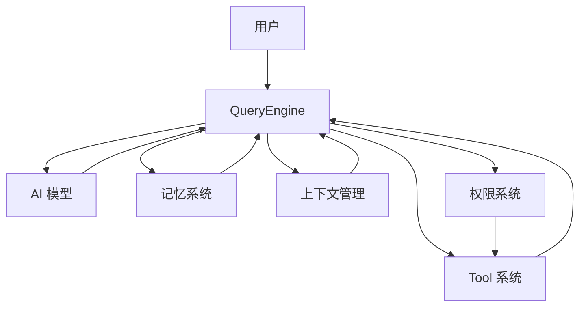
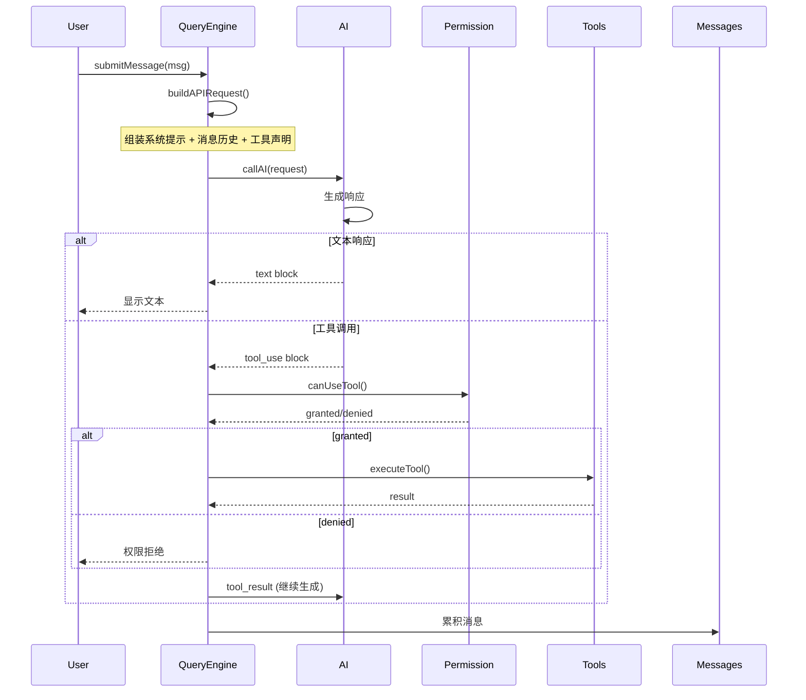
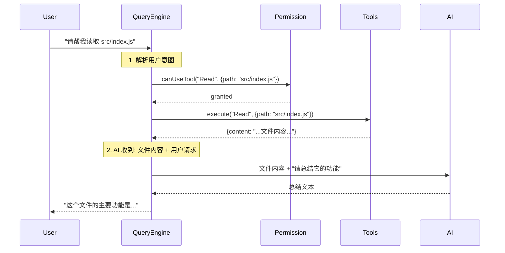
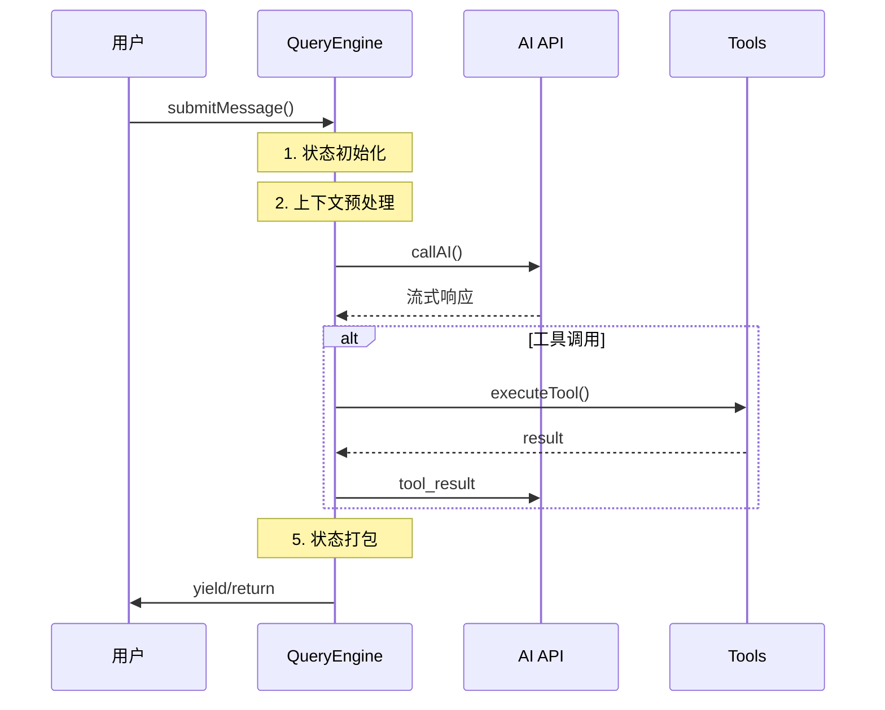

# ⚙️ QueryEngine

> ⏱ 难度: ★★★ | 重要性: ★★★ | 推荐学习时间: 3-4天
> 🎯 **核心地位**: QueryEngine 是 Claude Code 的心脏，所有其他系统都围绕它运转

---

## 概述

QueryEngine 是 Claude Code 的**核心引擎**，处理所有与 AI 的对话。

### 核心问题：QueryEngine 是做什么的？

```
用户消息 → QueryEngine → AI 模型 → 响应 + 工具调用
```

**类比**: QueryEngine 就像一个**交通枢纽**，所有请求都经过它，所有响应都从它发出。

---

## 在架构中的位置



---

## 核心结构

```typescript
export class QueryEngine {
  // 配置
  private config: QueryEngineConfig

  // 消息历史（跨轮次持久化）
  private mutableMessages: Message[]

  // 中断控制器（取消长时间运行）
  private abortController: AbortController

  // 权限追踪
  private permissionDenials: SDKPermissionDenial[]

  // 用量统计
  private totalUsage: NonNullableUsage
}
```

### 关键字段解析

| 字段 | 作用 | 为什么重要 |
|-----|------|----------|
| `mutableMessages` | 消息历史 | 实现跨轮次对话 |
| `abortController` | 中断控制 | 可以取消 AI 响应 |
| `permissionDenials` | 拒绝记录 | 追踪权限问题 |
| `totalUsage` | 用量统计 | 控制成本 |

---

## 主循环流程



### 流程详解

1. **submitMessage()** - 接收用户消息
2. **buildAPIRequest()** - 构建 AI 请求
   - 系统 prompt 组装
   - 消息历史拼接
   - 工具声明注入
3. **callAI()** - 发送给 AI
4. **handleTextBlock()** - 处理文本响应
5. **handleToolCall()** - 处理工具调用
6. **累积到 mutableMessages** - 保存对话历史

---

## 核心配置

```typescript
export type QueryEngineConfig = {
  // 工作目录
  cwd: string

  // 可用工具列表
  tools: Tools

  // 可用命令
  commands: Command[]

  // MCP 服务器连接
  mcpClients: MCPServerConnection[]

  // Agent 定义
  agents: AgentDefinition[]

  // 权限检查函数
  canUseTool: CanUseToolFn

  // 应用状态获取
  getAppState: () => AppState

  // 自定义系统提示
  customSystemPrompt?: string

  // 指定模型
  userSpecifiedModel?: string

  // 思考模式配置
  thinkingConfig?: ThinkingConfig

  // 最大对话轮次
  maxTurns?: number

  // 最大花费限制
  maxBudgetUsd?: number
}
```

---

## 工具调用处理（核心）

```typescript
async function handleToolCall(toolUse: ToolUse) {
  // 1. 权限检查
  const permission = await canUseTool(toolUse.name, toolUse.input);

  if (permission.denied) {
    // 记录拒绝
    this.permissionDenials.push({
      tool: toolUse.name,
      reason: permission.reason
    });

    // 返回拒绝信息给 AI
    return {
      type: "tool_result",
      tool_use_id: toolUse.id,
      content: `Permission denied: ${permission.reason}`
    };
  }

  // 2. 执行工具
  const result = await executeTool(toolUse.name, toolUse.input);

  // 3. 返回结果给 AI（AI 会继续生成）
  return {
    type: "tool_result",
    tool_use_id: toolUse.id,
    content: JSON.stringify(result)
  };
}
```

---

## 思考模式

Claude Code 支持让 AI 先思考再回答：

```typescript
export type ThinkingConfig = {
  provider: 'anthropic'
  budget: number  // 思考 token 预算 (100-2000)
}
```

### 思考模式工作流程

```
用户问题
    ↓
AI 先输出 <thinking>...</thinking> (不消耗输出token)
    ↓
AI 输出最终答案
    ↓
用户看到思考过程
```

### 使用场景

| 适合 | 不适合 |
-----|-------|
| 复杂逻辑推理 | 简单问答 |
| 代码调试 | 快速查找 |
| 多步分析 | 实时响应 |

---

## 错误处理与重试

| 错误类型 | 处理策略 | 重试 |
|---------|---------|-----|
| `rate_limit` | 等待后重试 | ✓ |
| `network` | 等待后重试 | ✓ |
| `server` | 等待后重试 | ✓ |
| `auth` | 不重试 | ✗ |
| `context_too_long` | 压缩上下文 | - |

### 断路器保护

```typescript
class QueryEngineCircuitBreaker {
  private failures = 0;
  private readonly threshold = 3;

  async callAI(request: AIRequest): Promise<AIResponse> {
    if (this.failures >= this.threshold) {
      throw new Error("AI 调用电路已断开");
    }

    try {
      return await this.doCallAI(request);
    } catch (e) {
      this.failures++;
      throw e;
    }
  }
}
```

---

## Feature Flags

QueryEngine 使用 `feature()` 实现灰度发布：

```typescript
// 检查功能开关
if (feature('streaming-tool-executor')) {
  // 使用新版流式工具执行
  return new StreamingToolExecutor();
} else {
  // 使用旧版
  return new BatchToolExecutor();
}
```

### 常见 Feature Flags

| Flag | 功能 |
-----|-----|
| `streaming-tool-executor` | 流式工具执行 |
| `compact-v2` | 新版压缩算法 |
| `thinking-mode` | 思考模式 |

---

## 设计模式总结

| 模式 | 在 QueryEngine 中的应用 |
-----|------------------------|
| **消息累积** | mutableMessages 持久化跨轮次状态 |
| **权限包装** | wrappedCanUseTool 追踪权限拒绝 |
| **Feature Flags** | 条件编译，灰度发布 |
| **延迟加载** | 重型模块按需加载 |
| **断路器** | 防止 API 级联失败 |

---

## 实战：理解一次对话

### 场景分析

```
用户: 请帮我读取 src/index.js 然后总结它的功能
```

### 后台发生的事



---

## 9. AsyncGenerator 主循环

QueryEngine 使用 `while(true)` 异步生成器模式：

```typescript
async function *QueryEngine() {
  while (true) {
    const state = initializeState();
    const context = await preprocess(state);
    const response = await callAPI(context);
    const result = await handleResponse(response);

    if (isTerminal(result)) {
      return result;
    }

    yield result;
  }
}
```

### 五种 yield 事件类型
| 事件 | 说明 |
|-----|------|
| `stream_request_start` | 流式请求开始 |
| `content_block_start` | 内容块开始 |
| `content_block_delta` | 内容块增量 |
| `message_delta` | 消息增量 |
| `tool_use` | 工具调用 |

### 十种终止原因
| 原因 | 说明 |
|-----|------|
| `completed` | 正常完成 |
| `aborted_streaming` | 流式中断 |
| `aborted_tools` | 工具执行中断 |
| `max_turns` | 达到最大轮次 |
| `blocking_limit` | 阻塞限制 |
| `prompt_too_long` | Prompt 太长 |
| `model_error` | 模型错误 |
| `stop_hook_prevented` | 停止钩子阻止 |
| `hook_stopped` | 钩子停止 |
| `image_error` | 图片错误 |

## 10. Turn 生命周期（五阶段）



## 11. 依赖注入设计（QueryDeps）

```typescript
interface QueryDeps {
  callModel: (request) => Promise<Response>;
  compact: (context) => Promise<CompactResult>;
  generate: (prompt) => Promise<string>;
  uuid: () => string;
}

// 使得测试可以注入 fake/mock
const engine = new QueryEngine({
  ...deps,
  callModel: fakeModelCall
});
```

---

## 相关章节

- [[../02-Tool系统/🔧-Tool系统]] - QueryEngine 调用工具
- [[../03-权限系统/🔐-权限系统]] - 权限包装工具调用
- [[../05-记忆系统/🧠-记忆系统]] - 记忆影响 prompt
- [[../06-上下文管理/📦-上下文管理]] - 上下文管理在其中发生
- [[../01-架构总览/📐-架构概览]] - QueryEngine 在架构中的位置