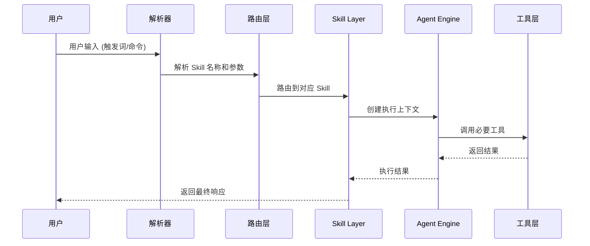
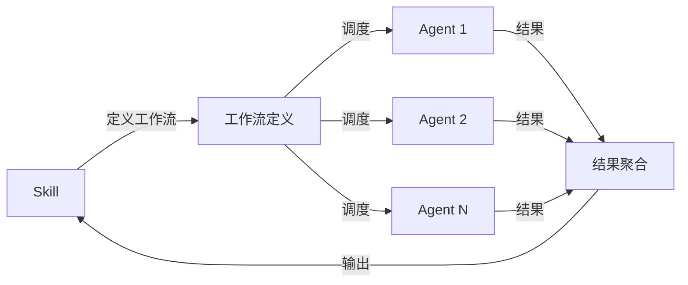
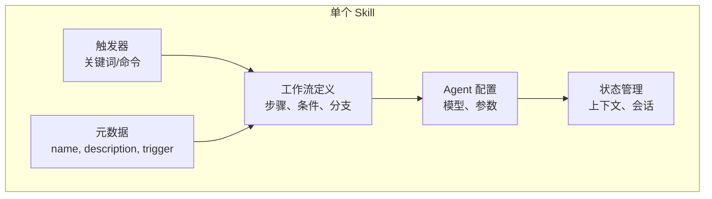

# 📚 Skill 系统完整指南

## 1. 概述

### 1.1 什么是 Skill

Skill 是 Claude Code 的**顶层能力封装**机制，基于 Hook 系统构建，提供可被用户直接调用的功能单元。它是一种**声明式**的能力扩展方式，允许开发者将复杂的工作流封装为可复用的技能模块。

### 1.2 Skill 与 Hook 的核心差异

| 维度 | Hook | Skill |
|-----|------|-------|
| **触发方式** | 生命周期事件自动触发 | 用户显式调用 `/skill` 或触发词 |
| **目的** | 修改/拦截系统行为 | 扩展用户能力 |
| **编写难度** | 需要理解内部机制 | 相对简单 |
| **数量** | 5类, 26事件 | 11个内置 + 可自定义 |
| **生命周期** | 隐式执行 | 按需显式调用 |
| **状态管理** | 无状态 | 可包含状态/上下文 |

### 1.3 Skill 在 Claude Code 架构中的位置

Skill 位于用户交互层和 Agent 执行层之间，是用户意图的**第一道翻译层**。当用户触发某个 Skill 时，系统会：

1. 解析 Skill 名称和参数
2. 加载 Skill 定义和实现
3. 创建或复用相应的 Agent 执行上下文
4. 将用户请求转化为具体的执行计划

---

## 2. 11个内置 Skill 详解

### 2.1 完整技能表

| Skill 名称 | 触发词 | 功能描述 | 适用场景 |
|-----------|--------|---------|---------|
| `autopilot` | "autopilot" | 全自动执行：从需求到代码的完整流程 | 快速实现完整功能 |
| `ralph` | "ralph" | 持久化循环：自我修正直到任务完成 | 需要多轮迭代的任务 |
| `ultrawork` | "ulw", "ultrawork" | 并行执行引擎：高吞吐量任务完成 | 大规模并行任务 |
| `team` | "team" | 团队协作：N个协调 Agent 共享任务列表 | 多 Agent 协作项目 |
| `ccg` | "ccg" | 多模型合成：Claude + Codex + Gemini 三模型编排 | 综合多模型优势 |
| `ultraqa` | "ultraqa" | QA 循环：测试-验证-修复-重复直到达标 | 测试驱动开发 |
| `plan` | "plan" | 规划工作流：战略规划 + 可选面试工作流 | 复杂任务规划 |
| `sciomc` | "sciomc" | 研究工作流：并行科学家 Agent 综合分析 | 研究与分析任务 |
| `deep-interview` | "deep interview" | 需求澄清：苏格拉底式深度访谈 + 数学模糊度门控 | 需求不明确时 |
| `ask` | "ask" | 模型路由：智能路由到最适合的模型 | 需要特定模型能力 |
| `learner` | "learner" | 技能提取：从当前对话提取为可复用技能 | 知识固化 |

### 2.2 核心 Skill 详细说明

#### 2.2.1 autopilot - 全自动执行

```
触发条件：用户输入包含 "autopilot"
执行模式：完全自主，无需人工干预
工作流程：
  1. 接收用户想法/需求
  2. 自动分析并规划
  3. 生成代码
  4. 验证结果
  5. 迭代直到满意
```

**使用示例**：
```
autopilot 创建一个 REST API 项目，使用 Express + MongoDB
```

#### 2.2.2 ralph - 持久化循环

```
触发条件：用户输入包含 "ralph"
核心机制：自我参照循环 + 可配置验证审查
工作流程：
  1. 执行当前任务
  2. 验证结果
  3. 如果失败，自我修正
  4. 重复直到成功或被取消
```

**使用示例**：
```
ralph 直到这个 bug 被修复
ralph 持续优化性能直到达到 100ms 以下
```

#### 2.2.3 ultrawork - 并行执行

```
触发条件：用户输入包含 "ulw" 或 "ultrawork"
核心机制：并行任务分发 + 结果聚合
工作流程：
  1. 分析任务可并行化的部分
  2. 分发到多个执行线程
  3. 并行执行
  4. 汇总结果
```

**使用示例**：
```
ulw 并行处理这 10 个文件的重构
ultrawork 同时运行测试和构建
```

#### 2.2.4 team - 团队协作

```
触发条件：用户输入包含 "team"
核心机制：N 个协调 Agent 共享任务列表
工作流程：
  1. 定义团队规模和角色
  2. 分配子任务
  3. Agent 间协调通信
  4. 结果汇总
```

**使用示例**：
```
team 3 个 Agent 完成这个重构任务
```

#### 2.2.5 deep-interview - 需求澄清

```
触发条件：用户输入包含 "deep interview"
核心机制：苏格拉底式提问 + 数学模糊度门控
工作流程：
  1. 深度提问澄清需求
  2. 识别模糊/歧义点
  3. 数学化表达需求明确度
  4. 门控通过后进入执行
```

**适用场景**：
- 需求不明确
- 用户无法清晰表达意图
- 需要深入分析问题本质

---

## 3. Skill 调用机制

### 3.1 调用方式

Skill 支持两种调用方式：

#### 3.1.1 显式调用 - `/skill` 命令

```bash
/skill autopilot 构建一个用户认证系统
/skill ralph 修复所有安全漏洞
/skill ultrawork 并行处理数据导入
```

#### 3.1.2 隐式调用 - 关键词触发

```bash
# 直接输入触发词
autopilot 创建一个博客系统

# 系统自动识别并路由到对应 Skill
```

### 3.2 调用流程



### 3.3 参数传递

```bash
# 基本参数
/skill autopilot <需求描述>

# 带选项参数
/skill ultraqa --test-framework jest --target-coverage 80

# 组合参数
/skill team 3 --role "frontend,backend,devops"
```

---

## 4. Skill 与 Agent 的关系

### 4.1 协作层次

| 层面 | Agent | Skill |
|-----|-------|-------|
| **定位** | 任务执行者 | 能力封装 |
| **粒度** | 整个任务 | 单个功能 |
| **调用方** | QueryEngine | 用户/其他 Skill |
| **协作** | 可 fork 子 Agent | 可组合嵌套 |
| **生命周期** | 任务级 | 会话级 |
| **状态** | 无状态 | 可包含状态 |

### 4.2 Skill 如何使用 Agent

Skill 本质上是**工作流编排器**，它通过以下方式使用 Agent：



### 4.3 组合示例

```bash
# Skill 嵌套调用
autopilot
  └── plan (内部规划)
  ├── team (多 Agent 执行)
  │   ├── Agent 1: 代码生成
  │   ├── Agent 2: 测试编写
  │   └── Agent 3: 文档编写
  └── ultraqa (质量验证)
```

---

## 5. Skill 系统架构图

### 5.1 整体架构

```mermaid
graph TD
    subgraph User["用户层"]
        U1[CLI 输入]
        U2[触发词]
        U3[/skill 命令]
    end

    subgraph Core["核心层"]
        Parser[解析器]
        Router[路由层]
        Registry[Skill 注册表]
    end

    subgraph SkillLayer["Skill 层"]
        S1[autopilot]
        S2[ralph]
        S3[ultrawork]
        S4[team]
        S5[ccg]
        S6[ultraqa]
        S7[plan]
        S8[sciomc]
        S9[deep-interview]
        S10[ask]
        S11[learner]
    end

    subgraph Agent["Agent 执行层"]
        A1[QueryEngine]
        A2[Agent Pool]
        A3[Tool Executor]
    end

    subgraph Hook["Hook 系统"]
        H1[生命周期 Hook]
        H2[自定义 Hook]
    end

    U1 --> Parser
    U2 --> Parser
    U3 --> Parser
    Parser --> Router
    Router --> Registry
    Registry --> SkillLayer
    SkillLayer --> A1
    A1 --> A2
    A2 --> A3
    A3 --> Hook
```

### 5.2 Skill 内部结构



---

## 6. 创建自定义 Skill

### 6.1 创建步骤

#### 步骤 1: 确定 Skill 名称和触发词

```yaml
name: my-custom-skill
trigger: ["my-skill", "custom"]
description: 这是一个自定义技能
```

#### 步骤 2: 创建 Skill 文件

在 `~/.claude/skills/` 目录下创建 `.md` 文件：

```markdown
---
name: my-custom-skill
description: 我的自定义技能说明
type: skill
trigger:
  - "my-skill"
  - "custom"
---

# Skill 实现

## 功能描述
在这里描述技能的具体功能...

## 使用示例
```bash
my-skill 参数1 参数2
```

## 工作流
1. 第一步：xxx
2. 第二步：xxx
3. 第三步：xxx
```

#### 步骤 3: 注册 Skill

Skill 文件会自动被系统发现并注册。如需手动刷新，可使用：

```bash
/skill refresh
```

### 6.2 Skill 文件模板

```markdown
---
name: skill-name
description: 技能描述
type: skill
trigger:
  - "trigger-word-1"
  - "trigger-word-2"
version: "1.0.0"
author: "Your Name"
tags:
  - tag1
  - tag2
---

# 技能名称

## 功能概述
一句话描述技能的功能

## 触发方式
- 命令: `/skill skill-name [参数]`
- 触发词: `trigger-word`

## 参数说明

| 参数 | 必填 | 说明 | 默认值 |
|-----|-----|-----|-------|
| param1 | 是 | 参数1说明 | - |
| param2 | 否 | 参数2说明 | default |

## 工作流程

1. **步骤一**: 描述
2. **步骤二**: 描述
3. **步骤三**: 描述

## 示例

### 示例 1
```bash
skill-name --param1 value
```

### 示例 2
```bash
trigger-word param1
```

## 注意事项
- 注意事项1
- 注意事项2
```

---

## 7. Skill 元数据格式

### 7.1 YAML Frontmatter 完整格式

```yaml
---
# 必需字段
name: skill-name           # Skill 唯一标识符
type: skill               # 类型: skill
description: 描述文本     # 功能描述

# 可选字段
trigger:                 # 触发词数组
  - "word1"
  - "word2"
version: "1.0.0"         # 版本号
author: "Author Name"    # 作者
tags: [tag1, tag2]       # 标签
category: utility        # 分类

# Agent 配置
agent:
  model: sonnet          # 使用的模型
  temperature: 0.7       # 温度参数
  max_tokens: 4096       # 最大 token 数

# 工作流配置
workflow:
  parallel: false        # 是否并行执行
  retry: 3              # 重试次数
  timeout: 300000       # 超时时间(毫秒)

# 依赖配置
requires:
  tools: [tool1, tool2] # 所需工具
  skills: [skill1]      # 依赖的其他技能
---
```

### 7.2 字段说明

| 字段 | 类型 | 必需 | 说明 |
|-----|-----|-----|-----|
| `name` | string | 是 | 技能唯一标识 |
| `type` | string | 是 | 固定为 "skill" |
| `description` | string | 是 | 功能描述 |
| `trigger` | array | 否 | 触发词列表 |
| `version` | string | 否 | 版本号 |
| `author` | string | 否 | 作者 |
| `tags` | array | 否 | 标签 |
| `category` | string | 否 | 分类 |
| `agent` | object | 否 | Agent 配置 |
| `workflow` | object | 否 | 工作流配置 |
| `requires` | object | 否 | 依赖配置 |

---

## 8. 常用 Skill 使用场景

### 8.1 场景矩阵

| 场景 | 推荐 Skill | 原因 |
|-----|-----------|------|
| **快速实现想法** | autopilot | 端到端自动化 |
| **需要多轮迭代** | ralph | 自我修正循环 |
| **大规模并行任务** | ultrawork | 高吞吐量 |
| **复杂团队协作** | team | 多 Agent 协调 |
| **多模型综合** | ccg | 三模型优势 |
| **测试驱动开发** | ultraqa | QA 循环 |
| **战略规划** | plan | 规划工作流 |
| **深度研究** | sciomc | 并行科学家 |
| **需求不明确** | deep-interview | 苏格拉底式澄清 |
| **特定模型能力** | ask | 智能路由 |
| **知识固化** | learner | 技能提取 |

### 8.2 选择决策树

```
需要什么？
├── 快速完成 → autopilot
├── 迭代修正 → ralph
├── 并行执行 → ultrawork
├── 多人协作 → team
├── 综合分析 → ccg / sciomc
├── 质量保证 → ultraqa
├── 规划分析 → plan
├── 澄清需求 → deep-interview
├── 特定模型 → ask
└── 固化知识 → learner
```

---

## 9. Skill vs Hook 对比表

### 9.1 核心差异

| 维度 | Hook | Skill |
|-----|------|-------|
| **触发方式** | 事件驱动 | 命令/触发词 |
| **执行时机** | 生命周期节点 | 按需调用 |
| **定义位置** | `settings.json` | 独立 `.md` 文件 |
| **复杂度** | 中等 | 较高 |
| **状态管理** | 无 | 支持 |
| **组合能力** | 有限 | 强大 |
| **适用场景** | 系统扩展 | 业务能力封装 |

### 9.2 功能对比

| 功能 | Hook | Skill |
|-----|------|-------|
| 拦截请求 | ✓ | ✗ |
| 修改响应 | ✓ | ✗ |
| 生命周期管理 | ✓ | ✗ |
| 并行执行 | ✗ | ✓ |
| 循环执行 | ✗ | ✓ |
| 多 Agent 协作 | ✗ | ✓ |
| 参数化执行 | ✗ | ✓ |
| 状态持久化 | ✗ | ✓ |

### 9.3 选择指南

```
需要做什么？
├── 修改系统行为 → Hook
│   ├── 消息拦截 → PreProcess Hook
│   ├── 响应修改 → PostProcess Hook
│   └── 认证授权 → Auth Hook
│
└── 扩展业务能力 → Skill
    ├── 快速实现 → autopilot
    ├── 迭代任务 → ralph
    └── 并行处理 → ultrawork
```

---

## 10. 对 Harness 开发的启示

### 10.1 架构设计启示

#### 10.1.1 分层设计

Skill 系统展示了优秀的分层架构：

```
用户层 → 解析层 → 路由层 → Skill 层 → Agent 层 → 工具层
```

**启示**：保持清晰的层次分离，每层只关注自己的职责。

#### 10.1.2 可扩展性

- **声明式配置**：通过 YAML frontmatter 定义元数据
- **插件化架构**：Skill 文件即插件，发现即注册
- **组合能力**：Skill 可嵌套组合

**启示**：设计时应考虑扩展点，让系统易于扩展。

### 10.2 工作流编排启示

Skill 的工作流编排模式值得借鉴：

1. **定义工作流**：声明式的步骤定义
2. **Agent 调度**：动态分配任务给 Agent
3. **结果聚合**：汇总多 Agent 结果
4. **状态管理**：维护执行上下文

### 10.3 实践建议

#### 10.3.1 创建自定义 Skill

```markdown
---
name: harness-test
description: Harness 测试技能
type: skill
trigger:
  - "harness-test"
  - "ht"
---

# Harness Test Skill

## 功能
自动化测试 Harness 功能

## 工作流
1. 加载测试用例
2. 执行 Harness
3. 验证结果
4. 生成报告
```

#### 10.3.2 Skill 组合示例

```yaml
# 复杂任务组合
workflow:
  - skill: plan
  - skill: team
    agents: 3
  - skill: ultraqa
```

### 10.4 学习资源

- Claude Code 官方文档
- oh-my-claudecode 参考：`omc-reference` Skill
- 社区分享的 Skill 集合

## 10. SKILL.md Frontmatter 完整字段

```yaml
---
name: my-skill              # 技能名称
description: 技能描述       # 一行描述
when_to_use: 使用场景       # 何时使用
arguments: arg1 arg2        # 参数定义
argument-hint: 提示文本     # 参数提示
allowed-tools: [Read,Edit]  # 允许的工具
model: sonnet               # 使用模型
effort: medium              # low|medium|high
user_invocable: true       # 是否可用户调用
disable-model-invocation: false
context: fork|inline        # 上下文模式
agent: executor            # 使用的Agent
version: "1.0"
paths: ["*.py", "src/**"]  # 条件触发路径
hooks:
  pre: hook-name           # 前置钩子
  post: hook-name          # 后置钩子
shell: bash|powershell     # Shell类型
---
```

## 11. 三级参数替换

```bash
# 位置参数
$0, $1, $2...$N
$ARGUMENTS      # 完整参数

# 命名参数（基于 frontmatter arguments 字段）
# arguments: foo bar
$foo            # 第一个参数
$bar            # 第二个参数
```

## 12. 六层加载优先级

```
managed → user → project → additional → legacy_DEPRECATED → bundled
```

## 13. 动态技能发现

Claude Code 沿文件路径向上查找 `.claude/skills/`：

```typescript
discoverSkillDirsForPaths(filePath) {
  // 沿路径向上搜索
  // 跳过 .gitignored 目录
  // 条件技能：paths frontmatter 激活
}
```

---

## 相关章节

- [[../04-Hook系统/🪝-Hook系统]] - Skill 基于 Hook 构建
- [[../09-子Agent与协作/🤝-子Agent与协作]] - Agent 间协作
- [[../01-架构总览/📐-架构概览]] - Skill 在架构中的位置

---

*最后更新：2026-04-02*
