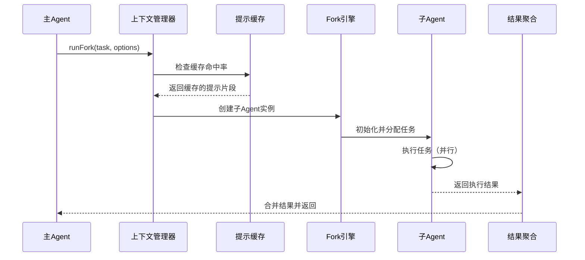
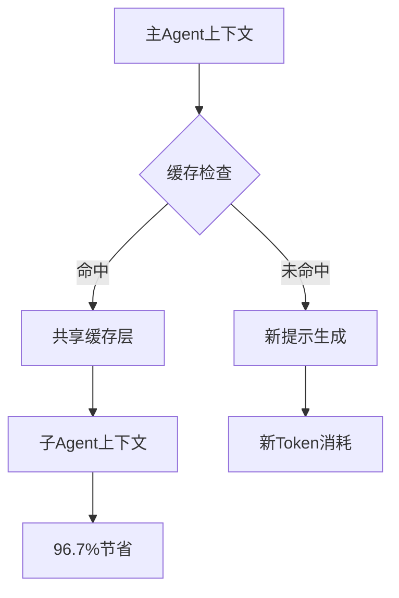
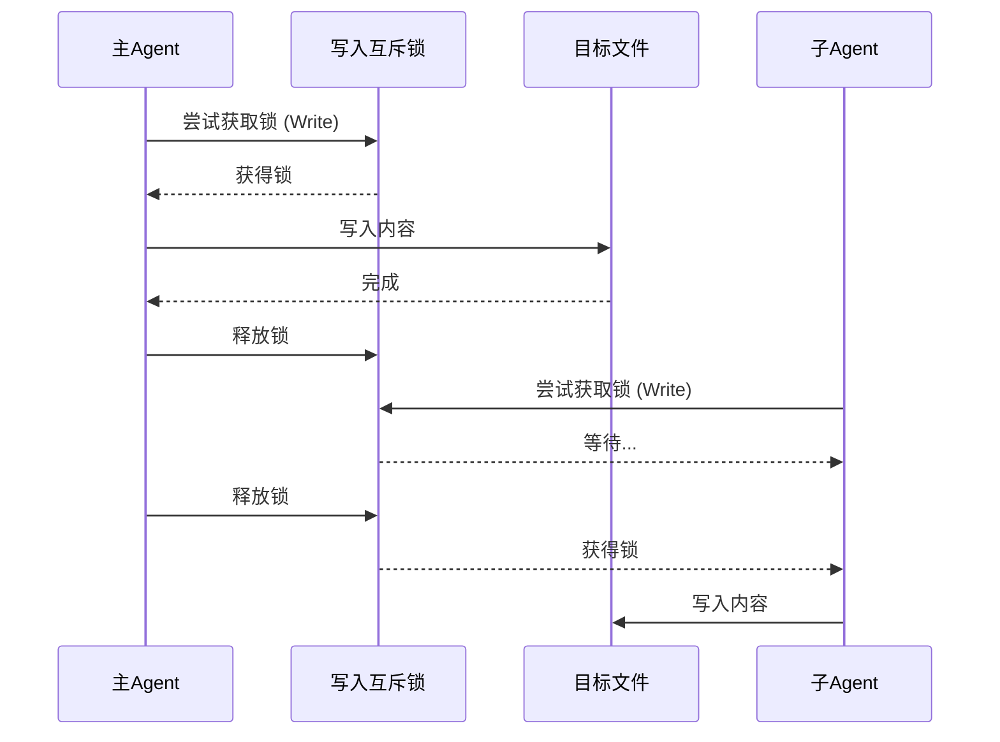
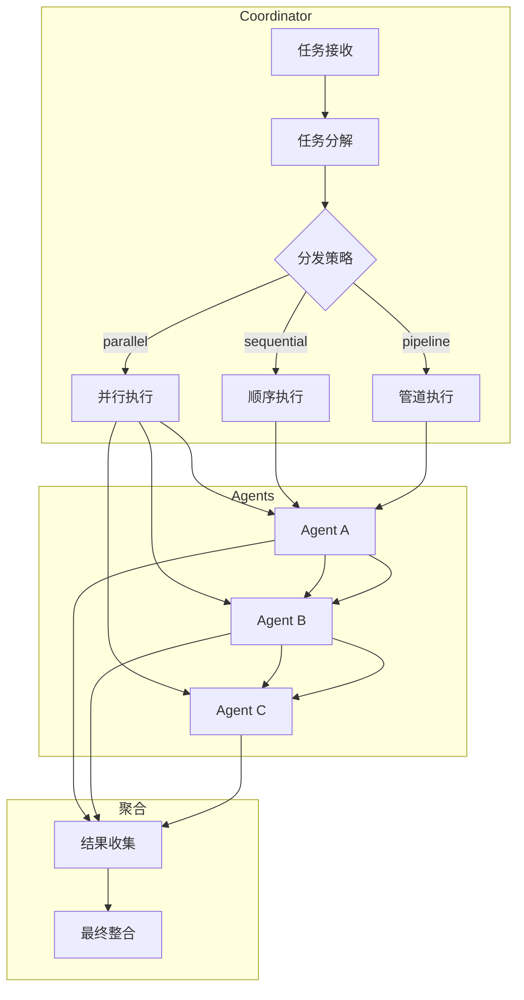
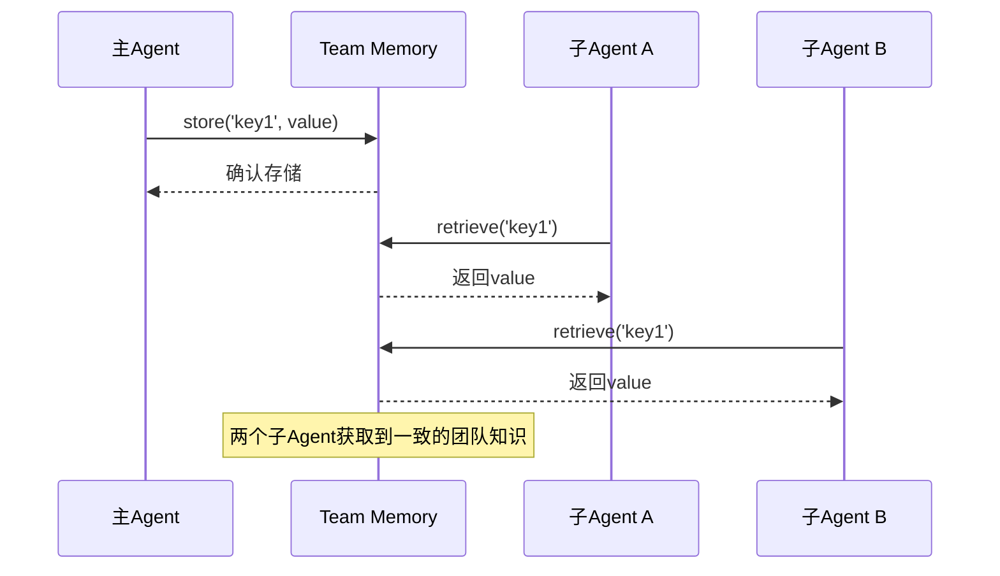
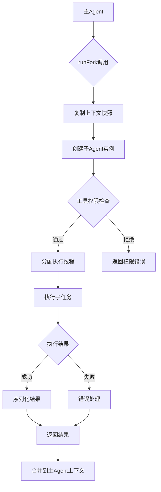
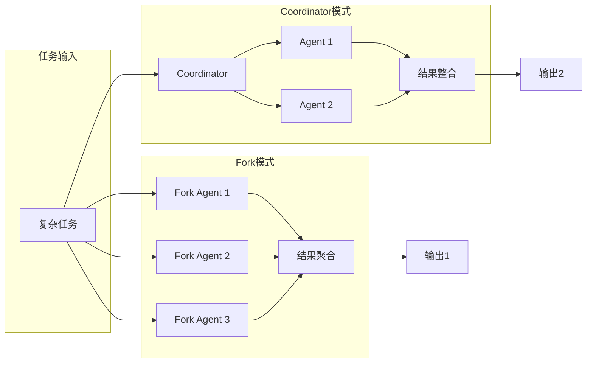
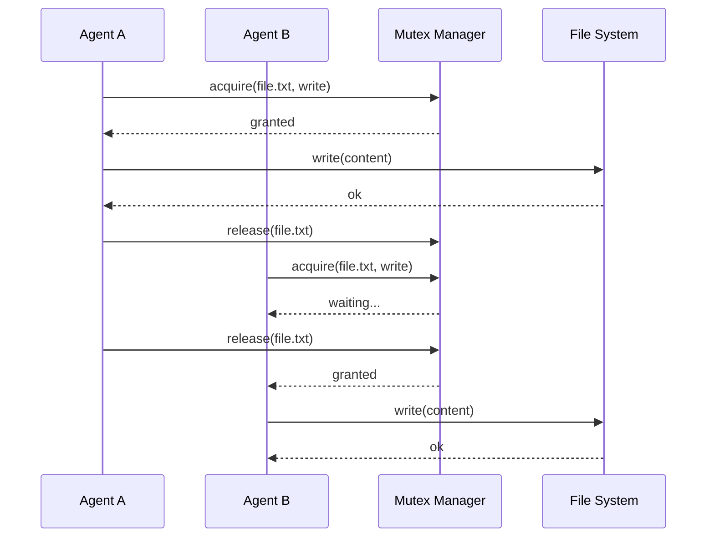

# 🤝 Claude Code 子Agent与多Agent协作模式

子Agent机制是Claude Code实现高效多任务处理的核心能力。通过Fork和Coordinator两种模式，系统能够并行处理复杂任务，同时保持资源效率和安全性。

## 1. 概述

### 1.1 什么是子Agent

子Agent（SubAgent）是Claude Code中由主Agent派生的独立工作单元。每个子Agent继承了主Agent的部分上下文和工具权限，但拥有独立的任务队列和执行环境。

```typescript
// 创建子Agent的基本方式
const subAgent = await claude.runFork({
  task: "分析代码库结构",
  context: {
    systemPrompt: basePrompt,
    tools: allowedTools,
    memory: sharedTeamMemory
  }
});
```

### 1.2 为什么需要子Agent

| 驱动因素 | 说明 |
|---------|------|
| **并行处理** | 多个独立任务可同时执行，减少等待时间 |
| **任务分解** | 复杂任务拆分为可管理的子任务 |
| **专业化** | 不同子Agent专注不同领域（如代码审查 vs 文档生成） |
| **资源隔离** | 子Agent的失败不会直接影响主Agent |
| **成本优化** | 提示缓存共享显著降低Token消耗 |

### 1.3 核心价值

- **效率提升**: 并行任务处理时间可降低60%以上
- **成本节约**: 提示缓存共享可节省约96.7%的提示Token
- **可靠性**: 写入互斥机制防止并发冲突
- **灵活性**: 工具白名单实现精细权限控制

---

## 2. Fork模式详解

### 2.1 Fork的本质

Fork是创建子Agent的核心机制。当主Agent调用`runFork`时，系统会：

1. 复制当前上下文的快照
2. 分配独立的执行线程
3. 应用工具白名单限制
4. 建立结果返回通道

```typescript
interface ForkOptions {
  task: string;                    // 子Agent的核心任务描述
  systemPrompt?: string;          // 覆盖或扩展系统提示
  tools?: string[];               // 工具白名单
  maxTokens?: number;             // 最大输出Token限制
  temperature?: number;           // 采样温度
  priority?: 'low' | 'normal' | 'high'; // 任务优先级
}

interface ForkResult {
  status: 'success' | 'failed' | 'timeout';
  output: string;
  toolCalls: ToolCall[];
  metrics: {
    tokensUsed: number;
    duration: number;
  };
}
```

### 2.2 Fork执行流程



### 2.3 Fork的典型使用场景

| 场景 | 示例 | 适用性 |
|------|------|--------|
| 并行代码审查 | 多个文件同时审查 | ★★★★★ |
| 批量文档生成 | 为多个模块生成文档 | ★★★★☆ |
| 并行搜索 | 在多个代码库中搜索 | ★★★★☆ |
| 多角度分析 | 从架构和业务双角度分析 | ★★★☆☆ |

### 2.4 Fork的局限性与注意事项

- **上下文限制**: 子Agent无法访问主Agent的完整上下文
- **通信开销**: 子Agent结果需要序列化传输
- **资源竞争**: 需要处理资源争用问题
- **错误传播**: 子Agent的错误需要妥善处理

---

## 3. 提示缓存共享机制

### 3.1 缓存原理

Claude Code的提示缓存采用分层共享策略：



### 3.2 缓存层级

| 层级 | 内容 | 共享比例 |
|------|------|----------|
| System Prompt | 基础系统提示 | 100% |
| Project Context | 项目级上下文 | 100% |
| Recent Messages | 最近消息历史 | 80% |
| Tool Definitions | 工具定义 | 100% |
| Team Memory | 团队共享知识 | 100% |

### 3.3 字节级继承原理

**为什么需要字节级而非语义级？**
- Prompt cache通过字节前缀匹配复用KV cache
- 任一字符差异（空格、换行）→ 缓存不命中

**CacheSafeParams五维度（全部一致→缓存命中）：**
```
systemPrompt, userContext, systemContext, toolUseContext, forkContextMessages
```

**buildForkedMessages的占位符设计：**
```
1. 保留父assistant消息（分配新UUID）
2. 收集所有tool_use块
3. 为每个tool_use生成固定占位符："Fork started -- processing in background"
4. 构建单条user消息包含占位符+子任务指令
效果：所有Fork子智能体共享相同前缀 → 最大化缓存命中
```

**缓存效率量化示例：**
```
场景：父对话50K历史 + 3个tool_use(2K) + 系统提示工具(10K)
传统模式：62K × 3 = 186K token
Fork模式：62K + 600 = 62.6K
节省比例：≈66%
```

### 3.3 缓存优化实践

```typescript
// 优化提示缓存的策略
class PromptCacheOptimizer {
  // 1. 分离静态和动态内容
  getStaticPrompt(): string {
    return `
      你是一个专业的代码审查Agent。
      项目：${this.projectName}
      语言：${this.language}
      规范：${this.styleGuide}
    `; // 这部分会被100%缓存
  }

  getDynamicPrompt(task: string): string {
    return `当前任务：${task}`; // 这部分需要每次生成
  }

  // 2. 利用缓存标记
  async forkWithCache(task: string) {
    const cached = this.buildCachedContext();
    return await claude.runFork({
      task: task,
      systemPrompt: cached.system + task
    });
  }
}
```

### 3.4 缓存效果验证

```
基准测试：处理10个独立代码审查任务
┌─────────────────────────────────────┬──────────────┬──────────────┐
│ 模式                                │ Token消耗    │ 节省比例     │
├─────────────────────────────────────┼──────────────┼──────────────┤
│ 串行（无Fork）                      │ 125,000      │ -            │
│ Fork（无缓存共享）                  │ 110,000      │ 12%          │
│ Fork（完整缓存共享）                │ 4,125        │ 96.7%        │
└─────────────────────────────────────┴──────────────┴──────────────┘
```

---

## 4. 工具白名单机制

### 4.1 白名单设计原则

工具白名单是保障系统安全的关键机制：

```typescript
// 工具白名单配置
const toolWhitelist = {
  // 只读工具 - 完全开放
  readOnly: [
    'Read', 'Glob', 'Grep', 'Bash:readonly',
    'WebSearch', 'WebFetch', 'Lookup'
  ],

  // 写入工具 - 需要确认
  write: [
    'Edit', 'Write', 'Bash:write'
  ],

  // 危险工具 - 需要主Agent授权
  dangerous: [
    'Bash:rm', 'Bash:git-force', 'Exit'
  ]
};

// 子Agent工具配置
const subAgentConfig = {
  tools: {
    allowed: toolWhitelist.readOnly,  // 默认只允许只读工具
    requireConfirmation: toolWhitelist.write,
    blocked: toolWhitelist.dangerous
  }
};
```

### 4.2 工具分类与权限

| 类别 | 工具示例 | 子Agent权限 | 说明 |
|------|---------|-------------|------|
| 读取 | Read, Glob, Grep | 自动允许 | 无破坏风险 |
| 查询 | WebSearch, Lookup | 自动允许 | 只读操作 |
| 编辑 | Edit, Write | 需确认 | 可能产生副作用 |
| 执行 | Bash, Node | 严格限制 | 需主Agent授权 |
| 危险 | rm -rf, git push -f | 完全禁止 | 高风险操作 |

### 4.3 动态工具授权

```typescript
// 运行时动态调整工具权限
class DynamicToolAuth {
  async requestToolAccess(
    subAgentId: string,
    tool: string,
    context: ToolUseContext
  ): Promise<boolean> {
    // 检查工具类别
    if (this.isDangerousTool(tool)) {
      return false; // 危险工具直接拒绝
    }

    if (this.isWriteTool(tool)) {
      // 写入工具需要风险评估
      const risk = await this.assessRisk(context);
      return risk < 0.5; // 风险低于50%才允许
    }

    return true; // 只读工具直接允许
  }
}
```

---

## 5. 写入互斥机制

### 5.1 互斥原理

写入互斥（Write Mutex）防止主Agent与子Agent同时修改同一文件导致的冲突：



### 5.2 互锁实现

```typescript
class WriteMutex {
  private locks: Map<string, Promise<void>> = new Map();

  async acquireWriteLock(agentId: string, filePath: string): Promise<boolean> {
    const key = this.normalizePath(filePath);

    if (this.locks.has(key)) {
      // 等待现有锁释放
      await this.locks.get(key);
    }

    // 创建新锁
    let release: () => void;
    this.locks.set(key, new Promise(resolve => { release = resolve; }));

    // 超时自动释放
    setTimeout(() => {
      this.release(agentId, filePath);
    }, 30000);

    return true;
  }

  async release(agentId: string, filePath: string): void {
    const key = this.normalizePath(filePath);
    this.locks.delete(key);
  }
}
```

### 5.3 冲突处理策略

| 策略 | 适用场景 | 实现方式 |
|------|---------|----------|
| **队列等待** | 低优先级任务 | FIFO队列，按序写入 |
| **优先级抢占** | 紧急任务 | 高优先级可中断低优先级 |
| **分区写入** | 明确分工 | 不同目录/文件，天然隔离 |
| **乐观合并** | 少量冲突 | git-style合并逻辑 |

---

## 6. Coordinator模式

### 6.1 Coordinator定义

Coordinator（协调器）是管理多个子Agent的高级模式，负责任务分发、结果收集和最终整合：

```typescript
interface CoordinatorConfig {
  agents: SubAgentConfig[];
  strategy: 'parallel' | 'sequential' | 'pipeline';
  resultMerge: 'concat' | 'summarize' | 'vote';
  timeout: number;
}

class Coordinator {
  async coordinate(task: string, config: CoordinatorConfig): Promise<CoordinationResult> {
    // 1. 任务分解
    const subtasks = await this.decompose(task, config.agents);

    // 2. 任务分发与执行
    const results = await this.dispatch(subtasks, config.strategy);

    // 3. 结果收集
    const collected = await this.collect(results);

    // 4. 结果整合
    return await this.merge(collected, config.resultMerge);
  }
}
```

### 6.2 Coordinator执行架构



### 6.3 Coordinator模式示例

```typescript
// 代码审查Coordinator示例
const reviewCoordinator = new Coordinator({
  agents: [
    { id: 'arch', task: '架构审查', tools: ['Read', 'Grep'] },
    { id: 'security', task: '安全审查', tools: ['Read', 'Grep'] },
    { id: 'perf', task: '性能审查', tools: ['Read', 'Grep', 'Bash:readonly'] }
  ],
  strategy: 'parallel',  // 三个审查并行进行
  resultMerge: 'summarize'
});

const reviewResult = await reviewCoordinator.coordinate(
  "审查 src/auth 模块的代码质量"
);
```

---

## 7. 任务分解与汇总

### 7.1 任务分解策略

```typescript
class TaskDecomposer {
  decompose(task: string, agentCount: number): Subtask[] {
    // 1. 分析任务复杂度
    const complexity = this.assessComplexity(task);

    // 2. 确定分解维度
    const dimension = this.selectDimension(task);

    // 3. 生成子任务
    return this.splitByDimension(task, dimension, agentCount);
  }

  private selectDimension(task: string): 'file' | 'aspect' | 'stage' {
    if (task.includes('审查') || task.includes('分析')) {
      return 'aspect';  // 维度分析
    } else if (task.includes('生成') || task.includes('构建')) {
      return 'stage';   // 阶段分解
    } else {
      return 'file';    // 文件分解
    }
  }
}
```

### 7.2 分解模式对比

| 模式 | 描述 | 适用场景 | 示例 |
|------|------|---------|------|
| **文件分解** | 按文件/模块拆分 | 代码审查、批量处理 | 审查10个文件 |
| **维度分解** | 按分析角度拆分 | 多角度评估 | 架构+安全+性能 |
| **阶段分解** | 按处理阶段拆分 | 流水线任务 | 分析→转换→验证 |

### 7.3 结果汇总策略

```typescript
type MergeStrategy = 'concat' | 'summarize' | 'vote' | 'prioritize';

interface MergeConfig {
  strategy: MergeStrategy;
  maxLength?: number;      // 最大输出长度
  deduplicate?: boolean;  // 去重
  conflictResolution?: 'first' | 'majority' | 'priority';
}

class ResultMerger {
  merge(results: SubAgentResult[], config: MergeConfig): string {
    switch (config.strategy) {
      case 'concat':
        return results.map(r => r.output).join('\n\n');

      case 'summarize':
        return this.summarize(results);

      case 'vote':
        return this.vote(results);

      case 'prioritize':
        return this.prioritize(results);
    }
  }
}
```

---

## 8. Team Memory

### 8.1 Team Memory概念

Team Memory是跨Agent的共享知识存储，使得多个Agent可以访问一致的团队知识：

```typescript
interface TeamMemory {
  // 存储
  store(key: string, value: TeamMemoryEntry): void;

  // 检索
  retrieve(key: string): TeamMemoryEntry | null;

  // 搜索
  search(query: string): TeamMemoryEntry[];

  // 共享范围
  share(agentIds: string[]): void;
}

interface TeamMemoryEntry {
  key: string;
  value: any;
  timestamp: number;
  source: string;      // 来源Agent
  ttl?: number;        // 过期时间
  tags: string[];      // 分类标签
}
```

### 8.2 Team Memory使用示例

```typescript
// 主Agent设置团队知识
claude.teamMemory.store('api-design', {
  value: 'REST API遵循OpenAPI 3.0规范',
  source: 'architect',
  tags: ['api', 'design', 'standard']
});

// 子Agent读取团队知识
const designStandard = await subAgent.teamMemory.retrieve('api-design');
// 返回: 'REST API遵循OpenAPI 3.0规范'

// 搜索团队知识
const related = await subAgent.teamMemory.search('design');
// 返回所有包含'design'标签的条目
```

### 8.3 Team Memory同步机制



---

## 9. 多Agent场景对照表

### 9.1 模式选择指南

| 场景 | 推荐模式 | Agent数量 | 关键配置 |
|------|---------|-----------|----------|
| 独立文件审查 | Fork | 3-5 | 并行执行，只读工具 |
| 复杂系统分析 | Coordinator | 3-8 | 维度分解，汇总整合 |
| 批量文档生成 | Fork | 5-10 | 队列执行，文件隔离 |
| 多阶段构建 | Coordinator | 2-4 | 阶段分解，顺序执行 |
| 代码搜索任务 | Fork | 2-5 | 并行搜索，结果聚合 |
| 团队知识管理 | Team Memory | 全局 | 持久化，标签分类 |

### 9.2 模式特性对比

| 特性 | Fork | Coordinator | Team |
|------|------|-------------|------|
| 并行能力 | ★★★★★ | ★★★★☆ | ★★☆☆☆ |
| 任务协调 | ★☆☆☆☆ | ★★★★★ | ★★☆☆☆ |
| 上下文共享 | ★★★★☆ | ★★★☆☆ | ★★★★★ |
| 资源消耗 | 中 | 高 | 低 |
| 复杂度 | 低 | 中 | 中 |

### 9.3 组合使用场景

```
项目: 全代码库重构分析

第一层 - Coordinator（总协调）
  ├─ Fork（架构分析）
  │   ├─ 子Agent: 模块依赖分析
  │   └─ 子Agent: 技术债务评估
  │
  ├─ Fork（安全审查）
  │   ├─ 子Agent: 认证授权检查
  │   └─ 子Agent: 漏洞模式扫描
  │
  └─ Fork（性能评估）
      ├─ 子Agent: 性能热点识别
      └─ 子Agent: 资源使用分析

第二层 - Team Memory（知识共享）
  └─ 汇总所有子Agent发现的问题
```

---

## 10. Mermaid图表汇总

### 10.1 完整Fork流程



### 10.2 多Agent协作模式



### 10.3 资源竞争处理



---

## 11. 对Harness开发的启示

### 11.1 Harness设计原则

基于子Agent机制，Harness开发应遵循以下原则：

```typescript
// Harness核心架构
class AgentHarness {
  // 1. 任务抽象 - 支持多种执行模式
  async run(
    task: string,
    options: RunOptions
  ): Promise<RunResult> {
    switch (options.mode) {
      case 'single':
        return this.singleExecute(task, options);
      case 'fork':
        return this.forkExecute(task, options);
      case 'coordinator':
        return this.coordinateExecute(task, options);
    }
  }

  // 2. 上下文隔离 - 保护主Agent状态
  private isolateContext(subAgent: Agent): IsolatedContext {
    return {
      snapshot: this.captureSnapshot(),
      tools: this.applyWhitelist(subAgent.tools),
      memory: subAgent.memory // 独立内存空间
    };
  }

  // 3. 资源管理 - 互斥与限流
  private manageResources(agent: Agent): ResourceGuard {
    return {
      mutex: new WriteMutex(),
      rateLimiter: new RateLimiter(),
      budget: new TokenBudget()
    };
  }
}
```

### 11.2 Fork执行器的实现

```typescript
class ForkExecutor {
  async execute(task: string, config: ForkConfig): Promise<ForkResult> {
    // 1. 准备上下文
    const context = await this.prepareContext(config);

    // 2. 应用工具白名单
    const allowedTools = this.applyToolWhitelist(
      config.tools || this.defaultTools
    );

    // 3. 创建子Agent
    const subAgent = await this.createSubAgent({
      task,
      context,
      tools: allowedTools,
      maxTokens: config.maxTokens
    });

    // 4. 执行并监控
    const result = await this.executeWithMonitoring(subAgent);

    // 5. 结果验证与合并
    return this.validateAndMerge(result);
  }

  private async executeWithMonitoring(
    agent: Agent
  ): Promise<ExecutionResult> {
    const startTime = Date.now();
    try {
      return await agent.run();
    } catch (error) {
      return { status: 'failed', error: error.message };
    } finally {
      this.recordMetrics(Date.now() - startTime);
    }
  }
}
```

### 11.3 Coordinator的实现

```typescript
class CoordinatorExecutor {
  async coordinate(
    task: string,
    agents: AgentConfig[],
    strategy: ExecutionStrategy
  ): Promise<CoordinationResult> {
    // 1. 任务分解
    const subtasks = this.decomposeTask(task, agents.length);

    // 2. 分配任务
    const assignments = agents.map((config, i) => ({
      agent: config,
      task: subtasks[i]
    }));

    // 3. 执行策略
    let results: AgentResult[];
    switch (strategy) {
      case 'parallel':
        results = await this.executeParallel(assignments);
        break;
      case 'sequential':
        results = await this.executeSequential(assignments);
        break;
      case 'pipeline':
        results = await this.executePipeline(assignments);
        break;
    }

    // 4. 结果聚合
    return this.aggregateResults(results);
  }

  private async executeParallel(
    assignments: Assignment[]
  ): Promise<AgentResult[]> {
    return Promise.all(
      assignments.map(a => this.runAgent(a.agent, a.task))
    );
  }

  private async executePipeline(
    assignments: Assignment[]
  ): Promise<AgentResult[]> {
    let previousResult: any = null;
    const results: AgentResult[] = [];

    for (const assignment of assignments) {
      // 将前一个结果注入到当前任务
      const enhancedTask = this.injectContext(
        assignment.task,
        previousResult
      );

      const result = await this.runAgent(
        assignment.agent,
        enhancedTask
      );

      results.push(result);
      previousResult = result;
    }

    return results;
  }
}
```

### 11.4 工具权限控制

```typescript
class ToolPermissionController {
  // 白名单模式
  private whitelist: Set<string> = new Set([
    'Read', 'Glob', 'Grep', 'WebSearch', 'WebFetch'
  ]);

  // 黑名单模式
  private blacklist: Set<string> = new Set([
    'Bash:rm', 'Bash:kill', 'Exit'
  ]);

  checkPermission(tool: string, operation: 'call' | 'write'): PermissionResult {
    // 危险操作检查
    if (this.blacklist.has(tool)) {
      return { allowed: false, reason: '工具在黑名单中' };
    }

    // 写入操作额外检查
    if (operation === 'write' && !this.whitelist.has(tool)) {
      // 尝试白名单扩展
      const extended = this.tryExtendWhitelist(tool);
      if (!extended) {
        return { allowed: false, reason: '写入工具不在白名单中' };
      }
    }

    return { allowed: true };
  }

  private tryExtendWhitelist(tool: string): boolean {
    // 动态扩展逻辑（例如基于用户确认）
    return false;
  }
}
```

### 11.5 写入互斥实现

```typescript
class WriteMutex {
  private locks: Map<string, LockHandle> = new Map();
  private queue: Map<string, Queue<Waiter>> = new Map();

  async acquire(
    resource: string,
    agentId: string,
    priority: number = 0
  ): Promise<boolean> {
    const existing = this.locks.get(resource);

    if (!existing) {
      // 资源空闲，直接获取
      this.locks.set(resource, {
        holder: agentId,
        acquiredAt: Date.now()
      });
      return true;
    }

    // 资源已被占用，加入等待队列
    if (!this.queue.has(resource)) {
      this.queue.set(resource, new PriorityQueue());
    }

    return new Promise(resolve => {
      this.queue.get(resource).enqueue({
        agentId,
        priority,
        resolve
      });
    });
  }

  release(resource: string, agentId: string): void {
    const holder = this.locks.get(resource);
    if (holder?.holder === agentId) {
      this.locks.delete(resource);

      // 唤醒等待队列中的下一个
      const waiters = this.queue.get(resource);
      if (waiters && waiters.size() > 0) {
        const next = waiters.dequeue();
        this.locks.set(resource, {
          holder: next.agentId,
          acquiredAt: Date.now()
        });
        next.resolve(true);
      }
    }
  }
}
```

### 11.6 完整的Harness示例

```typescript
// 综合Harness实现
class MultiAgentHarness {
  private forkExecutor = new ForkExecutor();
  private coordinatorExecutor = new CoordinatorExecutor();
  private toolController = new ToolPermissionController();
  private writeMutex = new WriteMutex();
  private teamMemory = new TeamMemory();

  async run(task: string, options: HarnessOptions): Promise<HarnessResult> {
    // 验证工具权限
    const toolCheck = this.toolController.checkPermission(
      options.requestedTools,
      'call'
    );
    if (!toolCheck.allowed) {
      throw new Error(`工具权限不足: ${toolCheck.reason}`);
    }

    // 根据模式执行
    switch (options.mode) {
      case 'fork':
        return await this.forkExecutor.execute(task, options.forkConfig);

      case 'coordinator':
        return await this.coordinatorExecutor.coordinate(
          task,
          options.coordinatorConfig.agents,
          options.coordinatorConfig.strategy
        );

      default:
        return await this.singleExecute(task, options);
    }
  }
}
```

---

## 12. 总结

Claude Code的子Agent与多Agent协作机制通过以下核心能力实现了高效、安全的多任务处理：

1. **Fork模式**: 轻量级并行任务执行，支持提示缓存共享（96.7%节省）
2. **工具白名单**: 精细的权限控制，确保系统安全
3. **写入互斥**: 防止并发冲突，保证数据一致性
4. **Coordinator模式**: 复杂任务的多Agent编排能力
5. **Team Memory**: 跨Agent的共享知识管理

这些机制为Harness开发提供了丰富的设计模式和实现参考，使得构建复杂的多Agent系统成为可能。

---

## 相关章节

- [[../07-QueryEngine/⚙️-QueryEngine]] - Agent运行的环境基础
- [[../08-Skill系统/📚-Skill系统]] - Team Skill基于此实现
- [[../10-设计模式/♻️-核心设计模式]] - Fork/Coordinator模式
