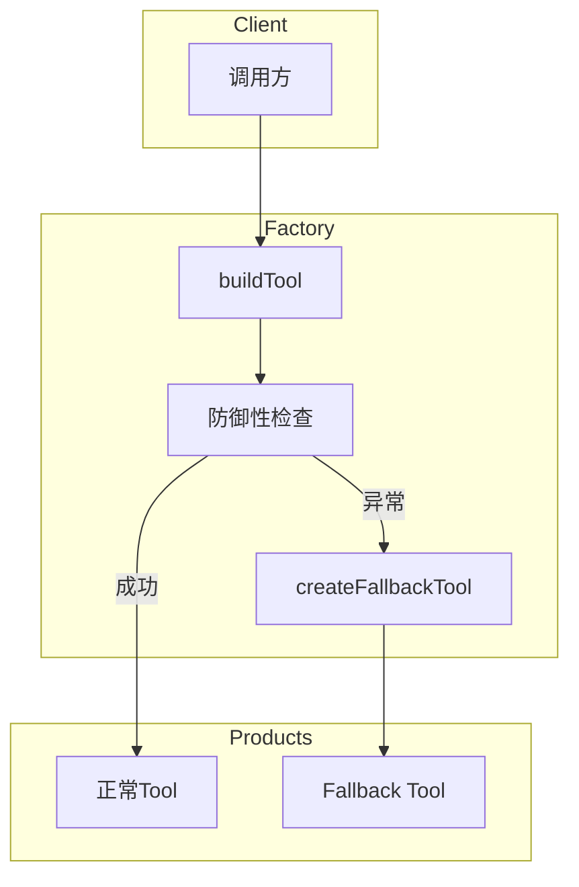
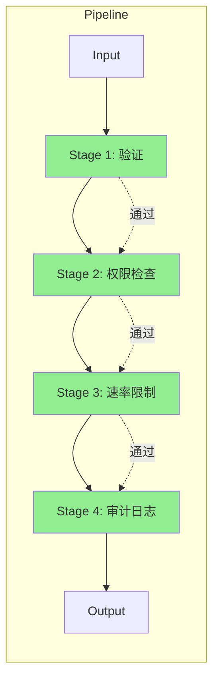
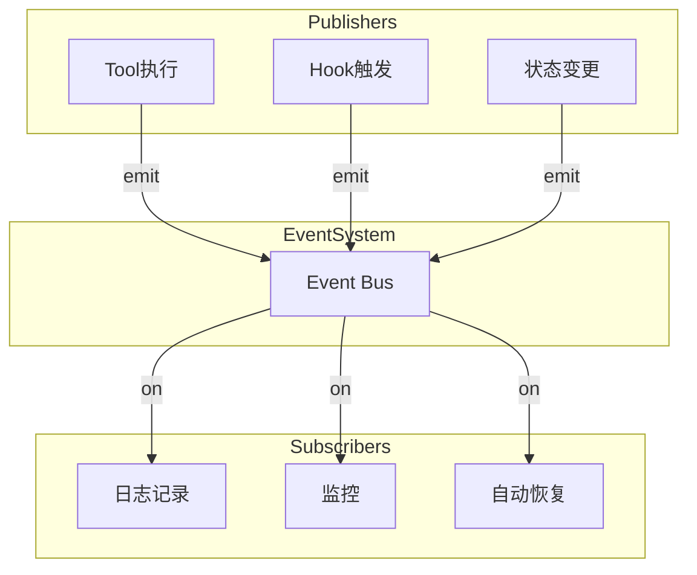
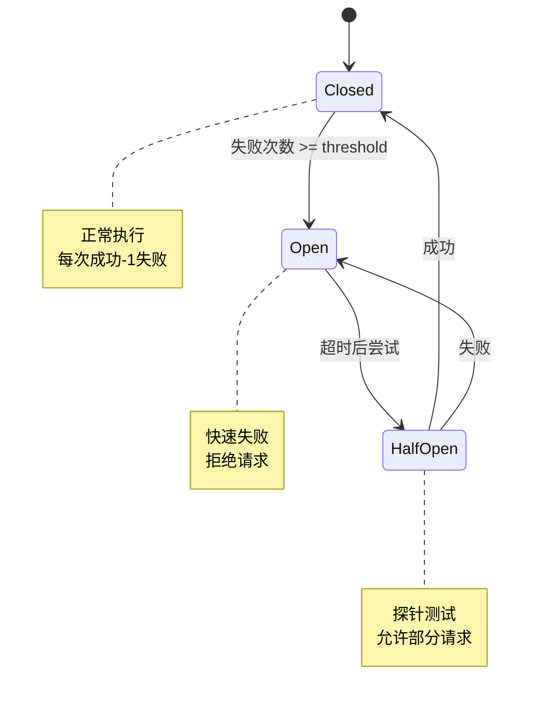
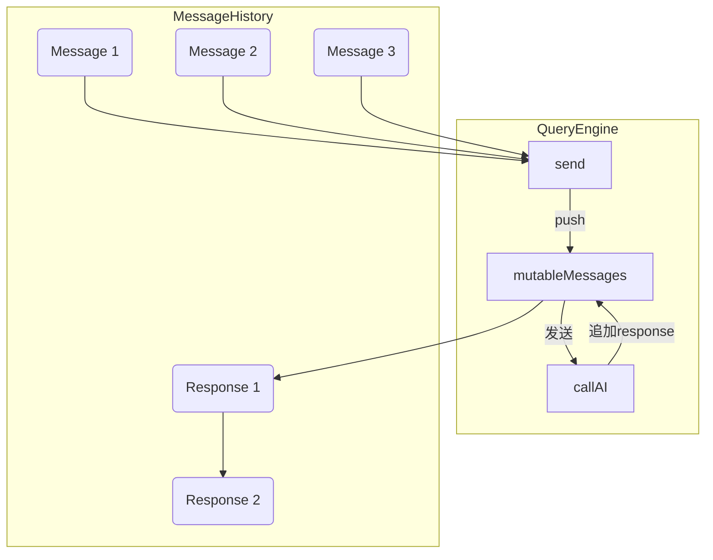
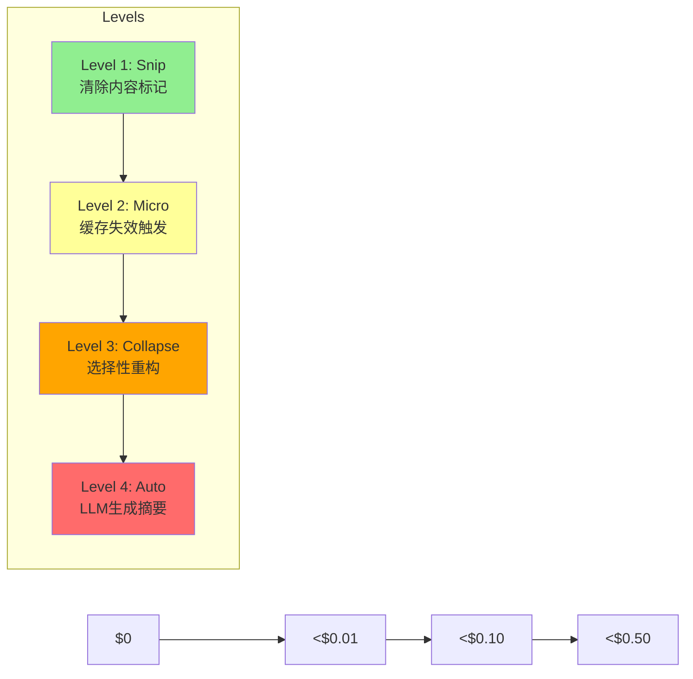
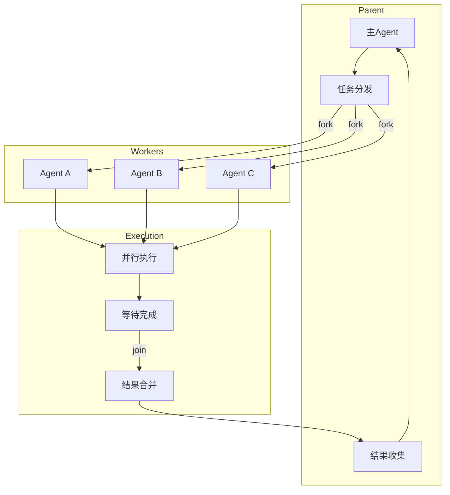
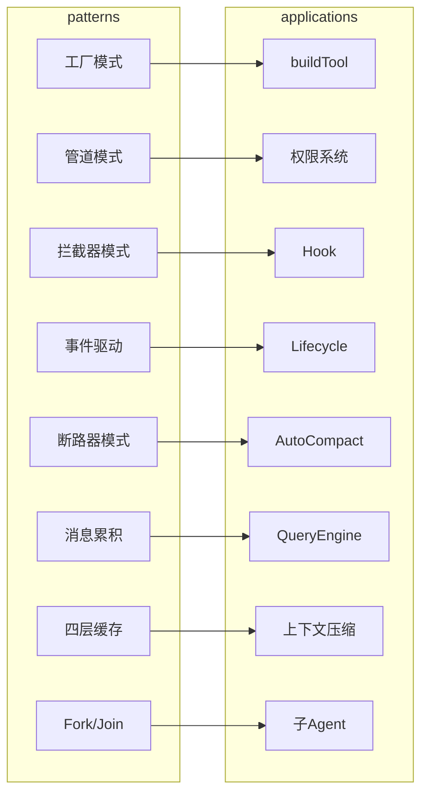
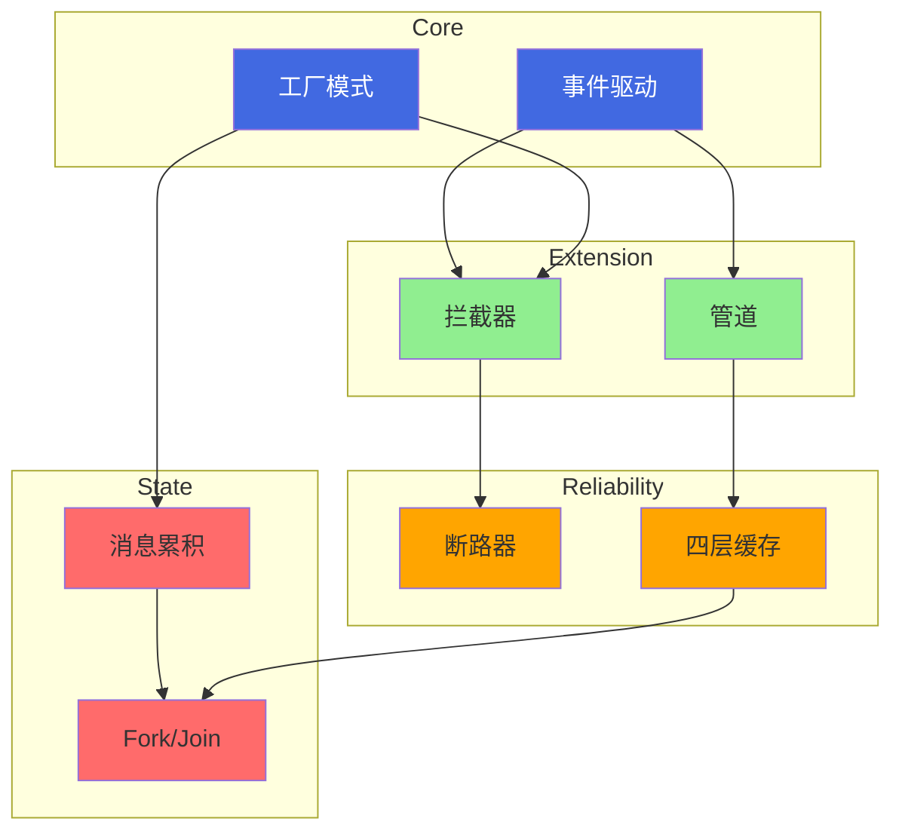

# ♻️ 核心设计模式

## 1. 工厂模式 - buildTool



**要点**：工厂封装了创建细节，调用方无需关心实现。

### 核心代码实现

```typescript
import type { Tool, ToolUseContext, Tools } from 'src/Tool.js'
import type { AssistantMessage } from 'src/types/message.js'
import type { CanUseToolFn } from 'src/hooks/useCanUseTool.js'
import type { PermissionResult } from 'src/types/permissions.js'
import type { ToolProgressData } from 'src/types/tools.js'
import type { z } from 'zod/v4'
import type { AnyObject } from 'src/Tool.js'

/**
 * Tool定义类型 - 与Tool类型相同，但默认方法为可选
 * buildTool会填充这些默认值
 */
type ToolDef<
  Input extends AnyObject = AnyObject,
  Output = unknown,
  P extends ToolProgressData = ToolProgressData,
> = Omit<Tool<Input, Output, P>, 
  'isEnabled' | 'isConcurrencySafe' | 'isReadOnly' | 'isDestructive' | 
  'checkPermissions' | 'toAutoClassifierInput' | 'userFacingName'
> & Partial<Pick<Tool<Input, Output, P>, 
  'isEnabled' | 'isConcurrencySafe' | 'isReadOnly' | 'isDestructive' | 
  'checkPermissions' | 'toAutoClassifierInput' | 'userFacingName'
>>

/**
 * 工具默认值 - fail-closed策略
 * 这些是Tool接口中可选方法的默认实现
 */
const TOOL_DEFAULTS = {
  // 默认启用 - 除非明确禁用
  isEnabled: () => true,
  // 默认非并发安全 - 保守策略
  isConcurrencySafe: (_input?: unknown) => false,
  // 默认非只读 - 假设会修改
  isReadOnly: (_input?: unknown) => false,
  // 默认非破坏性 - 除非明确标记
  isDestructive: (_input?: unknown) => false,
  // 默认允许 - 权限系统会进一步检查
  checkPermissions: (
    input: { [key: string]: unknown },
    _ctx?: ToolUseContext,
  ): Promise<PermissionResult> =>
    Promise.resolve({ behavior: 'allow', updatedInput: input }),
  // 默认跳过分类器 - 安全相关工具需覆盖
  toAutoClassifierInput: (_input?: unknown) => '',
  // 默认使用工具名作为显示名
  userFacingName: (_input?: unknown) => '',
}

/**
 * buildTool工厂函数 - 从部分定义构建完整的Tool
 * 
 * 核心职责：
 * 1. 填充默认值，避免调用方使用?.() ?? default模式
 * 2. 统一默认值位置，便于维护
 * 3. 类型安全地合并用户定义与默认值
 * 
 * @param def - 工具定义（部分属性可省略）
 * @returns 完整的Tool对象
 */
function buildTool<D extends ToolDef<any, any, any>>(def: D): Tool {
  return {
    // 展开所有默认值
    ...TOOL_DEFAULTS,
    // 用户提供的userFacingName默认为工具名
    userFacingName: () => def.name,
    // 展开用户提供的所有属性
    ...def,
  } as Tool
}

/**
 * Fallback工具工厂 - 创建降级工具
 * 当主工具不可用时使用
 */
function createFallbackTool(
  name: string,
  description: string,
  reason: string
): Tool {
  return buildTool({
    name,
    description,
    inputSchema: { type: 'object' } as any,
    maxResultSizeChars: 0,
    prompt: async () => `This tool is unavailable: ${reason}`,
    call: async () => ({
      data: { error: reason },
    }),
    isEnabled: () => false, // 永远禁用
  })
}

/**
 * 使用示例：构建一个文件读取工具
 */
function createFileReadTool(): Tool {
  return buildTool({
    name: 'Read',
    description: 'Read file contents from the filesystem',
    inputSchema: {
      type: 'object',
      properties: {
        file_path: { type: 'string', description: 'Path to file' },
        limit: { type: 'number', description: 'Max lines to read' },
      },
      required: ['file_path'],
    } as any,
    
    // 核心实现
    async call(args, context, canUseTool) {
      const { file_path, limit } = args
      
      // 1. 防御性检查 - 验证输入
      if (!file_path || typeof file_path !== 'string') {
        throw new Error('Invalid file_path')
      }
      
      // 2. 权限检查
      const permission = await canUseTool(this, args, context, null as any)
      if (permission.behavior !== 'allow') {
        return { 
          data: { 
            error: permission.message || 'Permission denied' 
          } 
        }
      }
      
      // 3. 实际读取逻辑（实际代码会更复杂）
      const content = await readFileContent(file_path, limit)
      
      return { data: { content } }
    },
    
    // 可选：覆盖默认实现
    isReadOnly: () => true,
    isConcurrencySafe: (input) => true,
    
    // 用户显示名 - 覆盖默认
    userFacingName: (input) => {
      const path = (input as any)?.file_path || ''
      return `Read ${path.split('/').pop()}`
    },
  })
}

/**
 * 实际源码中的buildTool类型约束
 * 来自 src/Tool.ts:783-792
 */
export function buildTool<D extends AnyToolDef>(def: D): BuiltTool<D> {
  return {
    ...TOOL_DEFAULTS,
    userFacingName: () => def.name,
    ...def,
  } as BuiltTool<D>
}
```

### 使用场景

- **动态工具注册**：根据配置/环境条件创建不同工具
- **测试替身**：创建mock工具进行单元测试
- **功能开关**：通过`isEnabled()`控制工具可用性

### 权衡分析

**优点**：
- 消除重复代码（60+工具共享同一套默认值）
- Fail-closed安全策略统一管理
- 类型安全地合并定义

**缺点**：
- 增加一层间接寻址
- 默认值可能被意外覆盖

### 反模式案例

```typescript
// 反模式：直接在调用处使用默认值
const tool = {
  isEnabled: () => toolDef.isEnabled?.() ?? true,  // 到处重复
  isConcurrencySafe: () => toolDef.isConcurrencySafe?.() ?? false,
  // ...
}

// 正解：使用buildTool统一处理
const tool = buildTool(toolDef)  // 一行解决
```

---

## 2. 管道模式 - 权限系统

> [!note] 管道模式在 QueryEngine 中的应用
> 权限管道的四阶段设计（验证→规则匹配→上下文评估→交互确认）体现了渐进式决策的核心理念，这种模式也应用于 QueryEngine 的工具调用流程。详见 [[../11-QueryEngine/11-01-⚙️-QueryEngine]]。

> [!note]- 关联知识
> [[../03-权限系统/03-01-🔐-权限系统]] - 权限管道设计



### 核心代码实现

```typescript
// 来自 src/utils/permissions/permissions.ts

/**
 * 权限检查管道 - 管道模式的应用
 *
 * 流程：验证 → 权限规则 → 分类器 → 沙箱 → 用户提示
 * 每个阶段职责单一，可独立配置和替换
 */

/**
 * 权限检查入口 - 管道起点
 */
export async function hasPermissionsToUseTool(
  tool: Tool,
  input: unknown,
  context: ToolUseContext,
  assistantMessage: AssistantMessage | null,
  toolUseID?: string,
): Promise<PermissionResult> {
  // 1. 基础验证阶段
  const validationResult = await validateToolInput(tool, input, context)
  if (!validationResult.valid) {
    return {
      behavior: 'deny',
      message: validationResult.message,
    }
  }

  // 2. 权限规则检查
  const ruleResult = await checkPermissionRules(tool, input, context)
  if (ruleResult.behavior !== 'passthrough') {
    return ruleResult
  }

  // 3. 分类器检查（如启用）
  if (feature('TRANSCRIPT_CLASSIFIER')) {
    const classifierResult = await checkClassifierDecision(
      tool, input, context
    )
    if (classifierResult) {
      return classifierResult
    }
  }

  // 4. 沙箱检查
  const sandboxResult = await checkSandboxRequirements(tool, input, context)
  if (sandboxResult.behavior !== 'passthrough') {
    return sandboxResult
  }

  // 5. Yolo模式检查
  if (context.mode === 'bypass') {
    return { behavior: 'allow', updatedInput: input as Record<string, unknown> }
  }

  // 6. 需要用户确认
  return {
    behavior: 'ask',
    pendingClassifierCheck: classifierCheck,
  }
}

/**
 * 权限规则阶段 - 检查预定义的allow/deny规则
 */
async function checkPermissionRules(
  tool: Tool,
  input: unknown,
  context: ToolPermissionContext,
): Promise<PermissionResult> {
  // 获取所有允许规则
  const allowRules = getAllowRules(context)
  
  for (const rule of allowRules) {
    if (matchesPermissionRule(tool, input, rule)) {
      return { 
        behavior: 'allow', 
        updatedInput: input as Record<string, unknown>,
        decisionReason: { type: 'rule', rule }
      }
    }
  }

  // 获取所有拒绝规则
  const denyRules = getDenyRules(context)
  
  for (const rule of denyRules) {
    if (matchesPermissionRule(tool, input, rule)) {
      return { 
        behavior: 'deny', 
        message: `Denied by rule: ${rule.value}`,
        decisionReason: { type: 'rule', rule }
      }
    }
  }

  // 规则未匹配，继续下一阶段
  return { behavior: 'passthrough' }
}

/**
 * 规则匹配器 - 支持通配符和正则
 */
function matchesPermissionRule(
  tool: Tool,
  input: unknown,
  rule: PermissionRule
): boolean {
  // 工具名匹配
  if (!matchesPattern(tool.name, rule.toolPattern)) {
    return false
  }

  // 输入参数匹配
  if (rule.inputPattern && input) {
    return matchesInputPattern(input, rule.inputPattern)
  }

  return true
}

function matchesPattern(value: string, pattern: string): boolean {
  if (pattern.includes('*')) {
    // 通配符匹配
    const regex = new RegExp('^' + pattern.replace(/\*/g, '.*') + '$')
    return regex.test(value)
  }
  return value === pattern
}

/**
 * 子命令结果检查 - Bash管道专用
 */
async function checkSubcommandResults(
  input: unknown,
  context: ToolPermissionContext,
): Promise<PermissionResult> {
  const bashInput = input as { command?: string }
  if (!bashInput.command) {
    return { behavior: 'passthrough' }
  }

  const subcommands = parseSubcommands(bashInput.command)
  const results: PermissionResult[] = []

  for (const subcmd of subcommands) {
    const result = await checkSingleCommand(subcmd, context)
    results.push(result)
  }

  // 汇总结果
  const needsApproval = results.filter(r => 
    r.behavior === 'ask' || r.behavior === 'passthrough'
  )

  if (needsApproval.length === 0) {
    return { behavior: 'allow' }
  }

  if (needsApproval.every(r => r.behavior === 'ask')) {
    return { behavior: 'ask' }
  }

  return { 
    behavior: 'ask',
    decisionReason: {
      type: 'subcommandResults',
      reasons: subcommands.map((cmd, i) => [cmd, results[i]])
    }
  }
}

/**
 * 审计日志 - 记录所有权限决策
 */
function logPermissionDecision(
  decision: PermissionDecision,
  tool: Tool,
  input: unknown,
  context: ToolPermissionContext,
): void {
  logEvent('permission_decision', {
    tool: tool.name,
    behavior: decision.behavior,
    reason: decision.decisionReason?.type,
    mode: context.mode,
    timestamp: Date.now(),
  })
}
```

### 使用场景

- **API请求处理**：验证 → 认证 → 授权 → 业务逻辑
- **文件操作**：路径验证 → 权限检查 → 实际执行
- **多租户系统**：租户隔离 → 资源配额 → 访问控制

### 权衡分析

**优点**：
- 单一职责，每个阶段易于理解和测试
- 可组合、可替换、可复用
- 便于添加新的检查阶段

**缺点**：
- 可能有性能开销（每阶段额外处理）
- 调试时需要跟踪整个管道
- 可能成为瓶颈

### 反模式案例

```typescript
// 反模式：所有逻辑混杂在一个函数中
async function hasPermissions(input) {
  if (!validate(input)) return false
  if (!checkAuth(input)) return false
  if (!checkRateLimit(input)) return false
  if (!checkPermissions(input)) return false
  // ... 1000行后
  return true
}

// 正解：管道模式，每阶段独立
const permissionPipeline = [
  validateStage,
  authStage,
  rateLimitStage,
  permissionStage,
]

async function hasPermissions(input) {
  for (const stage of permissionPipeline) {
    const result = await stage(input)
    if (result !== 'passthrough') return result
  }
  return 'allow'
}
```

**要点**：每个阶段职责单一，可组合、可替换。

---

## 3. 拦截器模式 - Hook

```mermaid
sequenceDiagram
    participant C as Caller
    participant H as withHook
    pre as Pre-Hook
    fn as Core Function
    post as Post-Hook

    C->>H: 调用函数
    H->>pre: emit(beforeEvent)

    alt 有拦截器阻止
        pre-->>H: {blocked: true}
        H-->>C: 返回 blocked
    else 继续执行
        pre-->>H: 允许
        H->>fn: 执行核心逻辑
        fn-->>H: result
        H->>post: emit(afterEvent, result)
        post-->>H: 确认
        H-->>C: 返回 result
    end
```

### 核心代码实现

```typescript
// 来自 src/utils/hooks.ts

/**
 * Hook类型定义 - 用户定义的生命周期钩子
 */

// Hook事件类型
type HookEvent =
  | 'PreToolUse'
  | 'PostToolUse'
  | 'PreCompact'
  | 'PostCompact'
  | 'SessionStart'
  | 'SessionEnd'
  | 'Stop'
  | 'SubagentStart'
  | 'SubagentStop'

/**
 * Hook输入类型 - 传递给Hook的信息
 */
type HookInput = {
  // Hook名称
  hookName: string
  // 触发Hook的工具（如适用）
  tool?: Tool
  // 工具输入参数
  toolInput?: Record<string, unknown>
  // 用户提供的指令
  instructions?: string
}

/**
 * Hook回调 - 同步或异步执行
 */
type HookCallback = (
  input: HookInput,
  abortSignal: AbortSignal
) => HookResult | Promise<HookResult>

/**
 * Hook结果
 */
type HookResult = {
  // 是否阻止操作
  blocked?: boolean
  // 阻止原因
  reason?: string
  // 修改后的输入
  newToolInput?: Record<string, unknown>
  // 自定义指令（用于PreToolUse）
  customInstructions?: string
  // 显示给用户的消息
  userMessage?: string
}

/**
 * Hook执行器 - 管理所有Hook的注册和执行
 */
class HookExecutor {
  private preToolUseHooks: Map<string, HookCallback[]> = new Map()
  private postToolUseHooks: Map<string, HookCallback[]> = new Map()
  private preCompactHooks: HookCallback[] = []
  private postCompactHooks: HookCallback[] = []
  private sessionStartHooks: HookCallback[] = []
  private sessionEndHooks: HookCallback[] = []

  /**
   * 注册Hook
   */
  register(hookName: string, callback: HookCallback): void {
    if (hookName.startsWith('PreToolUse')) {
      const toolPattern = hookName.replace('PreToolUse:', '')
      this.addToMap(this.preToolUseHooks, toolPattern, callback)
    } else if (hookName.startsWith('PostToolUse')) {
      const toolPattern = hookName.replace('PostToolUse:', '')
      this.addToMap(this.postToolUseHooks, toolPattern, callback)
    }
    // ... 其他Hook类型
  }

  private addToMap(map: Map<string, HookCallback[]>, key: string, cb: HookCallback): void {
    const existing = map.get(key) || []
    map.set(key, [...existing, cb])
  }

  /**
   * 执行PreToolUse Hooks
   * 
   * 流程：
   * 1. 找到匹配工具的所有Hook
   * 2. 按优先级顺序执行
   * 3. 任一Hook阻止则停止
   * 4. 聚合所有Hook的修改
   */
  async executePreToolUseHooks(
    tool: Tool,
    toolInput: Record<string, unknown>,
    abortSignal: AbortSignal
  ): Promise<{
    allowed: boolean
    newInput?: Record<string, unknown>
    reason?: string
    customInstructions?: string
  }> {
    const hooks = this.preToolUseHooks.get(tool.name) || []
    const wildcardHooks = this.preToolUseHooks.get('*') || []
    const allHooks = [...wildcardHooks, ...hooks]

    let currentInput = toolInput
    let blockedReason: string | undefined
    let customInstructions: string | undefined

    for (const hook of allHooks) {
      const result = await hook(
        { hookName: `PreToolUse:${tool.name}`, tool, toolInput: currentInput },
        abortSignal
      )

      if (result.blocked) {
        return {
          allowed: false,
          reason: result.reason || `Blocked by hook`,
        }
      }

      // 聚合修改
      if (result.newToolInput) {
        currentInput = result.newToolInput
      }
      if (result.customInstructions) {
        customInstructions = result.customInstructions
      }
    }

    return {
      allowed: true,
      newInput: currentInput,
      customInstructions,
    }
  }

  /**
   * 执行PostToolUse Hooks
   */
  async executePostToolUseHooks(
    tool: Tool,
    toolInput: Record<string, unknown>,
    toolResult: unknown,
    abortSignal: AbortSignal
  ): Promise<void> {
    const hooks = this.postToolUseHooks.get(tool.name) || []
    const wildcardHooks = this.postToolUseHooks.get('*') || []
    const allHooks = [...wildcardHooks, ...hooks]

    for (const hook of allHooks) {
      await hook(
        { hookName: `PostToolUse:${tool.name}`, tool, toolInput },
        abortSignal
      )
    }
  }
}

/**
 * PreToolUse Hook执行 - 拦截工具调用
 */
export async function executePreToolUseHooks(
  context: ToolUseContext,
  tool: Tool,
  input: Record<string, unknown>,
  signal: AbortSignal
): Promise<HookResult> {
  const { toolPermissionContext, agentId } = context

  // 获取会话级Hook
  const sessionHooks = getSessionHooks()
  const matchingPreHooks = sessionHooks.filter(h => 
    h.type === 'pre_tool_use' && matchesToolPattern(h.toolName, tool.name)
  )

  // 执行Hook循环
  for (const hook of matchingPreHooks) {
    const result = await execHook(hook, {
      hookName: `PreToolUse:${tool.name}`,
      tool,
      toolInput: input,
      agentId,
    }, signal)

    if (result.blocked) {
      // 记录阻止事件
      logEvent('hook_blocked', {
        hookName: hook.name,
        tool: tool.name,
        reason: result.reason,
      })
      return result
    }

    // 聚合输入修改
    if (result.newToolInput) {
      input = result.newToolInput
    }
  }

  return { allowed: true, newInput: input }
}

/**
 * Hook执行器 - 处理同步/异步Hook
 */
async function execHook(
  hook: Hook,
  input: HookInput,
  signal: AbortSignal
): Promise<HookResult> {
  // 支持shell命令Hook
  if (hook.type === 'command') {
    return execShellHook(hook.command, input, signal)
  }

  // 支持HTTP Hook
  if (hook.type === 'http') {
    return execHttpHook(hook.url, hook.method, input, signal)
  }

  // 支持函数Hook
  if (hook.type === 'function') {
    return hook.callback(input, signal)
  }

  return { allowed: true }
}

/**
 * 拦截器应用示例：权限Hook
 */
const permissionHook: HookCallback = async (input, signal) => {
  const { tool, toolInput } = input

  // 检查敏感操作
  if (tool.name === 'Bash') {
    const command = (toolInput as any).command
    if (command.includes('rm -rf')) {
      return {
        blocked: true,
        reason: 'Dangerous rm -rf command blocked by hook'
      }
    }
  }

  // 检查文件路径
  if (tool.name === 'Write' || tool.name === 'Edit') {
    const filePath = (toolInput as any).file_path
    if (isProtectedPath(filePath)) {
      return {
        blocked: true,
        reason: `Cannot modify protected path: ${filePath}`
      }
    }
  }

  return { blocked: false }
}
```

### 使用场景

- **安全拦截**：在执行危险操作前进行检查
- **日志记录**：记录所有操作及结果
- **性能监控**：测量操作执行时间
- **动态修改**：在执行前修改输入参数

### 权衡分析

**优点**：
- 无侵入性增强行为
- 可动态注册/注销
- 支持同步/异步执行

**缺点**：
- 调用栈变深，调试困难
- 可能影响性能（每个操作执行多个Hook）
- 状态管理复杂度增加

### 反模式案例

```typescript
// 反模式：Hook中执行阻塞操作
const slowHook: HookCallback = async (input) => {
  await sleep(5000)  // 阻塞5秒
  return { blocked: false }
}

// 正解：Hook应快速执行，异步处理重操作
const efficientHook: HookCallback = async (input) => {
  // 快速检查
  if (needsAsyncWork) {
    // 在后台队列中处理
    enqueueAsyncWork(input)
    return { blocked: false }
  }
  return { blocked: false }
}
```

**要点**：在不修改核心逻辑的情况下增强行为。

> [!note]- 关联知识
> [[../04-Hook系统/04-01-🪝-Hook系统]] - 拦截器模式实现

---

## 4. 事件驱动 - Lifecycle



### 核心代码实现

```typescript
// 来自 src/utils/telemetry/events.ts 及相关模块

/**
 * 事件系统 - 解耦发布/订阅
 * 
 * 核心组件：
 * 1. EventEmitter：事件发射器
 * 2. 事件总线：集中管理所有事件
 * 3. 订阅者：监听特定事件
 */

// 事件类型定义
type TelemetryEvent = {
  name: string
  properties: Record<string, unknown>
  timestamp: number
  traceId?: string
  spanId?: string
}

/**
 * 事件发射器 - 发布事件到事件总线
 */
class TelemetryEmitter {
  private events: TelemetryEvent[] = []
  private listeners: Map<string, ((event: TelemetryEvent) => void)[]> = new Map()

  /**
   * 发射事件
   */
  emit(event: TelemetryEvent): void {
    this.events.push(event)
    
    // 通知所有订阅者
    const listeners = this.listeners.get(event.name) || []
    for (const listener of listeners) {
      try {
        listener(event)
      } catch (e) {
        // 订阅者错误不应中断主流程
        logError(e)
      }
    }
  }

  /**
   * 订阅事件
   */
  on(eventName: string, callback: (event: TelemetryEvent) => void): () => void {
    const listeners = this.listeners.get(eventName) || []
    listeners.push(callback)
    this.listeners.set(eventName, listeners)

    // 返回取消订阅函数
    return () => {
      const current = this.listeners.get(eventName) || []
      const filtered = current.filter(l => l !== callback)
      this.listeners.set(eventName, filtered)
    }
  }

  /**
   * 一次性订阅
   */
  once(eventName: string, callback: (event: TelemetryEvent) => void): void {
    const wrapper = (event: TelemetryEvent) => {
      callback(event)
      this.off(eventName, wrapper)
    }
    this.on(eventName, wrapper)
  }
}

// 全局事件发射器实例
const telemetryEmitter = new TelemetryEmitter()

/**
 * Lifecycle事件 - 贯穿整个会话生命周期
 */

// 会话启动事件
type SessionStartEvent = {
  type: 'session_start'
  sessionId: string
  model: string
  timestamp: number
}

// Hook开始事件
type HookStartEvent = {
  type: 'hook_start'
  hookType: 'pre_tool_use' | 'post_tool_use' | 'pre_compact' | 'post_compact'
  hookName: string
  timestamp: number
}

// Hook结束事件
type HookEndEvent = {
  type: 'hook_end'
  hookType: string
  durationMs: number
  timestamp: number
}

// 工具使用开始事件
type ToolUseStartEvent = {
  type: 'tool_use_start'
  toolName: string
  input: Record<string, unknown>
  timestamp: number
}

// 工具使用结束事件
type ToolUseEndEvent = {
  type: 'tool_use_end'
  toolName: string
  durationMs: number
  success: boolean
  timestamp: number
}

// 压缩开始事件
type CompactStartEvent = {
  type: 'compact_start'
  trigger: 'auto' | 'manual'
  preCompactTokenCount: number
  timestamp: number
}

// 压缩结束事件
type CompactEndEvent = {
  type: 'compact_end'
  postCompactTokenCount: number
  savedTokens: number
  timestamp: number
}

/**
 * 事件发射助手 - 简化常见事件发射
 */
function emitHookStarted(hookType: string, hookName: string): void {
  telemetryEmitter.emit({
    name: 'hook_start',
    properties: { hookType, hookName },
    timestamp: Date.now(),
  })
}

function emitHookEnded(hookType: string, durationMs: number): void {
  telemetryEmitter.emit({
    name: 'hook_end',
    properties: { hookType, durationMs },
    timestamp: Date.now(),
  })
}

function emitToolUseStart(toolName: string, input: Record<string, unknown>): void {
  telemetryEmitter.emit({
    name: 'tool_use_start',
    properties: { toolName, input },
    timestamp: Date.now(),
  })
}

function emitToolUseEnd(
  toolName: string,
  durationMs: number,
  success: boolean
): void {
  telemetryEmitter.emit({
    name: 'tool_use_end',
    properties: { toolName, durationMs, success },
    timestamp: Date.now(),
  })
}

/**
 * 订阅者示例：日志记录器
 */
function setupLoggingSubscriber(): void {
  telemetryEmitter.on('hook_start', (event) => {
    logForDebugging(`Hook started: ${event.properties.hookName}`)
  })

  telemetryEmitter.on('hook_end', (event) => {
    logForDebugging(
      `Hook ended: ${event.properties.hookType} (${event.properties.durationMs}ms)`
    )
  })

  telemetryEmitter.on('tool_use_start', (event) => {
    logForDebugging(`Tool started: ${event.properties.toolName}`)
  })

  telemetryEmitter.on('tool_use_end', (event) => {
    const { toolName, durationMs, success } = event.properties
    logForDebugging(
      `Tool ended: ${toolName} - ${success ? 'success' : 'failed'} (${durationMs}ms)`
    )
  })
}

/**
 * 订阅者示例：性能监控
 */
function setupPerformanceMonitor(): void {
  const durations: Map<string, number[]> = new Map()

  telemetryEmitter.on('tool_use_end', (event) => {
    const toolName = event.properties.toolName as string
    const durationMs = event.properties.durationMs as number
    
    const existing = durations.get(toolName) || []
    existing.push(durationMs)
    durations.set(toolName, existing)
  })

  // 计算平均执行时间
  function getAverageDuration(toolName: string): number {
    const times = durations.get(toolName) || []
    if (times.length === 0) return 0
    return times.reduce((a, b) => a + b, 0) / times.length
  }
}

/**
 * 订阅者示例：自动恢复
 */
function setupAutoRecovery(): void {
  telemetryEmitter.on('tool_use_end', async (event) => {
    const { toolName, success } = event.properties
    
    if (!success && shouldRetry(toolName)) {
      // 触发自动重试
      await delay(1000)  // 等待1秒
      logForDebugging(`Auto-retry triggered for: ${toolName}`)
      // 重试逻辑
    }
  })
}

/**
 * 事件在压缩流程中的应用
 */
async function compactConversationWithEvents(
  messages: Message[],
  context: ToolUseContext,
  // ...
): Promise<CompactionResult> {
  // 发射压缩开始事件
  telemetryEmitter.emit({
    name: 'compact_start',
    properties: { 
      trigger: isAutoCompact ? 'auto' : 'manual',
      preCompactTokenCount: tokenCountWithEstimation(messages)
    },
    timestamp: Date.now(),
  })

  try {
    // 执行PreCompact Hooks
    telemetryEmitter.emit({
      name: 'hook_start',
      properties: { hookType: 'pre_compact' },
      timestamp: Date.now(),
    })

    const hookResult = await executePreCompactHooks(
      { trigger: isAutoCompact ? 'auto' : 'manual' },
      context.abortController.signal
    )

    telemetryEmitter.emit({
      name: 'hook_end',
      properties: { hookType: 'pre_compact', durationMs: 0 },
      timestamp: Date.now(),
    })

    // 执行压缩...
    const result = await doCompact(messages, context)

    // 发射压缩结束事件
    telemetryEmitter.emit({
      name: 'compact_end',
      properties: {
        postCompactTokenCount: result.truePostCompactTokenCount,
        savedTokens: preCompactTokenCount - result.truePostCompactTokenCount,
      },
      timestamp: Date.now(),
    })

    return result
  } catch (error) {
    // 发射错误事件
    telemetryEmitter.emit({
      name: 'compact_error',
      properties: { error: String(error) },
      timestamp: Date.now(),
    })
    throw error
  }
}
```

### 使用场景

- **日志记录**：解耦日志系统和业务逻辑
- **性能监控**：独立收集性能指标
- **错误追踪**：捕获并记录错误
- **自动恢复**：响应失败事件触发重试

### 权衡分析

**优点**：
- 高度解耦，发布者和订阅者互不感知
- 支持多个订阅者
- 易于添加新的订阅者

**缺点**：
- 事件流可能变得复杂
- 调试困难（难以追踪事件流）
- 可能导致内存泄漏（未取消订阅）

### 反模式案例

```typescript
// 反模式：订阅后不取消订阅
function setup() {
  emitter.on('data', (data) => {
    // 处理数据
  })
  // 组件卸载时不清理，导致内存泄漏
}

// 正解：保存取消订阅函数
function setup() {
  const unsubscribe = emitter.on('data', handler)
  return () => unsubscribe()  // 卸载时调用
}
```

**要点**：解耦订阅者和发布者。

---

## 5. 断路器模式 - AutoCompact



### 核心代码实现

```typescript
// 来自 src/services/compact/autoCompact.ts

/**
 * 自动压缩跟踪状态
 * 包含断路器所需的失败计数
 */
export type AutoCompactTrackingState = {
  compacted: boolean
  turnCounter: number
  turnId: string
  // 连续失败次数，成功后重置
  // 用于断路器：当上下文无限超过限制时停止重试
  consecutiveFailures?: number
}

// 断路器阈值：连续失败3次后停止尝试
// 统计显示：1,279个会话在单次会话中有50+次连续失败
// 每天浪费约250K API调用
const MAX_CONSECUTIVE_AUTOCOMPACT_FAILURES = 3

/**
 * 断路器核心逻辑：检查是否应该跳过压缩
 * 
 * 当连续失败次数达到阈值时：
 * 1. 不再尝试自动压缩
 * 2. 避免对已超限的上下文浪费API调用
 * 3. 用户仍可通过手动 /compact 尝试
 */
export async function autoCompactIfNeeded(
  messages: Message[],
  toolUseContext: ToolUseContext,
  cacheSafeParams: CacheSafeParams,
  querySource?: QuerySource,
  tracking?: AutoCompactTrackingState,
  snipTokensFreed?: number,
): Promise<{
  wasCompacted: boolean
  compactionResult?: CompactionResult
  consecutiveFailures?: number
}> {
  // 1. 断路器检查：超过阈值直接返回
  if (
    tracking?.consecutiveFailures !== undefined &&
    tracking.consecutiveFailures >= MAX_CONSECUTIVE_AUTOCOMPACT_FAILURES
  ) {
    return { wasCompacted: false }
  }

  // 2. 检查是否需要压缩
  const shouldCompact = await shouldAutoCompact(
    messages,
    model,
    querySource,
    snipTokensFreed,
  )

  if (!shouldCompact) {
    return { wasCompacted: false }
  }

  // 3. 尝试压缩
  try {
    const compactionResult = await compactConversation(
      messages,
      toolUseContext,
      cacheSafeParams,
      true, // 抑制用户问题
      undefined, // 无自定义指令
      true, // 是自动压缩
      recompactionInfo,
    )

    return {
      wasCompacted: true,
      compactionResult,
      // 成功时重置失败计数
      consecutiveFailures: 0,
    }
  } catch (error) {
    // 4. 失败时增加计数
    const prevFailures = tracking?.consecutiveFailures ?? 0
    const nextFailures = prevFailures + 1
    
    if (nextFailures >= MAX_CONSECUTIVE_AUTOCOMPACT_FAILURES) {
      logForDebugging(
        `autocompact: circuit breaker tripped after ${nextFailures} consecutive failures`
      )
    }
    
    return { 
      wasCompacted: false, 
      consecutiveFailures: nextFailures 
    }
  }
}

/**
 * 阈值判断逻辑 - 计算压缩触发点
 * 
 * 成本层级：
 * - 警告阈值 (WARNING_THRESHOLD_BUFFER_TOKENS): 20,000
 * - 自动压缩阈值 (AUTOCOMPACT_BUFFER_TOKENS): 13,000
 * - 阻塞限制 (MANUAL_COMPACT_BUFFER_TOKENS): 3,000
 */
export const AUTOCOMPACT_BUFFER_TOKENS = 13_000
export const WARNING_THRESHOLD_BUFFER_TOKENS = 20_000
export const MANUAL_COMPACT_BUFFER_TOKENS = 3_000

export function getAutoCompactThreshold(model: string): number {
  const effectiveContextWindow = getEffectiveContextWindowSize(model)
  return effectiveContextWindow - AUTOCOMPACT_BUFFER_TOKENS
}

export function calculateTokenWarningState(
  tokenUsage: number,
  model: string,
): {
  percentLeft: number
  isAboveWarningThreshold: boolean
  isAboveErrorThreshold: boolean
  isAboveAutoCompactThreshold: boolean
  isAtBlockingLimit: boolean
} {
  const threshold = isAutoCompactEnabled()
    ? getAutoCompactThreshold(model)
    : getEffectiveContextWindowSize(model)

  const percentLeft = Math.max(0, Math.round(((threshold - tokenUsage) / threshold) * 100))

  const warningThreshold = threshold - WARNING_THRESHOLD_BUFFER_TOKENS
  const errorThreshold = threshold - ERROR_THRESHOLD_BUFFER_TOKENS

  return {
    percentLeft,
    isAboveWarningThreshold: tokenUsage >= warningThreshold,
    isAboveErrorThreshold: tokenUsage >= errorThreshold,
    isAboveAutoCompactThreshold: tokenUsage >= threshold,
    isAtBlockingLimit: tokenUsage >= threshold - MANUAL_COMPACT_BUFFER_TOKENS,
  }
}
```

### 使用场景

- **API调用限流**：防止向不可恢复的API重复发送请求
- **服务降级**：快速失败而非无限等待
- **资源保护**：避免在注定失败的操作上消耗资源

### 权衡分析

**优点**：
- 防止级联失败
- 节省API调用成本（每天约250K次）
- 快速失败改善用户体验

**缺点**：
- 可能过早触发（网络抖动导致）
- 需要合理的阈值配置

### 反模式案例

```typescript
// 反模式：无断路器的无限重试
async function compress() {
  while (true) {  // 可能永远循环
    try {
      return await compactConversation(messages)
    } catch (e) {
      // 只记录，不停止
      logError(e)
    }
  }
}

// 正解：带断路器的有限重试
async function compressWithBreaker(tracking) {
  if (tracking.consecutiveFailures >= MAX_FAILURES) {
    return { wasCompacted: false }
  }
  try {
    return await compactConversation(messages)
  } catch (e) {
    return { 
      wasCompacted: false, 
      consecutiveFailures: tracking.consecutiveFailures + 1 
    }
  }
}
```

**要点**：防止级联失败，快速失败而非无限重试。

---

## 6. 消息累积模式 - QueryEngine



### 核心代码实现

```typescript
// 来自 src/services/SessionMemory/sessionMemory.ts

/**
 * 会话内存模块 - 消息累积模式的应用
 * 
 * 功能：
 * 1. 自动维护会话期间的markdown笔记
 * 2. 使用fork子agent周期性地提取关键信息
 * 3. 不中断主对话流程
 */

// 模块级状态 - 跨调用保持
let lastMemoryMessageUuid: string | undefined

/**
 * 消息累积器 - 跟踪工具调用次数
 * 用于判断是否应该触发记忆提取
 */
function countToolCallsSince(
  messages: Message[],
  sinceUuid: string | undefined,
): number {
  let toolCallCount = 0
  let foundStart = sinceUuid === null || sinceUuid === undefined

  for (const message of messages) {
    if (!foundStart) {
      if (message.uuid === sinceUuid) {
        foundStart = true
      }
      continue
    }

    if (message.type === 'assistant') {
      const content = message.message.content
      if (Array.isArray(content)) {
        // 统计tool_use块数量
        toolCallCount += count(content, block => block.type === 'tool_use')
      }
    }
  }

  return toolCallCount
}

/**
 * 判断是否应该提取会话记忆
 * 
 * 触发条件（需同时满足）：
 * 1. Token阈值：上下文中增长的token数达到阈值
 * 2. 工具调用阈值：自上次提取以来的工具调用数达到阈值
 * 3. 安全检查：最后的assistant turn没有工具调用（自然对话断点）
 */
export function shouldExtractMemory(messages: Message[]): boolean {
  // 1. 检查是否满足初始化阈值
  const currentTokenCount = tokenCountWithEstimation(messages)
  if (!isSessionMemoryInitialized()) {
    if (!hasMetInitializationThreshold(currentTokenCount)) {
      return false
    }
    markSessionMemoryInitialized()
  }

  // 2. 检查Token增长阈值
  const hasMetTokenThreshold = hasMetUpdateThreshold(currentTokenCount)

  // 3. 检查工具调用阈值
  const toolCallsSinceLastUpdate = countToolCallsSince(
    messages,
    lastMemoryMessageUuid,
  )
  const hasMetToolCallThreshold =
    toolCallsSinceLastUpdate >= getToolCallsBetweenUpdates()

  // 4. 检查最后的assistant turn是否安全（无待处理工具调用）
  const hasToolCallsInLastTurn = hasToolCallsInLastAssistantTurn(messages)

  // 触发条件：
  // (Token阈值 AND 工具调用阈值) OR (Token阈值 AND 自然断点)
  const shouldExtract =
    (hasMetTokenThreshold && hasMetToolCallThreshold) ||
    (hasMetTokenThreshold && !hasToolCallsInLastTurn)

  // 更新最后消息UUID
  if (shouldExtract) {
    const lastMessage = messages[messages.length - 1]
    if (lastMessage?.uuid) {
      lastMemoryMessageUuid = lastMessage.uuid
    }
    return true
  }

  return false
}

/**
 * 会话内存提取器 - sequential确保串行执行
 * 防止并发提取导致状态混乱
 */
const extractSessionMemory = sequential(async function (
  context: REPLHookContext,
): Promise<void> {
  const { messages, toolUseContext, querySource } = context

  // 仅在主REPL线程运行
  if (querySource !== 'repl_main_thread') {
    return
  }

  // 门控检查（非阻塞缓存）
  if (!isSessionMemoryGateEnabled()) {
    return
  }

  // 初始化配置（惰性，单例）
  initSessionMemoryConfigIfNeeded()

  if (!shouldExtractMemory(messages)) {
    return
  }

  markExtractionStarted()

  // 设置会话内存文件
  const { memoryPath, currentMemory } =
    await setupSessionMemoryFile(toolUseContext)

  // 构建提取提示词
  const userPrompt = await buildSessionMemoryUpdatePrompt(
    currentMemory,
    memoryPath,
  )

  // 使用forked agent运行提取
  // runForkedAgent创建隔离上下文，防止修改父状态
  await runForkedAgent({
    promptMessages: [createUserMessage({ content: userPrompt })],
    cacheSafeParams: createCacheSafeParams(context),
    canUseTool: createMemoryFileCanUseTool(memoryPath),
    querySource: 'session_memory',
    forkLabel: 'session_memory',
    overrides: { readFileState: setupContext.readFileState },
  })

  // 更新最后摘要消息ID
  updateLastSummarizedMessageIdIfSafe(messages)

  markExtractionCompleted()
})

/**
 * 内存提取后的安全更新
 * 仅在无待处理工具调用时更新
 */
function updateLastSummarizedMessageIdIfSafe(messages: Message[]): void {
  if (!hasToolCallsInLastAssistantTurn(messages)) {
    const lastMessage = messages[messages.length - 1]
    if (lastMessage?.uuid) {
      setLastSummarizedMessageId(lastMessage.uuid)
    }
  }
}
```

### 状态管理详解

```typescript
/**
 * 模块级可变状态
 * 这些状态在函数调用之间保持
 */

// 1. 最后记忆消息的UUID - 用于计算工具调用增量
let lastMemoryMessageUuid: string | undefined

// 2. 会话内存配置 - 惰性初始化，单例模式
const initSessionMemoryConfigIfNeeded = memoize(() => {
  const remoteConfig = getSessionMemoryRemoteConfig()
  const config: SessionMemoryConfig = {
    minimumMessageTokensToInit: remoteConfig.minimumMessageTokensToInit || 5000,
    minimumTokensBetweenUpdate: remoteConfig.minimumTokensBetweenUpdate || 2000,
    toolCallsBetweenUpdates: remoteConfig.toolCallsBetweenUpdates || 10,
  }
  setSessionMemoryConfig(config)
})

// 3. 提取频率日志记录
let hasLoggedGateFailure = false
```

### 使用场景

- **多轮对话**：累积上下文，保持对话连贯性
- **长程记忆**：跨会话保持重要信息
- **增量处理**：定期总结，避免上下文膨胀

### 权衡分析

**优点**：
- 保持对话历史完整
- 增量处理减少每次处理的数据量
- 异步处理不阻塞主流程

**缺点**：
- 状态管理复杂度增加
- 可能有竞态条件（sequential包装解决）
- 内存占用随时间增长

### 反模式案例

```typescript
// 反模式：每次调用创建新实例，状态丢失
async function send(message) {
  const messages = []  // 每次都是新的
  messages.push(message)
  return await callAI(messages)
}

// 正解：使用实例级状态
class QueryEngine {
  private mutableMessages: Message[] = []
  
  async send(message: Message) {
    this.mutableMessages.push(message)
    const response = await this.callAI(this.mutableMessages)
    this.mutableMessages.push(response)
    return response
  }
}
```

**要点**：跨调用保持状态。

---

## 7. 四层缓存 - 上下文压缩



| 级别 | 策略 | 成本 |
-----|------|-----|
| L1 Snip | 清除内容标记 | 0 |
| L2 Micro | 缓存失效触发 | 极低 |
| L3 Collapse | 选择性重构 | 中 |
| L4 Auto | LLM生成摘要 | 高 |

### 四层缓存代码实现

```typescript
// 来自 src/services/compact/compact.ts 及相关模块

/**
 * L1 Snip - 清除内容标记（零成本）
 * 
 * 策略：直接移除图片/文档块，替换为文本标记
 * 适用场景：上下文即将超限时
 * 成本：$0
 */
export function stripImagesFromMessages(messages: Message[]): Message[] {
  return messages.map(message => {
    if (message.type !== 'user') {
      return message
    }

    const content = message.message.content
    if (!Array.isArray(content)) {
      return message
    }

    let hasMediaBlock = false
    const newContent = content.flatMap(block => {
      if (block.type === 'image') {
        hasMediaBlock = true
        return [{ type: 'text' as const, text: '[image]' }]
      }
      if (block.type === 'document') {
        hasMediaBlock = true
        return [{ type: 'text' as const, text: '[document]' }]
      }
      // 同样处理嵌套在tool_result中的媒体
      if (block.type === 'tool_result' && Array.isArray(block.content)) {
        let toolHasMedia = false
        const newToolContent = block.content.map(item => {
          if (item.type === 'image') {
            toolHasMedia = true
            return { type: 'text' as const, text: '[image]' }
          }
          if (item.type === 'document') {
            toolHasMedia = true
            return { type: 'text' as const, text: '[document]' }
          }
          return item
        })
        if (toolHasMedia) {
          hasMediaBlock = true
          return [{ ...block, content: newToolContent }]
        }
      }
      return [block]
    })

    if (!hasMediaBlock) {
      return message
    }

    return {
      ...message,
      message: {
        ...message.message,
        content: newContent,
      },
    } as typeof message
  })
}

/**
 * L2 Micro - 缓存失效触发（极低成本）
 * 
 * 策略：通过prompt cache break detection检测缓存失效
 * 触发条件：缓存前缀发生变化
 * 成本：极低（仅检测）
 */

// 来自 src/services/api/promptCacheBreakDetection.ts
export function notifyCompaction(
  querySource: string,
  agentId: AgentId | undefined
): void {
  // 重置缓存读取基线
  // 使得压缩后的上下文下降不会触发误报的缓存断裂
  resetCacheReadBaseline()
}

/**
 * L3 Collapse - 选择性重构（中成本）
 * 
 * 策略：保留关键文件，清除不重要的文件状态
 * 工具：readFileState缓存清理
 */
export async function createPostCompactFileAttachments(
  readFileState: Record<string, { content: string; timestamp: number }>,
  toolUseContext: ToolUseContext,
  maxFiles: number = 5,
): Promise<AttachmentMessage[]> {
  const recentFiles = Object.entries(readFileState)
    .map(([filename, state]) => ({ filename, ...state }))
    .filter(file => !shouldExcludeFromPostCompactRestore(file.filename))
    .sort((a, b) => b.timestamp - a.timestamp)  // 按最近访问排序
    .slice(0, maxFiles)  // 只保留最近的N个

  // 生成文件附件
  return Promise.all(
    recentFiles.map(async file => {
      const attachment = await generateFileAttachment(
        file.filename,
        { ...toolUseContext, fileReadingLimits: { maxTokens: 5000 } },
        'post_compact_file_restore',
        'post_compact_file_error',
      )
      return attachment ? createAttachmentMessage(attachment) : null
    })
  )
}

// 需要保留的文件类型
function shouldExcludeFromPostCompactRestore(filename: string): boolean {
  const normalizedFilename = expandPath(filename)
  // 排除plan文件
  if (isPlanFile(normalizedFilename)) return true
  // 排除所有memory文件
  if (isMemoryFile(normalizedFilename)) return true
  return false
}

/**
 * L4 Auto - LLM生成摘要（高成本）
 * 
 * 策略：调用LLM生成对话摘要
 * 触发条件：上下文超过阈值
 * 成本：约$0.10-$0.50每次
 */
export async function compactConversation(
  messages: Message[],
  context: ToolUseContext,
  cacheSafeParams: CacheSafeParams,
  suppressFollowUpQuestions: boolean,
  customInstructions?: string,
  isAutoCompact: boolean = false,
  recompactionInfo?: RecompactionInfo,
): Promise<CompactionResult> {
  const preCompactTokenCount = tokenCountWithEstimation(messages)

  // 1. 执行PreCompact hooks
  context.onCompactProgress?.({ type: 'hooks_start', hookType: 'pre_compact' })
  const hookResult = await executePreCompactHooks({
    trigger: isAutoCompact ? 'auto' : 'manual',
    customInstructions: customInstructions ?? null,
  }, context.abortController.signal)

  // 2. 调用LLM生成摘要
  const compactPrompt = getCompactPrompt(customInstructions)
  const summaryRequest = createUserMessage({ content: compactPrompt })

  const summaryResponse = await streamCompactSummary({
    messages,
    summaryRequest,
    appState: context.getAppState(),
    context,
    preCompactTokenCount,
    cacheSafeParams,
  })

  const summary = getAssistantMessageText(summaryResponse)

  // 3. 清理文件状态缓存
  context.readFileState.clear()

  // 4. 生成边界标记和摘要消息
  const boundaryMarker = createCompactBoundaryMessage(
    isAutoCompact ? 'auto' : 'manual',
    preCompactTokenCount,
    messages.at(-1)?.uuid,
  )

  const summaryMessages = [
    createUserMessage({
      content: getCompactUserSummaryMessage(summary, suppressFollowUpQuestions),
      isCompactSummary: true,
      isVisibleInTranscriptOnly: true,
    }),
  ]

  return {
    boundaryMarker,
    summaryMessages,
    attachments: postCompactFileAttachments,
    hookResults: hookMessages,
    preCompactTokenCount,
    truePostCompactTokenCount,
    compactionUsage,
  }
}

/**
 * 渐进式压缩决策
 */
export async function shouldAutoCompact(
  messages: Message[],
  model: string,
  querySource?: QuerySource,
  snipTokensFreed = 0,
): Promise<boolean> {
  // 1. 递归守卫：子agent不触发
  if (querySource === 'session_memory' || querySource === 'compact') {
    return false
  }

  // 2. 检查是否启用
  if (!isAutoCompactEnabled()) {
    return false
  }

  // 3. 计算token使用量（减去snip已释放的）
  const tokenCount = tokenCountWithEstimation(messages) - snipTokensFreed
  const threshold = getAutoCompactThreshold(model)

  logForDebugging(
    `autocompact: tokens=${tokenCount} threshold=${threshold}`
  )

  return tokenCount >= threshold
}
```

### 各层对比

| 层级 | 触发条件 | 处理方式 | Token节省 | API调用 | 成本 |
|------|----------|----------|-----------|---------|------|
| L1 Snip | 手动/snip命令 | 清除媒体标记 | ~10-30% | 无 | $0 |
| L2 Micro | 缓存失效 | 检测+重置 | 10-20% | 无 | $0 |
| L3 Collapse | 接近阈值 | 保留关键文件 | 20-40% | 极少 | <$0.01 |
| L4 Auto | 超过阈值 | LLM摘要 | 40-60% | 1次 | $0.10-$0.50 |

### 使用场景

- **上下文即将耗尽**：按需选择合适的压缩层级
- **成本敏感场景**：优先低层级压缩
- **长对话处理**：渐进式压缩避免单次大规模重写

### 权衡分析

**优点**：
- 渐进式优化，非一步到位
- 成本可控
- 保留关键信息

**缺点**：
- 多层实现复杂度高
- 各层策略需要协调
- 可能有信息损失

**要点**：渐进式优化，而非一步到位。

---

## 8. Fork/Join 模式 - 子Agent



### 核心代码实现

```typescript
// 来自 src/utils/swarm/inProcessRunner.ts 及相关模块

/**
 * Fork/Join模式 - 子Agent并行执行
 *
 * 核心流程：
 * 1. Fork：主Agent将任务分发给多个子Agent
 * 2. 执行：子Agent并行处理各自任务
 * 3. Join：主Agent等待所有子Agent完成并合并结果
 */

/**
 * 子Agent任务状态
 */
type SubagentTask = {
  id: string
  type: 'local_agent' | 'remote_agent'
  status: 'pending' | 'running' | 'completed' | 'failed'
  result?: unknown
  error?: string
}

/**
 * Forked Agent运行器 - 管理子Agent生命周期
 */
class InProcessRunner {
  private activeTasks: Map<string, SubagentTask> = new Map()
  private abortController: AbortController

  /**
   * 启动子Agent - Fork阶段
   */
  async runSubagent(params: {
    prompt: string
    agentType?: string
    canUseTool?: CanUseToolFn
    systemPrompt?: string
    forkLabel?: string
  }): Promise<{ taskId: string }> {
    const taskId = generateTaskId()

    // 1. 创建任务
    const task: SubagentTask = {
      id: taskId,
      type: 'local_agent',
      status: 'pending',
    }
    this.activeTasks.set(taskId, task)

    // 2. 异步启动
    this.executeSubagent(taskId, params).catch(error => {
      task.status = 'failed'
      task.error = String(error)
    })

    return { taskId }
  }

  /**
   * 执行子Agent - 在隔离上下文中运行
   */
  private async executeSubagent(
    taskId: string,
    params: {
      prompt: string
      agentType?: string
      canUseTool?: CanUseToolFn
      systemPrompt?: string
      forkLabel?: string
    }
  ): Promise<void> {
    const task = this.activeTasks.get(taskId)
    if (!task) return

    task.status = 'running'

    try {
      // 使用隔离的上下文运行Agent
      // runWithTeammateContext提供AsyncLocalStorage隔离
      const result = await runWithTeammateContext(
        { teammateId: taskId },
        async () => {
          return await runAgent({
            promptMessages: [createUserMessage({ content: params.prompt })],
            cacheSafeParams: createCacheSafeParams(params),
            canUseTool: params.canUseTool || defaultCanUseTool,
            querySource: params.forkLabel || 'subagent',
            forkLabel: params.forkLabel,
          })
        }
      )

      task.status = 'completed'
      task.result = result.messages
    } catch (error) {
      task.status = 'failed'
      task.error = errorMessage(error)
    }
  }

  /**
   * 等待所有子Agent完成 - Join阶段
   */
  async join(taskIds: string[]): Promise<SubagentResult[]> {
    const results: SubagentResult[] = []

    // 并行等待所有任务
    await Promise.all(
      taskIds.map(async (taskId) => {
        const result = await this.waitForTask(taskId)
        results.push(result)
      })
    )

    return results
  }

  /**
   * 等待单个任务完成
   */
  private async waitForTask(taskId: string): Promise<SubagentResult> {
    const task = this.activeTasks.get(taskId)
    if (!task) {
      return { success: false, error: 'Task not found' }
    }

    // 轮询直到完成
    while (task.status === 'pending' || task.status === 'running') {
      await sleep(100)
    }

    if (task.status === 'completed') {
      return { success: true, result: task.result }
    }

    return { success: false, error: task.error }
  }

  /**
   * 取消所有子Agent
   */
  cancel(): void {
    this.abortController.abort()
    for (const task of this.activeTasks.values()) {
      if (task.status === 'pending' || task.status === 'running') {
        task.status = 'failed'
        task.error = 'Cancelled by parent'
      }
    }
  }
}

/**
 * 任务创建工具 - 触发Fork
 */
async function createTask(params: {
  prompt: string
  agentType?: string
  description?: string
}): Promise<{ taskId: string }> {
  // 创建任务
  const { taskId } = await taskManager.createTask({
    type: 'local_agent',
    prompt: params.prompt,
    agentType: params.agentType,
    description: params.description,
  })

  // 触发子Agent执行
  taskManager.startTask(taskId)

  return { taskId }
}

/**
 * 任务列表工具 - 收集所有任务状态
 */
async function listTasks(): Promise<Task[]> {
  return taskManager.listTasks()
}

/**
 * 结果合并 - Join阶段的聚合逻辑
 */
async function gatherSubagentResults(taskIds: string[]): Promise<{
  messages: Message[]
  totalUsage: TokenUsage
  errors: string[]
}> {
  const allMessages: Message[] = []
  const allErrors: string[] = []
  let totalUsage = { input_tokens: 0, output_tokens: 0 }

  for (const taskId of taskIds) {
    const task = await taskManager.getTask(taskId)

    if (task.status === 'completed' && task.result) {
      // 合并消息
      allMessages.push(...task.result.messages)

      // 累加token使用量
      if (task.result.totalUsage) {
        totalUsage.input_tokens += task.result.totalUsage.input_tokens
        totalUsage.output_tokens += task.result.totalUsage.output_tokens
      }
    } else if (task.error) {
      allErrors.push(`Task ${taskId}: ${task.error}`)
    }
  }

  return { messages: allMessages, totalUsage, errors: allErrors }
}

/**
 * runForkedAgent - 封装Fork/Join的便捷函数
 */
async function runForkedAgent(params: {
  promptMessages: Message[]
  cacheSafeParams: CacheSafeParams
  canUseTool?: CanUseToolFn
  querySource: string
  forkLabel?: string
  maxTurns?: number
}): Promise<ForkedAgentResult> {
  const taskId = generateTaskId()

  // Fork：启动子Agent
  await runSubagent({
    taskId,
    promptMessages: params.promptMessages,
    cacheSafeParams: params.cacheSafeParams,
    canUseTool: params.canUseTool,
    querySource: params.querySource,
    forkLabel: params.forkLabel,
    maxTurns: params.maxTurns,
  })

  // Join：等待完成
  const result = await waitForForkedAgent(taskId, params.maxTurns)

  return result
}

/**
 * 团队创建 - 多Agent协作
 */
async function createTeam(params: {
  teammates: Array<{
    name: string
    role: string
    prompt: string
  }>
}): Promise<{ teamId: string }> {
  const teamId = generateTeamId()

  // 为每个成员创建子Agent
  for (const teammate of params.teammates) {
    await createTask({
      prompt: buildTeamMemberPrompt(teammate),
      agentType: 'teammate',
      description: `${teamId}:${teammate.name}`,
    })
  }

  return { teamId }
}

/**
 * 团队消息传递 - Agent间通信
 */
async function sendMessageToTeammate(
  teammateName: string,
  message: string
): Promise<void> {
  // 查找目标 teammate 的 mailbox 并写入消息
  const mailbox = getTeammateMailbox(teammateName)
  await mailbox.write({
    type: 'message',
    content: message,
    from: getCurrentAgentName(),
    timestamp: Date.now(),
  })

  // 触发 teammate 的处理
  await notifyTeammate(teammateName)
}

/**
 * 处理来自 teammate 的消息
 */
async function readMailbox(): Promise<MailboxMessage[]> {
  const mailbox = getCurrentAgentMailbox()
  return mailbox.readAll()
}
```

### Fork/Join流程图

```
主Agent                    子Agent A                  子Agent B
   |                           |                           |
   |---- fork(task A) -------->|                           |
   |---- fork(task B) ------------------------------------>|
   |                           |                           |
   |                           |<-- 执行中 ---------------->|
   |                           |                           |
   |<---- join() 等待中 -------|<---- join() 等待中 --------|
   |                           |                           |
   |<---- 结果A ----------------|                           |
   |<---- 结果B ------------------------------------------------|
   |                           |                           |
   |==== 合并结果 =============>|                           |
```

### 使用场景

- **并行搜索**：多个Agent同时搜索不同信息源
- **团队协作**：多个专业Agent协同完成复杂任务
- **Map-Reduce**：分发给Map，汇总到Reduce

### 权衡分析

**优点**：
- 真正的并行处理
- 隔离执行环境，互不干扰
- 灵活的Agent管理

**缺点**：
- 资源消耗大（每个Agent独立上下文）
- 状态共享复杂
- 调试困难

**要点**：并行处理任务，最后合并结果。

---

## 9. 设计模式速查表



| 模式 | 在 Claude Code 中的应用 | 核心价值 |
-----|------------------------|---------|
| 工厂 | buildTool | 封装创建，防御性 fallback |
| 管道 | 权限系统 | 单一职责，可组合 |
| 拦截器 | Hook | 无侵入增强 |
| 事件驱动 | Lifecycle | 解耦发布/订阅 |
| 断路器 | AutoCompact | 防止级联失败 |
| 消息累积 | QueryEngine | 跨调用状态保持 |
| 四层缓存 | 上下文压缩 | 渐进式成本优化 |
| Fork/Join | 子Agent | 并行执行，结果合并 |

---

## 10. 模式关系图



**模式协作关系**：
- **事件驱动**是基础设施，拦截器和管道基于它构建
- **工厂**创建拦截器和管道组件
- **断路器**保护拦截器调用
- **消息累积**依赖工厂创建的消息队列
- **四层缓存**为消息累积提供优化
- **Fork/Join**组合消息累积的结果

---

## 相关章节

- [[../02-Tool系统/02-01-🔧-Tool系统]] - 工厂模式应用
- [[../03-权限系统/03-01-🔐-权限系统]] - 管道模式应用
- [[../04-Hook系统/04-01-🪝-Hook系统]] - 拦截器模式应用
- [[../06-上下文管理/06-01-📦-上下文管理]] - 四层缓存应用
- [[../09-子Agent与协作/09-01-🤝-子Agent与协作]] - Fork/Join 模式应用

> [!cite]- 知识来源
>
> ## 8种设计模式的来源
>
> | 模式 | 应用场景 | 主要来源 |
> |-----|---------|---------|
> | 工厂模式 | buildTool | [lintsinghua/claude-code-book - Tool工厂](https://github.com/lintsinghua/claude-code-book)，[liuup/claude-code-analysis - 工具构造器](https://github.com/liuup/claude-code-analysis) |
> | 管道模式 | 权限系统 | [lintsinghua/claude-code-book - 权限校验链](https://github.com/lintsinghua/claude-code-book)，[liuup/claude-code-analysis - 安全验证](https://github.com/liuup/claude-code-analysis) |
> | 拦截器模式 | Hook系统 | [lintsinghua/claude-code-book - Hook机制](https://github.com/lintsinghua/claude-code-book)，[liuup/claude-code-analysis - 生命周期钩子](https://github.com/liuup/claude-code-analysis) |
> | 事件驱动 | Lifecycle | [lintsinghua/claude-code-book - 事件总线](https://github.com/lintsinghua/claude-code-book)，[claude-code-best/claude-code - 事件系统](https://github.com/claude-code-best/claude-code) |
> | 断路器模式 | AutoCompact | [lintsinghua/claude-code-book - 错误处理](https://github.com/lintsinghua/claude-code-book)，[liuup/claude-code-analysis - 优雅降级](https://github.com/liuup/claude-code-analysis) |
> | 消息累积模式 | QueryEngine | [lintsinghua/claude-code-book - 消息管理](https://github.com/lintsinghua/claude-code-book)，[claude-code-best/claude-code - 对话引擎](https://github.com/claude-code-best/claude-code) |
> | 四层缓存 | 上下文压缩 | [lintsinghua/claude-code-book - 上下文管理](https://github.com/lintsinghua/claude-code-book)，[liuup/claude-code-analysis - Token优化](https://github.com/liuup/claude-code-analysis) |
> | Fork/Join模式 | 子Agent | [lintsinghua/claude-code-book - 多Agent协作](https://github.com/lintsinghua/claude-code-book)，[claude-code-best/claude-code - 任务分发](https://github.com/claude-code-best/claude-code) |
>
> ## Mermaid图表来源
>
> 本文档中的所有 Mermaid 图表均为知识库作者根据 Claude Code 源码分析后自行绘制，用于可视化呈现设计模式的结构和交互关系。
>
> ## 主教材
>
> - [lintsinghua/claude-code-book](https://github.com/lintsinghua/claude-code-book)（主教材，1,190+ stars） - 体系化讲解 Claude Code 架构
> - [liuup/claude-code-analysis](https://github.com/liuup/claude-code-analysis)（源码分析，537+ stars） - 深入源码细节
> - [claude-code-best/claude-code](https://github.com/claude-code-best/claude-code)（企业级版本，8,712+ stars） - 可运行的完整实现