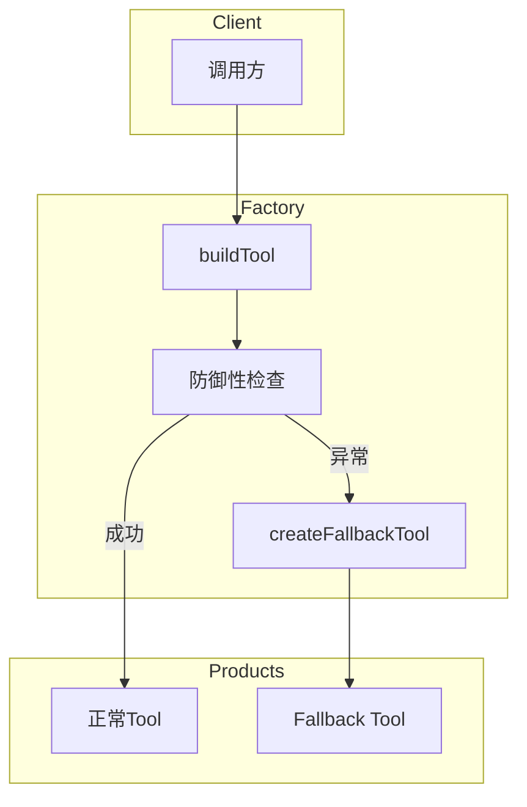
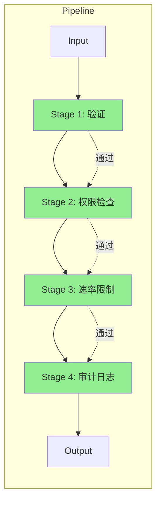
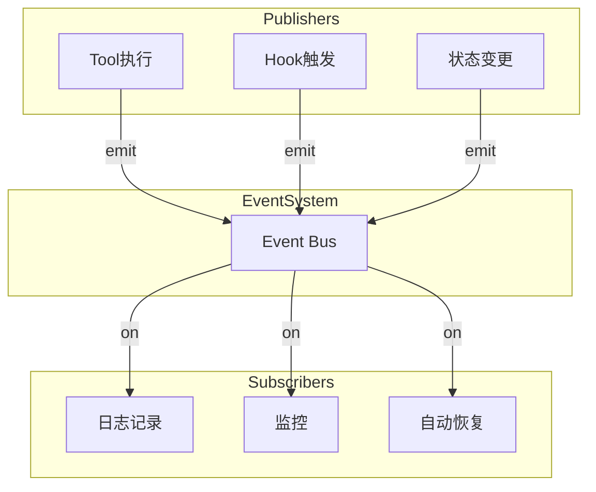
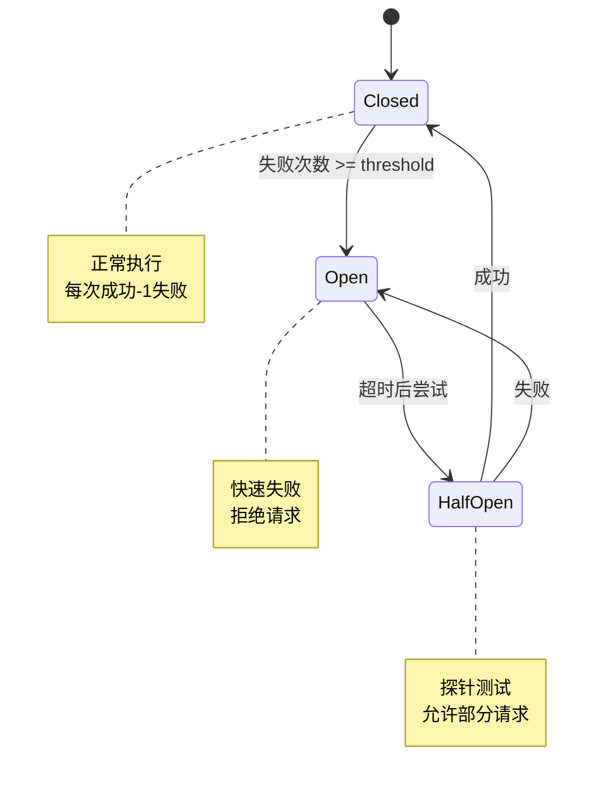
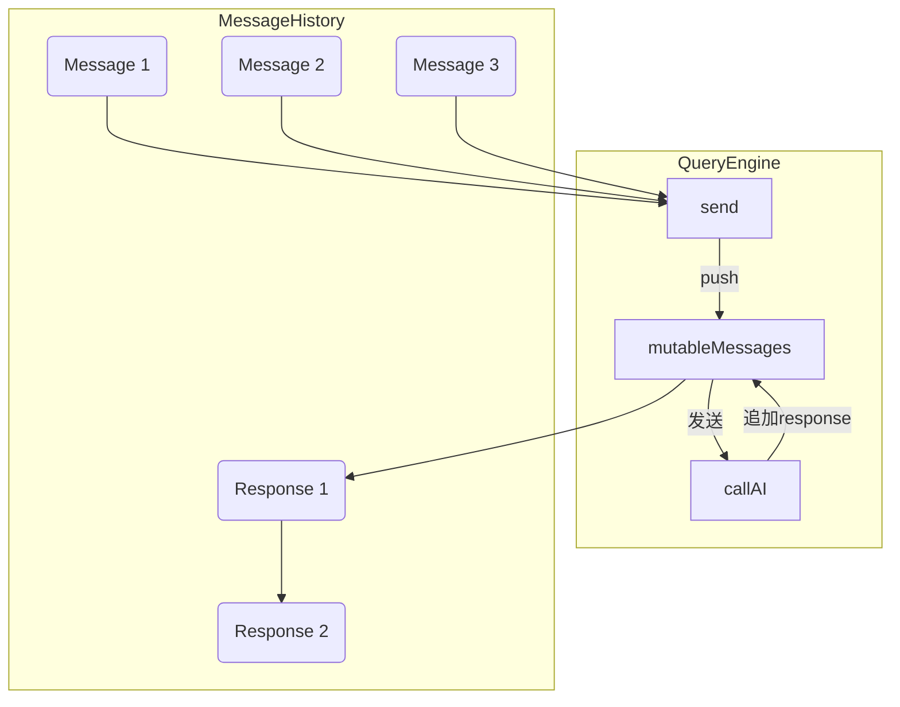
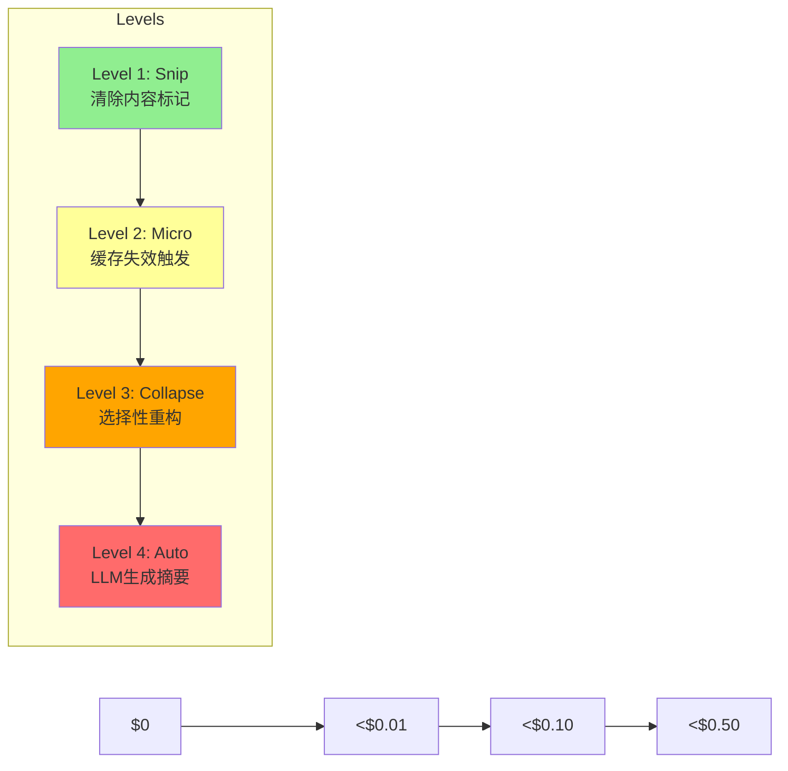
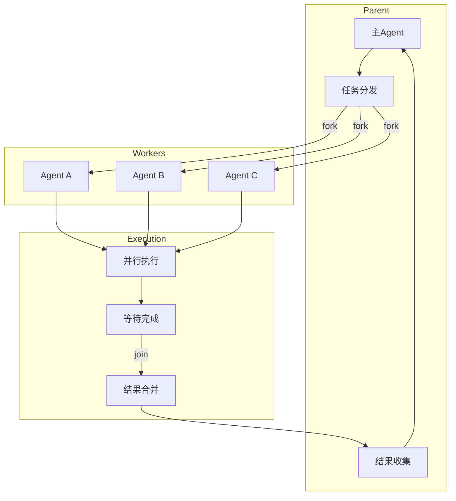
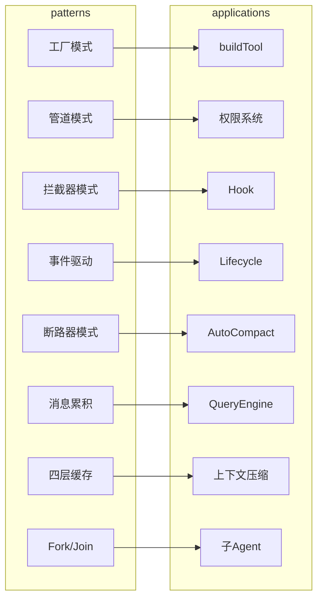
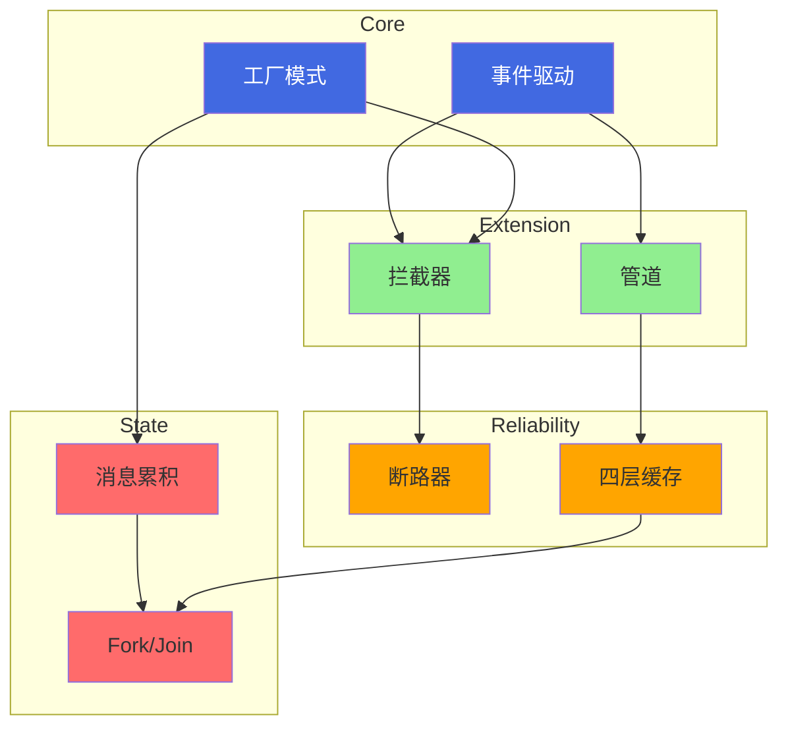

# ♻️ 核心设计模式

## 1. 工厂模式 - buildTool



**要点**：工厂封装了创建细节，调用方无需关心实现。

---

## 2. 管道模式 - 权限系统



**要点**：每个阶段职责单一，可组合、可替换。

---

## 3. 拦截器模式 - Hook

```mermaid
sequenceDiagram
    participant C as Caller
    participant H as withHook
    pre as Pre-Hook
    fn as Core Function
    post as Post-Hook

    C->>H: 调用函数
    H->>pre: emit(beforeEvent)

    alt 有拦截器阻止
        pre-->>H: {blocked: true}
        H-->>C: 返回 blocked
    else 继续执行
        pre-->>H: 允许
        H->>fn: 执行核心逻辑
        fn-->>H: result
        H->>post: emit(afterEvent, result)
        post-->>H: 确认
        H-->>C: 返回 result
    end
```

**要点**：在不修改核心逻辑的情况下增强行为。

---

## 4. 事件驱动 - Lifecycle



**要点**：解耦订阅者和发布者。

---

## 5. 断路器模式 - AutoCompact



```typescript
class CircuitBreaker {
  private failures = 0;
  private readonly threshold = 3;

  async execute(fn: () => Promise<Result>) {
    if (this.failures >= this.threshold) {
      throw new CircuitOpenError();
    }
    try {
      return await fn();
    } catch (e) {
      this.failures++;
      throw e;
    }
  }
}
```

**要点**：防止级联失败，快速失败而非无限重试。

---

## 6. 消息累积模式 - QueryEngine



```typescript
class QueryEngine {
  private mutableMessages: Message[] = [];

  async send(message: Message) {
    this.mutableMessages.push(message);
    const response = await this.callAI(this.mutableMessages);
    this.mutableMessages.push(response);
    return response;
  }
}
```

**要点**：跨调用保持状态。

---

## 7. 四层缓存 - 上下文压缩



| 级别 | 策略 | 成本 |
-----|------|-----|
| L1 Snip | 清除内容标记 | 0 |
| L2 Micro | 缓存失效触发 | 极低 |
| L3 Collapse | 选择性重构 | 中 |
| L4 Auto | LLM生成摘要 | 高 |

**要点**：渐进式优化，而非一步到位。

---

## 8. Fork/Join 模式 - 子Agent



**要点**：并行处理任务，最后合并结果。

---

## 9. 设计模式速查表



| 模式 | 在 Claude Code 中的应用 | 核心价值 |
-----|------------------------|---------|
| 工厂 | buildTool | 封装创建，防御性 fallback |
| 管道 | 权限系统 | 单一职责，可组合 |
| 拦截器 | Hook | 无侵入增强 |
| 事件驱动 | Lifecycle | 解耦发布/订阅 |
| 断路器 | AutoCompact | 防止级联失败 |
| 消息累积 | QueryEngine | 跨调用状态保持 |
| 四层缓存 | 上下文压缩 | 渐进式成本优化 |
| Fork/Join | 子Agent | 并行执行，结果合并 |

---

## 10. 模式关系图



**模式协作关系**：
- **事件驱动**是基础设施，拦截器和管道基于它构建
- **工厂**创建拦截器和管道组件
- **断路器**保护拦截器调用
- **消息累积**依赖工厂创建的消息队列
- **四层缓存**为消息累积提供优化
- **Fork/Join**组合消息累积的结果

---

## 相关章节

- [[../02-Tool系统/🔧-Tool系统]] - 工厂模式应用
- [[../03-权限系统/🔐-权限系统]] - 管道模式应用
- [[../04-Hook系统/🪝-Hook系统]] - 拦截器模式应用
- [[../06-上下文管理/📦-上下文管理]] - 四层缓存应用
- [[../09-子Agent与协作/🤝-子Agent与协作]] - Fork/Join 模式应用