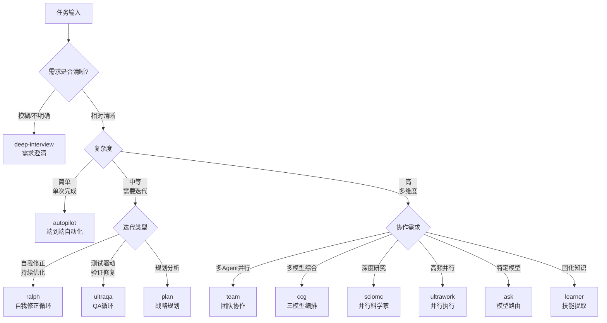
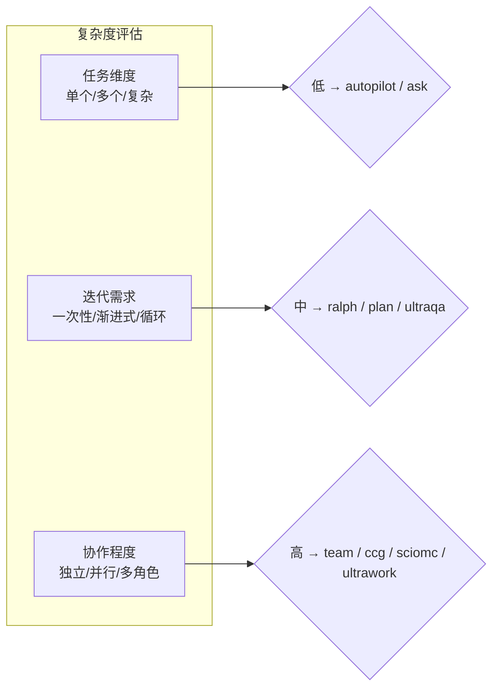

# 🎯 Skill选择决策树

## 概述

当面对一个任务时，正确选择Skill是高效完成工作的第一步。本文档提供系统化的决策流程，帮助你在11个内置Skill中找到最合适的那一个。

## 1. 决策流程图



## 2. 意图判断阶段

### 2.1 四类核心意图

| 意图类型 | 特征关键词 | 对应Skill |
|---------|-----------|-----------|
| **快速实现** | "做出来"、"实现"、"完成" | [[../08-Skill系统/08-01-📚-Skill系统|autopilot]] |
| **迭代优化** | "优化"、"改进"、"直到..." | [[../08-Skill系统/08-01-📚-Skill系统|ralph]] |
| **并行处理** | "并行"、"同时"、"批量" | [[../08-Skill系统/08-01-📚-Skill系统|ultrawork]] |
| **协作探索** | "团队"、"协作"、"分析" | [[../08-Skill系统/08-01-📚-Skill系统|team]] |

### 2.2 意图识别示例

```
用户输入                              → 识别意图      → Skill
──────────────────────────────────────────────────────────────
"帮我做一个用户登录功能"              → 快速实现       → autopilot
"持续优化性能直到响应时间<100ms"       → 迭代优化       → ralph
"同时处理这20个文件的重构"            → 并行处理       → ultrawork
"用3个Agent分别审查架构、安全、性能"   → 团队协作       → team
"深入研究为什么这个系统性能这么差"    → 深度研究       → sciomc
"需求不太清楚，先帮我理清楚"          → 需求澄清       → deep-interview
```

## 3. 复杂度评估阶段

### 3.1 复杂度三维模型



### 3.2 复杂度分级

| 等级 | 特征 | 耗时 | 推荐Skill |
|-----|------|-----|----------|
| **L1 简单** | 单文件、单任务、需求明确 | <30分钟 | autopilot, ask |
| **L2 中等** | 3-5个文件、需要调试 | 30分钟-2小时 | ralph, ultraqa |
| **L3 复杂** | 多模块、跨领域协作 | 2-8小时 | team, plan |
| **L4 超复杂** | 系统级、多团队、多阶段 | >8小时 | ccg, sciomc |

## 4. Skill映射表

### 4.1 基础映射

| 需求 | → | Skill | 触发词 |
|------|---|-------|--------|
| 端到端实现 | → | [[../08-Skill系统/08-01-📚-Skill系统|autopilot]] | `autopilot` |
| 持续修正直到完成 | → | [[../08-Skill系统/08-01-📚-Skill系统|ralph]] | `ralph` |
| 高吞吐量并行任务 | → | [[../08-Skill系统/08-01-📚-Skill系统|ultrawork]] | `ulw`, `ultrawork` |
| 多Agent团队协作 | → | [[../08-Skill系统/08-01-📚-Skill系统|team]] | `team` |
| 三模型综合分析 | → | [[../08-Skill系统/08-01-📚-Skill系统|ccg]] | `ccg` |
| QA循环验证 | → | [[../08-Skill系统/08-01-📚-Skill系统|ultraqa]] | `ultraqa` |
| 战略规划 | → | [[../08-Skill系统/08-01-📚-Skill系统|plan]] | `plan` |
| 深度研究 | → | [[../08-Skill系统/08-01-📚-Skill系统|sciomc]] | `sciomc` |
| 需求澄清 | → | [[../08-Skill系统/08-01-📚-Skill系统|deep-interview]] | `deep interview` |
| 模型路由 | → | [[../08-Skill系统/08-01-📚-Skill系统|ask]] | `ask` |
| 知识固化 | → | [[../08-Skill系统/08-01-📚-Skill系统|learner]] | `learner` |

> [!note]- 关联知识
> [[../08-Skill系统/08-01-📚-Skill系统]] - Skill系统完整参考

### 4.2 场景矩阵

| 场景 | 推荐Skill | 备选Skill |
|------|----------|----------|
| 快速MVP | autopilot | ralph (如果需要迭代) |
| Bug修复 | ralph 或 ultraqa | team (如果复杂) |
| 批量文件处理 | ultrawork | team |
| 性能优化 | ralph | sciomc (如果需要研究) |
| 架构设计 | plan | team |
| 代码审查 | team | ccg |
| 需求不明确 | deep-interview | plan |
| 测试驱动开发 | ultraqa | ralph |
| 技术研究 | sciomc | ask |
| 知识整理 | learner | - |

## 5. 决策树详解

### 5.1 autopilot 使用判断

```
是否使用 autopilot?
├── 需求是否明确? ──否──→ deep-interview (先澄清)
├── 是否需要多轮迭代? ──是──→ ralph
├── 是否需要并行? ──是──→ ultrawork
└── 以上都不是 ──是──→ autopilot ✓
```

**最佳场景**:
- 需求相对清晰的独立功能开发
- 快速原型和MVP
- 一次性任务不需要回环

### 5.2 ralph 使用判断

```
是否使用 ralph?
├── 需求相对明确?
│   └── 是 → 任务是否可以自动化验证?
│       └── 是 → 是否有明确的完成标准?
│           └── 是 → ralph ✓
└── 否 → deep-interview (需求不清)
```

**最佳场景**:
- Bug修复（有明确的复现步骤）
- 性能优化（有明确的指标目标）
- 重构（有明确的代码质量标准）

**不适用场景**:
- 需求本身模糊（应该用deep-interview）
- 一次性简单任务（用autopilot即可）

### 5.3 ultrawork 使用判断

```
是否使用 ultrawork?
├── 任务是否可以分解?
│   └── 是 → 子任务是否相互独立?
│       └── 是 → 是否需要高吞吐量?
│           └── 是 → ultrawork ✓
└── 否 → team (需要协作)
```

**最佳场景**:
- 批量文件处理（重命名、转换、迁移）
- 并行搜索（多代码库、多关键词）
- 独立模块的并行构建

### 5.4 team 使用判断

```
是否使用 team?
├── 是否需要多角色协作?
│   └── 是 → 不同角色是否需要同步?
│       └── 是 → team ralph ✓
├── 是否需要多维度分析?
│   └── 是 → team ✓
└── 否 → ultrawork (纯并行)
```

**team 变体选择**:

| 变体 | 使用场景 | 示例 |
|------|---------|------|
| `team` | 多Agent并行/协作 | "team 3个Agent审查代码" |
| `team ralph` | 团队+自我修正 | "team ralph 修复所有漏洞" |
| `team plan` | 团队规划 | "team plan 设计系统架构" |
| `team fix` | 团队修复 | "team fix 解决这个bug" |

### 5.5 deep-interview 使用判断

```
是否使用 deep-interview?
├── 需求是否模糊/不明确?
│   └── 是 → deep-interview ✓
├── 是否存在隐含约束?
│   └── 是 → deep-interview ✓
├── 用户是否无法清晰表达?
│   └── 是 → deep-interview ✓
└── 以上都不是 → 其他Skill
```

**最佳场景**:
- 新项目初始化，需求尚未成型
- 复杂系统重构，边界不清晰
- 技术选型，多个方案各有优劣

## 6. 组合使用

### 6.1 常见组合

| 组合 | 使用场景 |
|------|---------|
| `deep-interview` → `autopilot` | 澄清需求后快速实现 |
| `deep-interview` → `team` | 澄清需求后团队协作 |
| `plan` → `ralph` | 规划后迭代执行 |
| `plan` → `team` | 规划后团队实施 |
| `team` → `ultraqa` | 团队执行后QA验证 |
| `autopilot` → `ultraqa` | 自动实现后测试验证 |

### 6.2 组合示例

```
# 完整项目流程
deep-interview  "帮我想想这个产品该怎么设计"
    ↓ (需求澄清)
plan  "规划一下技术方案和实施步骤"
    ↓ (规划完成)
team 3  "用3个Agent分别负责前端、后端、测试"
    ↓ (团队完成)
ultraqa  "验证所有功能和测试通过"
```

## 7. 快速参考卡

```
┌─────────────────────────────────────────────────────────┐
│                    Skill 选择速查                        │
├─────────────────────────────────────────────────────────┤
│ 不知道用什么 → ask                                       │
│ 需求不清 → deep-interview                                │
│ 快速实现 → autopilot                                     │
│ 需要迭代 → ralph                                        │
│ 批量并行 → ultrawork                                    │
│ 团队协作 → team                                         │
│ 三模型 → ccg                                            │
│ 深度研究 → sciomc                                       │
│ 测试驱动 → ultraqa                                      │
│ 做规划 → plan                                           │
│ 固化知识 → learner                                      │
└─────────────────────────────────────────────────────────┘
```

---

## 相关章节

- [[../08-Skill系统/08-01-📚-Skill系统]] - Skill系统完整指南
- [[../09-子Agent与协作/09-01-🤝-子Agent与协作]] - 多Agent协作模式
- [[14-02-🔄-Ralph循环最佳实践]] - Ralph循环详解
- [[14-04-💡-Deep-Interview工作流]] - 需求澄清工作流
- [[14-03-🤖-Team协作拓扑]] - Team协作模式

---

*最后更新：2026-04-03*
