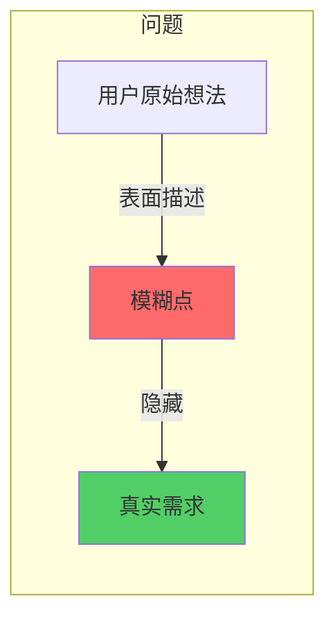
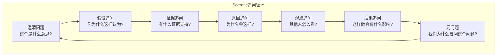
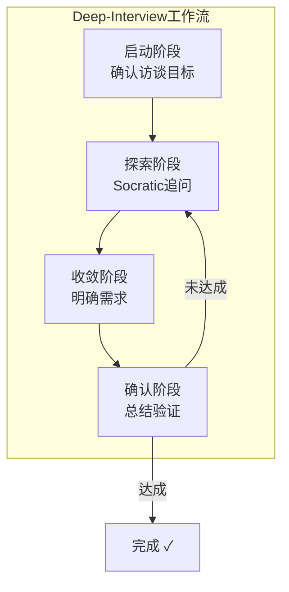

# 💡 Deep-Interview工作流

## 1. 概述

Deep-Interview是Claude Code的Socratic式需求澄清Skill。当需求不明确、约束隐含或问题本质模糊时，它通过系统性追问，帮助用户厘清真正的问题和需求。

### 1.1 为什么需要Deep-Interview



| 传统方式 | Deep-Interview |
|---------|---------------|
| 直接实现用户说的 | 追问本质原因 |
| 容易返工 | 一次做对 |
| 忽略隐含需求 | 挖掘隐含约束 |

### 1.2 核心价值

| 价值 | 说明 |
|------|------|
| **需求澄清** | 将模糊想法转化为明确需求 |
| **问题挖掘** | 发现用户自己都没想到的问题 |
| **约束识别** | 识别技术、业务、时间的隐含约束 |
| **风险预防** | 提前发现可能导致返工的风险点 |

## 2. Socratic追问法

### 2.1 Socratic方法原理

苏格拉底式追问通过一系列精心设计的问题，引导思考者自己发现答案，而非直接告知。



### 2.2 六类核心追问

| 类型 | 追问模板 | 目的 |
|------|---------|------|
| **澄清类** | "你说的X是指...?" | 消除歧义 |
| **假设类** | "你为什么这样认为?" | 检验前提 |
| **证据类** | "有什么证据支持?" | 验证依据 |
| **原因类** | "为什么会出现这种情况?" | 追溯根源 |
| **观点类** | "其他人/团队会怎么看?" | 多元视角 |
| **后果类** | "如果这样做了会怎样?" | 预判影响 |

## 3. 5Why追问法

### 3.1 5Why原理

5Why是一种从现象追溯到根本原因的技术，通过连续追问"为什么"，逐层深入。

```
示例: 为什么系统很慢?

Why 1: 为什么系统很慢?
→ 因为数据库查询时间过长

Why 2: 为什么数据库查询时间过长?
→ 因为缺少索引

Why 3: 为什么缺少索引?
→ 因为表结构变更后没有更新索引

Why 4: 为什么表结构变更后没有更新索引?
→ 因为没有索引创建规范

Why 5: 为什么没有索引创建规范?
→ 因为没有代码审查流程

根本原因: 需要建立代码审查流程和索引规范
```

### 3.2 5Why使用场景

| 场景类型 | 示例问题 | 适用性 |
|---------|---------|--------|
| **性能问题** | "为什么系统慢?" | ★★★★★ |
| **Bug根因** | "为什么会出现这个bug?" | ★★★★★ |
| **流程问题** | "为什么发布经常延期?" | ★★★★☆ |
| **架构问题** | "为什么系统难以扩展?" | ★★★★☆ |
| **沟通问题** | "为什么团队协作效率低?" | ★★★☆☆ |

### 3.3 5Why追问技巧

```
技巧1: 区分现象和原因
  ✗ "为什么bug没修复?" (现象)
  ✓ "为什么bug会出现?" (原因)

技巧2: 避免回答者防御
  ✗ "你这样做是错的，为什么?"
  ✓ "这样做可能有什么原因?"

技巧3: 连续追问直到根本
  至少追问3-5次，直到触及系统性问题
```

## 4. Deep-Interview工作流

### 4.1 工作流阶段



### 4.2 各阶段详解

#### 阶段1: 启动阶段

```
目标: 建立访谈框架，明确访谈范围

关键问题:
  • "你想解决什么问题?"
  • "这个问题的影响是什么?"
  • "成功的标准是什么?"
  • "有什么约束条件?"
```

#### 阶段2: 探索阶段

```
目标: 通过追问深入理解问题

主要技术:
  • 5Why追溯法
  • Socratic六类追问
  • 假设检验
  • 案例分析
```

#### 阶段3: 收敛阶段

```
目标: 将模糊需求转化为明确需求

产出:
  • 明确的问题陈述
  • 具体的功能需求列表
  • 非功能性需求
  • 约束和风险清单
```

#### 阶段4: 确认阶段

```
目标: 验证理解是否正确

确认方式:
  • 重述理解，征求用户确认
  • 列出待解决问题清单
  • 明确优先级
  • 约定后续步骤
```

## 5. 适用场景

### 5.1 典型场景

| 场景 | 表现 | Deep-Interview效果 |
|------|------|-------------------|
| **新项目初始化** | "我想做一个类似XX的系统" | 明确真正需求 |
| **需求变更** | "加个功能就行" | 理解变更影响 |
| **技术选型** | "用XX技术好不好" | 分析真正原因 |
| **问题诊断** | "系统有问题" | 定位真正原因 |
| **架构重构** | "需要重构一下" | 明确重构目标 |

### 5.2 判断标准

```
是否需要Deep-Interview?
│
├── 需求是否模糊/不明确?
│   └── 是 → 需要 ✓
│
├── 是否存在隐含约束?
│   └── 是 → 需要 ✓
│
├── 用户是否无法清晰表达?
│   └── 是 → 需要 ✓
│
├── 问题是否反复出现?
│   └── 是 → 需要（5Why）✓
│
└── 以上都不是 → 可以直接执行
```

### 5.3 不适用场景

| 场景 | 原因 | 推荐替代 |
|------|------|---------|
| 需求已明确 | 不需要澄清 | [[14-01-🎯-Skill选择决策树|autopilot]] |
| 简单一次性任务 | 成本过高 | [[14-01-🎯-Skill选择决策树|autopilot]] |
| 纯执行任务 | 不需要分析 | [[14-01-🎯-Skill选择决策树|ralph]] |
| 多人已有共识 | 不需要追问 | [[14-01-🎯-Skill选择决策树|team]] |

## 6. 追问技巧

### 6.1 有效追问原则

| 原则 | 说明 | 示例 |
|------|------|------|
| **开放性** | 避免是非题 | "你怎么看?" 而非 "是不是?" |
| **具体性** | 避免泛泛而问 | "具体是哪里慢?" 而非 "哪里有问题?" |
| **中立性** | 避免引导性 | "为什么?" 而非 "对吧?" |
| **递进性** | 由浅入深 | 先澄清再深入 |

### 6.2 追问话术库

```
澄清类:
  "你说的X具体是指什么?"
  "能举个具体的例子吗?"
  "X和Y有什么区别?"

假设类:
  "你为什么认为X会导致Y?"
  "这个结论的前提是什么?"
  "如果没有这个前提，还会成立吗?"

证据类:
  "有什么数据支持这个结论?"
  "这个观察是从哪里来的?"
  "能提供具体的例子吗?"

原因类:
  "为什么会出现这种情况?"
  "根本原因是什么?"
  "5Why: 为什么..."

影响类:
  "这样做会有什么后果?"
  "如果不做会有什么影响?"
  "最好的情况和最坏的情况是什么?"
```

### 6.3 常见陷阱

| 陷阱 | 问题 | 应对 |
|------|------|------|
| **过早收敛** | 太快进入解决方案 | 坚持多轮追问 |
| **表面回答** | 用户给表面原因 | 追问"还有呢?" |
| **假设验证** | 验证自己的假设 | 让用户主导 |
| **情绪卷入** | 进入辩论模式 | 保持中立 |

## 7. 与其他Skill组合

### 7.1 组合矩阵

| 组合 | 场景 | 效果 |
|------|------|------|
| `deep-interview` → `plan` | 澄清后规划 | 需求清晰+战略规划 |
| `deep-interview` → `autopilot` | 澄清后实现 | 需求清晰+快速实现 |
| `deep-interview` → `team` | 澄清后协作 | 需求清晰+团队执行 |
| `deep-interview` → `ralph` | 澄清后迭代 | 需求清晰+持续优化 |

### 7.2 典型工作流

```
# 完整项目启动流程

1. 深度访谈
   deep-interview
   "帮我理清这个产品的需求"
   → 产出: 需求文档

2. 战略规划
   plan
   "制定实现方案"
   → 产出: 技术方案

3. 执行
   autopilot / team / ralph
   → 根据复杂度选择

4. 验证
   ultraqa
   → 确保质量
```

## 8. 产出模板

### 8.1 需求澄清产出

```markdown
## 需求澄清报告

### 问题陈述
[一句话描述要解决的问题]

### 背景
[为什么需要解决这个问题]

### 目标
- [具体可衡量的目标1]
- [具体可衡量的目标2]

### 功能需求
| 需求 | 优先级 | 验收标准 |
|------|--------|---------|
|      | P0/P1  |          |

### 非功能需求
- 性能:
- 安全:
- 可用性:

### 约束条件
- 技术约束:
- 业务约束:
- 时间约束:

### 风险清单
| 风险 | 影响 | 应对措施 |
|------|------|---------|
|      |      |          |

### 待确认事项
- [ ]
- [ ]
```

## 9. 快速参考

```
┌────────────────────────────────────────────────────────┐
│            Deep-Interview 使用速查                     │
├────────────────────────────────────────────────────────┤
│ 何时用:                                               │
│   • 需求模糊、不明确                                   │
│   • 约束隐含、未知                                    │
│   • 问题反复出现、需要根因分析                        │
│   • 用户无法清晰表达                                 │
│                                                        │
│ 核心技巧:                                             │
│   • 5Why追溯根本原因                                 │
│   • Socratic六类追问                                 │
│   • 开放性问题引导                                   │
│   • 不预设立场                                       │
│                                                        │
│ 工作流:                                               │
│   启动 → 探索 → 收敛 → 确认                           │
│                                                        │
│ 产出:                                                │
│   明确的需求文档 + 风险清单 + 确认事项                │
└────────────────────────────────────────────────────────┘
```

---

## 相关章节

- [[../08-Skill系统/08-01-📚-Skill系统]] - Skill系统完整指南
- [[../09-子Agent与协作/09-01-🤝-子Agent与协作]] - 多Agent协作模式

---

*最后更新：2026-04-03*
