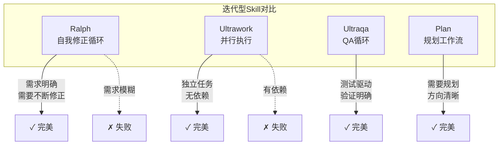
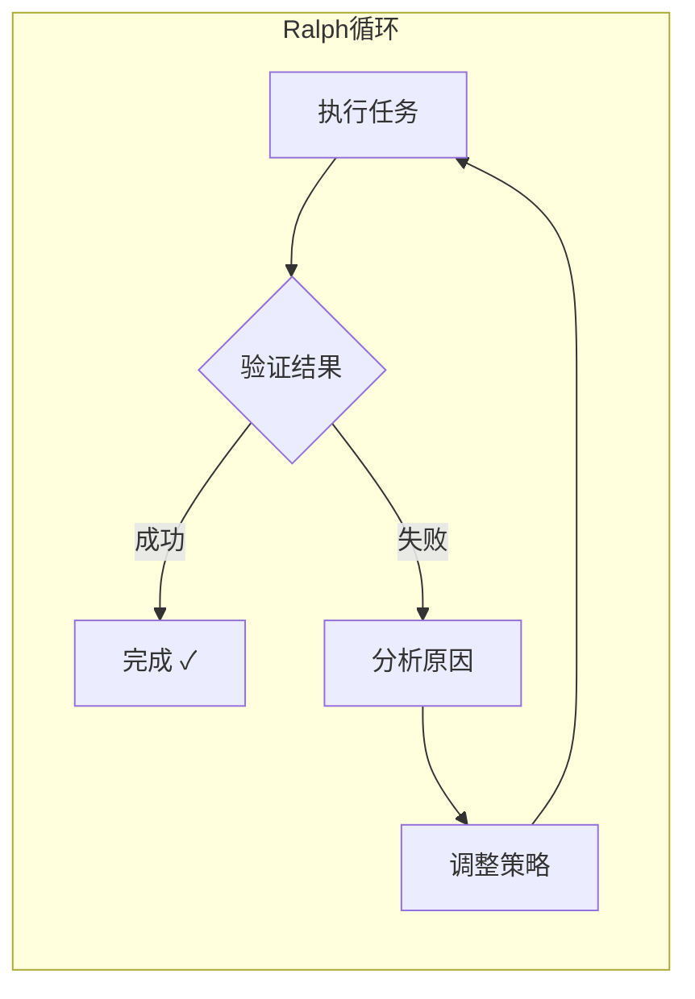

# 🔄 Ralph循环最佳实践

## 1. 概述

Ralph是Claude Code的"自我修正直到完成"Skill。其核心理念是：给定一个明确的目标，通过不断的执行→验证→修正循环，持续逼近目标，直到任务完成或被手动取消。

### 1.1 Ralph vs 其他Skill



### 1.2 核心价值

| 价值 | 说明 |
|------|------|
| **持久性** | 不达目标不罢休，即使失败也会继续尝试 |
| **自省性** | 能够评估自身输出并发现问题 |
| **适应性** | 根据反馈动态调整策略 |

## 2. 工作原理

### 2.1 Ralph循环流程



### 2.2 循环终止条件

| 条件类型 | 说明 | 示例 |
|---------|------|------|
| **成功终止** | 目标达成 | "性能提升到100ms以下" |
| **人工终止** | 用户主动取消 | 用户说"够了" |
| **死循环检测** | 多次重复无进展 | 相同错误超过阈值 |
| **超时终止** | 超过最大时间 | 达到timeout限制 |

### 2.3 适用条件

```
Ralph适用条件（必须同时满足）：
┌────────────────────────────────────┐
│ 1. 目标可验证                      │
│    - 有明确的成功/失败标准         │
│    - 可以自动化检测                │
│                                     │
│ 2. 需求相对明确                    │
│    - 知道要做什么                  │
│    - 只是需要多轮迭代              │
│                                     │
│ 3. 修正可行                        │
│    - 失败原因可诊断                │
│    - 可以针对性修改                │
└────────────────────────────────────┘
```

## 3. 适用场景

### 3.1 场景分类

| 场景类型 | 示例 | 为什么适合Ralph |
|---------|------|----------------|
| **Bug修复** | "修复所有空指针异常" | 不断尝试直到所有case通过 |
| **性能优化** | "优化到响应时间<100ms" | 迭代优化直到达标 |
| **代码重构** | "重构所有monkey代码" | 逐个改善直到全部完成 |
| **测试编写** | "补充测试直到覆盖率>80%" | 持续补测直到达标 |
| **安全审计** | "修复所有安全漏洞" | 逐个修复直到清零 |

### 3.2 典型案例

#### 案例1: Bug修复

```
用户: ralph 修复所有空指针异常

Ralph循环:
  第1轮: 扫描代码 → 发现5个NPE → 修复2个
  第2轮: 验证 → 发现还有3个 → 继续修复
  第3轮: 验证 → 还有1个 → 修复
  第4轮: 验证 → 全部通过 → 完成 ✓
```

#### 案例2: 性能优化

```
用户: ralph 持续优化性能直到响应时间<100ms

Ralph循环:
  第1轮: 基准测试 250ms → 分析热点
  第2轮: 优化后 180ms → 仍有差距
  第3轮: 进一步优化 130ms → 接近目标
  第4轮: 微调后 95ms → 达标 ✓
```

### 3.3 不适用场景

| 场景 | 原因 | 推荐替代 |
|------|------|---------|
| 需求模糊 | 无法验证成功 | [[💡-Deep-Interview工作流\|deep-interview]] |
| 一次性任务 | 不需要迭代 | [[🎯-Skill选择决策树\|autopilot]] |
| 纯并行任务 | 无依赖关系 | [[🎯-Skill选择决策树\|ultrawork]] |
| 需要规划 | 方向不清晰 | [[🎯-Skill选择决策树\|plan]] |

## 4. 使用技巧

### 4.1 设置清晰的验证标准

**好的标准**（可验证）:
```
ralph 修复所有登录相关的bug
ralph 优化查询性能直到P99<50ms
ralph 重构所有圈复杂度过20的函数
```

**坏的标准**（不可验证）:
```
ralph 把代码改好
ralph 优化性能
ralph 让系统更快
```

### 4.2 提供上下文帮助

```
ralph 修复这个模块的bug
  → 附上: 相关日志、错误堆栈、复现步骤

ralph 优化数据库查询性能
  → 附上: 当前查询计划、慢查询日志、数据量

ralph 重构这段代码
  → 附上: 编码规范、架构约束、测试要求
```

### 4.3 设置合理的边界

```bash
# 设置最大循环次数（防止无限循环）
ralph --max-loops 10 修复所有内存泄漏

# 设置超时（防止长时间运行）
ralph --timeout 30m 优化性能

# 设置阶段性目标
ralph 修复10个bug，然后报告进展
```

### 4.4 分阶段执行

对于超大型任务，分阶段执行效果更好：

```
ralph 第一阶段: 修复P0级别的bug
  → 完成后报告

ralph 第二阶段: 修复P1级别的bug
  → 完成后报告

ralph 第三阶段: 修复P2级别的bug
  → 完成后报告
```

## 5. 调试技巧

### 5.1 诊断模式

当Ralph循环没有进展时，使用诊断：

```
ralph --diagnose 修复这个bug
  → 输出: 当前状态、已尝试方案、失败原因
```

### 5.2 中间干预

Ralph运行时可以随时干预：

| 干预方式 | 效果 |
|---------|------|
| "暂停" | 暂停当前循环 |
| "继续" | 恢复暂停的循环 |
| "跳过这个" | 跳过当前问题继续下一个 |
| "改变策略" | 让Ralph尝试不同方法 |
| "取消" | 终止Ralph循环 |

### 5.3 常见问题处理

| 问题 | 原因 | 解决方案 |
|------|------|---------|
| 循环无法终止 | 标准不够明确 | 重新定义验证标准 |
| 同一问题重复失败 | 修复方案不对 | 提供更多上下文 |
| 进展缓慢 | 策略不够优化 | 尝试改变策略 |
| 修复引入新问题 | 验证不够全面 | 加强验证条件 |

## 6. 与其他Skill组合

### 6.1 组合矩阵

| 组合 | 场景 | 效果 |
|------|------|------|
| `plan` → `ralph` | 规划后执行 | 先明确路径再迭代 |
| `deep-interview` → `ralph` | 澄清后修正 | 需求清晰后迭代 |
| `team` → `ralph` | 团队执行后修正 | 并行处理后再优化 |
| `ralph` → `ultraqa` | 修正后验证 | 修正完成再测试 |

### 6.2 组合示例

```
# 复杂项目工作流
deep-interview  "帮我理清这个系统的需求"
    ↓
plan  "规划实现路径"
    ↓
team 3  "用3个Agent并行开发"
    ↓
ralph  "持续优化直到所有指标达标"
    ↓
ultraqa  "全面测试验证"
```

## 7. 进阶用法

### 7.1 自定义循环条件

```bash
# 使用自定义验证函数
ralph --verify ./check_performance.sh 优化性能

# 使用多个退出条件
ralph --exit-when "passes=100" --exit-when "time<50ms" 测试通过且性能达标

# 渐进式标准
ralph --threshold 80%  "先达到80%覆盖率"
ralph --threshold 95%  "再提升到95%"
```

### 7.2 上下文传递

Ralph在循环中会保留上下文，这有助于：

1. **跨轮次学习**: 从失败中学习
2. **状态保持**: 不丢失已完成的进度
3. **知识积累**: 记录有效的修复策略

```bash
# 第一次运行
ralph 修复这批bug
  → 学习: 类型A的bug用方案X有效

# 第二次运行
ralph 修复另一批bug
  → 应用: 类型A的bug用方案X
```

## 8. 快速参考

```
┌──────────────────────────────────────────────────────┐
│              Ralph 使用速查                           │
├──────────────────────────────────────────────────────┤
│ 何时用:                                             │
│   • 目标明确、可验证                                  │
│   • 需要多轮迭代                                      │
│   • 有明确的成功/失败标准                             │
│                                                      │
│ 何时不用:                                            │
│   • 需求模糊 → deep-interview                        │
│   • 一次性任务 → autopilot                           │
│   • 纯并行 → ultrawork                               │
│                                                      │
│ 关键技巧:                                            │
│   • 设置清晰的验证标准                                │
│   • 提供足够的上下文                                  │
│   • 设置合理的边界（循环次数/超时）                   │
│   • 分阶段执行大型任务                               │
└──────────────────────────────────────────────────────┘
```

---

## 相关章节

- [[../08-Skill系统/📚-Skill系统]] - Skill系统完整指南
- [[../09-子Agent与协作/🤝-子Agent与协作]] - 多Agent协作模式

---

*最后更新：2026-04-03*
