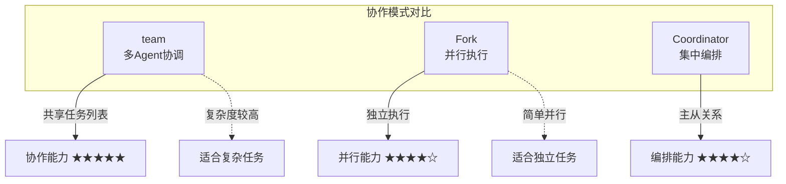
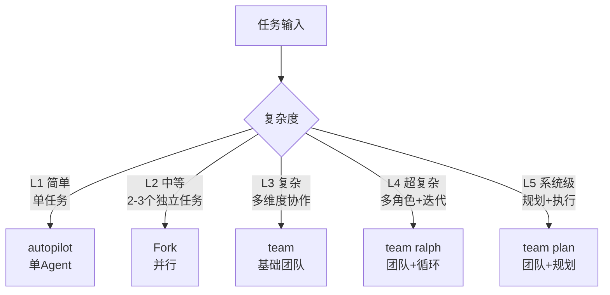
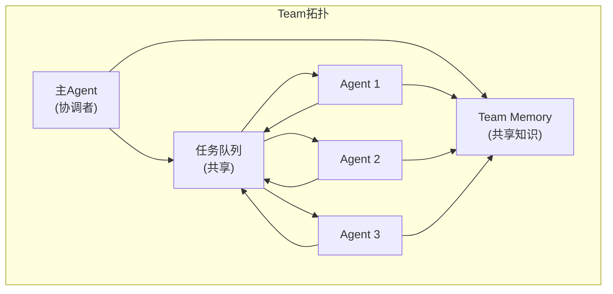
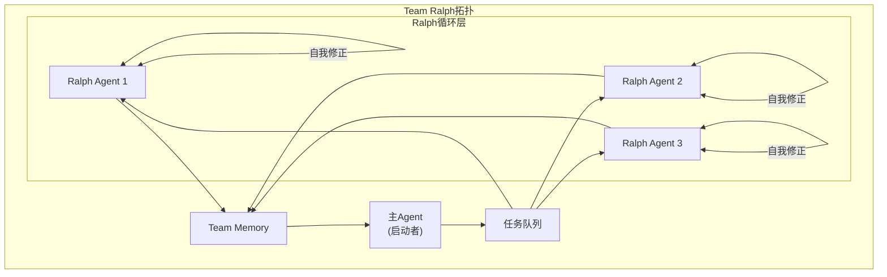
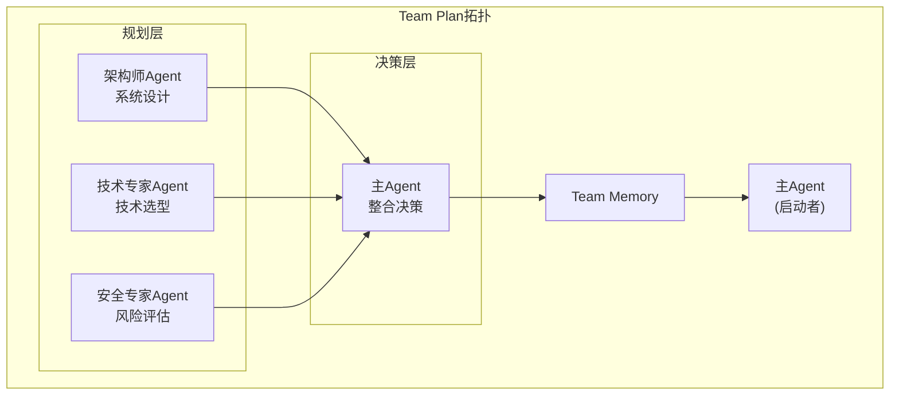
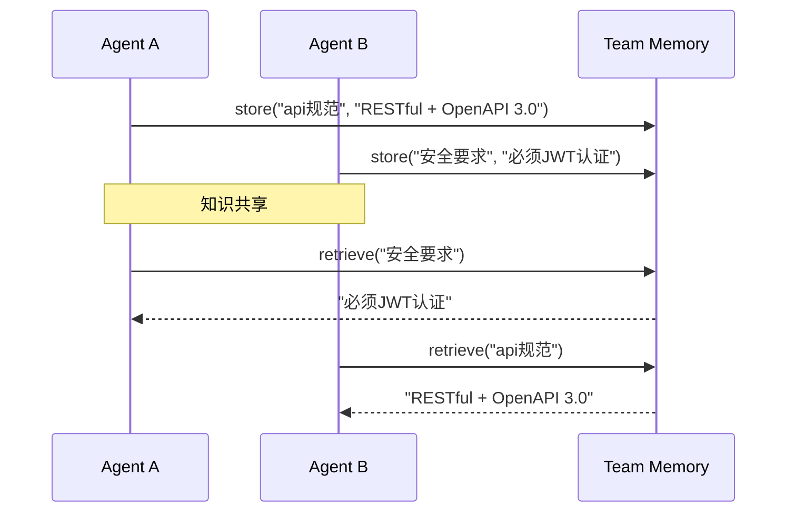
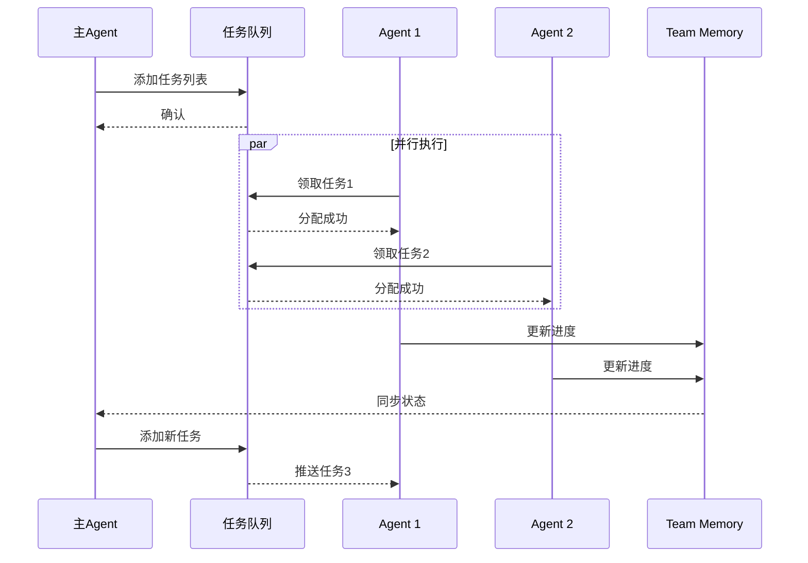

# 🤖 Team协作拓扑

## 1. 概述

Team是Claude Code的多Agent协作Skill，通过协调多个Agent共享任务列表，实现复杂任务的并行处理和高效协作。

### 1.1 Team vs 其他协作模式



### 1.2 Team的核心价值

| 价值 | 说明 |
|------|------|
| **任务协调** | 多个Agent共享同一任务队列 |
| **资源共享** | Team Memory实现跨Agent知识共享 |
| **动态分配** | 任务根据Agent能力动态分配 |
| **结果聚合** | 多Agent输出统一整合 |

## 2. Team模式选择

### 2.1 复杂度对应模式



### 2.2 Team变体对照表

| 变体 | 适用场景 | 特点 |
|------|---------|------|
| `team` | 多Agent并行任务 | 基础协作，共享任务列表 |
| `team ralph` | 团队+自我修正 | 持续迭代直到完成 |
| `team fix` | 团队修复问题 | 协作诊断和修复 |
| `team plan` | 团队规划 | 协作制定计划 |

### 2.3 模式选择决策树

```
选择哪个Team变体?
│
├── 主要是修复/调试?
│   └── 是 → team fix
│
├── 需要持续迭代优化?
│   └── 是 → team ralph
│
├── 需要规划和分析?
│   └── 是 → team plan
│
└── 以上都不是 → team (基础模式)
```

## 3. Team架构拓扑

### 3.1 基础拓扑结构



### 3.2 Team Ralph拓扑



### 3.3 Team Plan拓扑



## 4. Team Memory机制

### 4.1 Team Memory作用

Team Memory是跨Agent的共享知识存储，解决多Agent协作时的信息不对称问题。



### 4.2 Team Memory数据结构

```typescript
interface TeamMemory {
  // 存储条目
  entries: TeamMemoryEntry[];

  // 操作方法
  store(key: string, value: TeamMemoryEntry): void;
  retrieve(key: string): TeamMemoryEntry | null;
  search(query: string): TeamMemoryEntry[];
  clear(): void;
}

interface TeamMemoryEntry {
  key: string;           // 唯一标识
  value: string;         // 内容
  source: string;        // 来源Agent
  timestamp: number;     // 时间戳
  tags: string[];        // 分类标签
  ttl?: number;         // 过期时间(ms)
}
```

### 4.3 Team Memory使用示例

```bash
# Agent A 存储团队知识
team memory store api-design "遵循OpenAPI 3.0规范，RESTful风格"

# Agent B 读取团队知识
team memory retrieve api-design

# 搜索相关知识
team memory search "api"
```

## 5. 任务分配策略

### 5.1 分配策略类型

| 策略 | 说明 | 适用场景 |
|------|------|---------|
| **静态分配** | 预先指定Agent角色和任务 | 角色明确的大型项目 |
| **动态分配** | 根据Agent能力动态分配 | 灵活的小型团队 |
| **负载均衡** | 根据队列状态分配 | 高吞吐量场景 |
| **优先级分配** | 按任务优先级分配 | 紧急任务处理 |

### 5.2 静态分配示例

```
team 3 --role "frontend,backend,devops"

任务分配:
  frontend  → 用户界面开发
  backend   → API和服务端开发
  devops    → 部署和运维配置
```

### 5.3 动态分配示例

```
team 3 --strategy dynamic

系统自动:
  1. 分析任务复杂度
  2. 评估Agent能力
  3. 动态分配任务
  4. 监控负载状态
```

## 6. 通信与同步机制

### 6.1 通信模式

| 模式 | 说明 | 延迟 |
|------|------|------|
| **同步通信** | Agent间实时通信 | 低 |
| **异步通信** | 通过Team Memory中转 | 中 |
| **广播** | 主Agent向所有Agent推送 | 低 |

### 6.2 同步机制



### 6.3 冲突处理

| 冲突类型 | 处理策略 | 说明 |
|---------|---------|------|
| 任务重复 | 去重 | 检测并合并重复任务 |
| 资源竞争 | 互斥锁 | 写入操作互斥 |
| 结果冲突 | 投票/优先级 | 多方案时选择最优 |
| 死锁 | 超时中断 | 超过阈值强制退出 |

## 7. 团队规模选择

### 7.1 规模参考

| 任务复杂度 | 推荐规模 | 说明 |
|-----------|---------|------|
| 简单并行 | 2-3 Agent | 独立任务并行 |
| 中等复杂 | 3-5 Agent | 分工协作 |
| 复杂系统 | 5-8 Agent | 多维度并行 |
| 超复杂 | 8+ Agent | 分层协作 |

### 7.2 规模选择决策

```
选择多少个Agent?
│
├── 任务是否可分解?
│   └── 否 → 减少Agent数量
│
├── 子任务是否独立?
│   └── 是 → 可增加Agent
│   └── 否 → 协调成本高，减少Agent
│
├── 有多少不同角色?
│   └── 角色多 → Agent数量≈角色数
│
└── 考虑通信成本:
    Agent越多 → 协调开销越大
```

## 8. 最佳实践

### 8.1 Team使用 checklist

```
使用Team前的检查清单:
□ 任务是否足够复杂需要多Agent?
□ Agent角色是否清晰?
□ 是否有共享知识需要Team Memory?
□ 任务分配策略是否合理?
□ 是否有明确的完成标准?
□ 协调机制是否到位?
```

### 8.2 常见错误

| 错误 | 问题 | 解决方案 |
|------|------|---------|
| Agent过多 | 协调成本高 | 减少到3-5个 |
| 角色不清 | 任务重叠 | 明确角色分工 |
| 通信不畅 | 信息孤岛 | 使用Team Memory |
| 缺乏同步 | 结果不一致 | 设置同步点 |

### 8.3 性能优化

```bash
# 优化点1: 合理设置Agent数量
team 3  # 不要过多

# 优化点2: 使用任务队列
team --use-queue

# 优化点3: 开启Team Memory
team --with-memory

# 优化点4: 设置超时
team --timeout 30m
```

## 9. 与其他Skill组合

### 9.1 组合矩阵

| 组合 | 场景 | 效果 |
|------|------|------|
| `team` → `ultraqa` | 团队执行后QA | 分工+验证 |
| `team ralph` → `ultraqa` | 团队迭代后验证 | 持续优化+验证 |
| `plan` → `team` | 规划后团队执行 | 计划+实施 |
| `deep-interview` → `team` | 澄清后团队协作 | 需求清晰+实施 |

### 9.2 完整工作流示例

```
# 大型项目完整工作流

1. 需求澄清
   deep-interview  "帮我理清这个电商系统的需求"
       ↓

2. 战略规划
   plan  "制定详细的技术方案和实施计划"
       ↓

3. 团队协作执行
   team 5 --role "frontend,backend,db,devops,qa"
       ↓

4. 持续优化（如需要）
   team ralph  "持续优化直到所有指标达标"
       ↓

5. 全面验证
   ultraqa  "全面测试确保质量"
```

## 10. 快速参考

```
┌────────────────────────────────────────────────────────┐
│              Team 协作速查                             │
├────────────────────────────────────────────────────────┤
│ 何时用:                                               │
│   • 多角色协作的大型任务                               │
│   • 需要并行处理多个独立子任务                         │
│   • 团队需要共享知识和状态                             │
│                                                        │
│ Team变体:                                             │
│   • team        → 基础多Agent协作                      │
│   • team ralph  → 团队+自我修正循环                    │
│   • team fix    → 团队协作修复                         │
│   • team plan   → 团队协作规划                         │
│                                                        │
│ 关键机制:                                             │
│   • Team Memory → 跨Agent知识共享                      │
│   • 任务队列   → 动态任务分配                          │
│   • 同步点     → 结果聚合与验证                        │
└────────────────────────────────────────────────────────┘
```

---

## 相关章节

- [[../08-Skill系统/📚-Skill系统]] - Skill系统完整指南
- [[../09-子Agent与协作/🤝-子Agent与协作]] - 子Agent与协作模式

---

*最后更新：2026-04-03*
