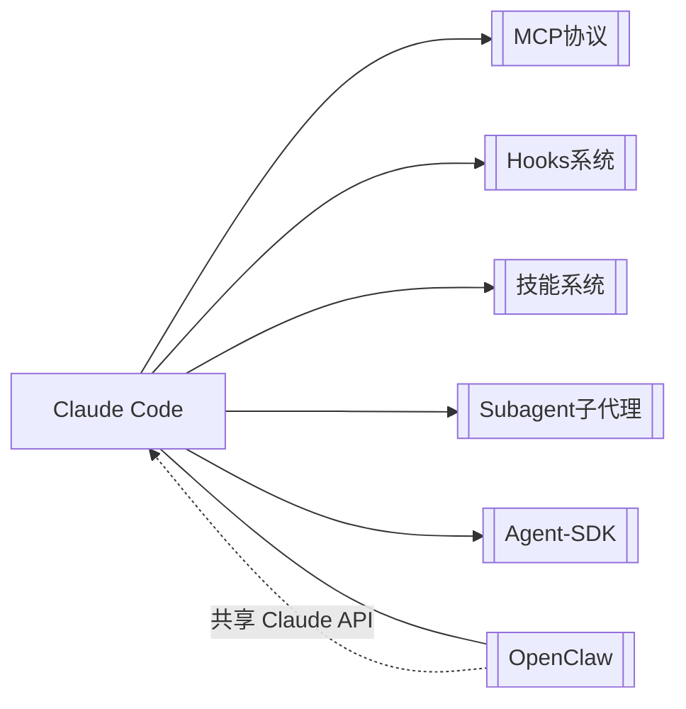

# Claude Code

> [!summary] 一句话定义
> Anthropic 官方的 **AI 编程 CLI 工具**，通过终端交互，能读写文件、执行命令、搜索代码，覆盖编程全流程。

---

## 核心定位

| 维度 | 说明 |
|------|------|
| **产品类型** | 命令行 AI 编程助手 (CLI) |
| **开发方** | Anthropic 官方 |
| **当前版本** | v2.1.78 (2026-03-18) |
| **许可证** | 免费开源（API 调用按量计费） |
| **底层模型** | Claude Sonnet 4.6 / Opus 4.6 / Haiku 4.5 |

## 与相关概念的关系



- **[[MCP协议]]** — 扩展 Claude Code 外部工具连接能力
- **[[Hooks系统]]** — 事件驱动的自动化工作流
- **[[技能系统]]** — 可复用的功能包（`.claude/skills/`）
- **[[Subagent子代理]]** — 专家代理和团队协作
- **[[OpenClaw]]** — 互补工具，CC 管编程，OC 管日常

## 三种使用模式

| 模式 | 命令 | 场景 |
|------|------|------|
| **交互模式** | `claude` | 日常开发，对话式编程 |
| **单次命令** | `claude "指令"` | 快速查询，脚本调用 |
| **打印模式** | `claude -p "指令"` | 管道友好，输出重定向 |

## 配置层级

```
~/.claude/CLAUDE.md          ← 全局（个人偏好）
项目根目录/CLAUDE.md          ← 项目（团队共享，入库）
项目根目录/.claude/settings.json  ← 权限和工具配置
项目根目录/.mcp.json          ← MCP 服务器配置
```

> [!tip] 进阶要点
> 已有 3-4 个项目经验后，重点关注：
> 1. **CLAUDE.md 精简** — 控制在 5000 字符内，减少 token 消耗 → [[CLAUDE-md编写指南]]
> 2. **权限白名单** — 用 `allowedTools` 精确控制 → [[权限与沙箱]]
> 3. **MCP 集成** — 连接外部工具生态 → [[MCP协议]]
> 4. **Hooks 自动化** — 事件驱动的开发流 → [[Hooks系统]]

## 关键命令速查

```bash
claude                          # 交互模式
claude "你的指令"                # 单次命令
claude -p "问题"                 # 打印模式
claude --version                # 查看版本
claude --verbose                # 详细日志（调试用）
claude --dangerously-skip-permissions  # ⚠️ 跳过权限（谨慎！）
```

> [!warning] 危险参数警告
> `--dangerously-skip-permissions` 是**高风险操作**，可能产生不可逆的修改。
> 仅在个人项目 + Git 已提交的环境下使用！

---

**相关笔记**：[[OpenClaw]] · [[MCP协议]] · [[Hooks系统]] · [[Commands自定义命令]] · [[CLAUDE-md编写指南]]
