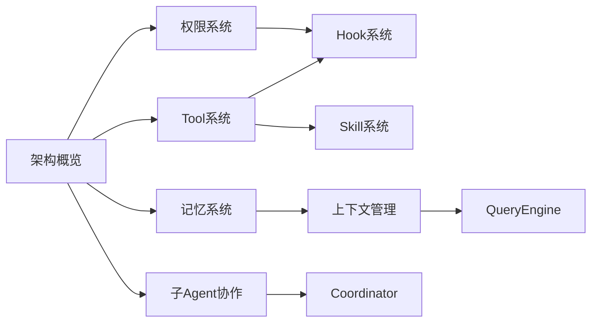

# 🎓 Claude Code 源码学习知识库

> 基于 7 个 GitHub 仓库分析 + lintsinghua/claude-code-book 体系化学习方案
> 目标：harness coding 开发 | 中小型项目 | AI 知识库建设
> 适合：已有 3-4 个小项目经验的中级开发者

---

## 🚀 新手入门（先看这个！）

刚接触 Claude Code？以下是日常使用最频繁的基础命令：

### 日常必备命令

```bash
# 启动对话（最常用方式）
claude .

# 指定具体项目
claude /path/to/your/project

# 简洁模式（减少输出）
claude . --print

# 安全的计划模式（不执行，只规划）
claude . --print --dangerously-skip-permissions
```

### 核心交互命令

| 命令 | 作用 | 示例 |
|-----|------|------|
| `Ctrl+C` | 中断当前操作 | 放弃正在执行的任务 |
| `Ctrl+D` | 结束会话 | 正常退出 Claude Code |
| `/help` | 查看可用命令 | 显示所有 slash 命令 |
| `/resume` | 继续被中断的任务 | 恢复之前的对话 |

### 文件操作快捷键

在对话中直接使用自然语言：
- "读取这个文件" → 自动调用 Read
- "帮我改一下这段代码" → 自动调用 Edit
- "运行这个命令" → 自动调用 Bash

### 常用参数速查

| 参数 | 作用 | 新手建议 |
|-----|------|---------|
| `--print` | 只输出最终回复，不交互 | 学习时关闭流式输出，更易阅读 |
| `--dangerously-skip-permissions` | 跳过权限检查 | ⚠️ 危险！仅理解原理时使用 |
| `--verbose` | 显示详细日志 | 调试时开启 |
| `-y` | 自动确认权限提示 | 熟悉后可减少确认 |

### 第一次使用建议

1. **先读不看**: 用 `--print` 运行，看它如何分析
2. **小任务开始**: 从改一个 bug 开始，不要一开始就重构
3. **查看日志**: 出问题时加 `--verbose` 看到更多细节
4. **信任但验证**: 关键操作前自己检查一下

---

## 🚀 快速入口

| 学习路径 | 适合场景 | 推荐起点 |
|---------|---------|---------|
| [[01-架构总览/📐-架构概览]] | 理解全局 | ★★★ 必须 |
| [[02-Tool系统/🔧-Tool系统]] | 写harness核心 | ★★★ 必须 |
| [[03-权限系统/🔐-权限系统]] | 安全边界设计 | ★★★ 必须 |
| [[05-记忆系统/🧠-记忆系统]] | 知识库建设 | ★★☆ 推荐 |
| [[06-上下文管理/📦-上下文管理]] | 上下文优化 | ★★☆ 推荐 |
| [[04-Hook系统/🪝-Hook系统]] | 扩展机制 | ★☆☆ 选学 |
| [[07-QueryEngine/⚙️-QueryEngine]] | 核心引擎 | ★★☆ 推荐 |

---

## 📊 学习路径图



---

## 📈 Dataview 入口

```dataview
TABLE file.ctime as 创建时间, type, description
FROM "00-入口"
SORT file.ctime DESC
```

---

## 🎯 按目标选择

### 如果你想写自己的 harness
1. [[02-Tool系统/🔧-Tool系统]] - 最重要
2. [[03-权限系统/🔐-权限系统]] - 安全第一
3. [[04-Hook系统/🪝-Hook系统]] - 扩展机制
4. [[10-设计模式/♻️-核心设计模式]] - 设计思路

### 如果你在建设 AI 知识库
1. [[05-记忆系统/🧠-记忆系统]] - 核心
2. [[06-上下文管理/📦-上下文管理]] - 上下文
3. [[07-QueryEngine/⚙️-QueryEngine]] - 检索机制

### 如果你想理解 Agent 架构
1. [[01-架构总览/📐-架构概览]] - 必须先看
2. [[09-子Agent与协作/🤝-子Agent与协作]] - 多Agent
3. [[08-Skill系统/📚-Skill系统]] - 能力扩展

---

## 📚 推荐阅读顺序

| 周次 | 内容 | 产出 |
|-----|------|-----|
| 第1周 | 架构概览 + Tool系统前半 | 理解整体结构 |
| 第2周 | Tool系统后半 + 权限系统 | 核心系统掌握 |
| 第3周 | 记忆系统 + 上下文管理 | 知识库设计思路 |
| 第4周 | Hook/Skill + 设计模式 | 扩展与复用 |
| 第5周 | 子Agent协作 + 复盘 | 多Agent入门 |

---

## 🔗 相关资源

### GitHub 高Star学习项目

| 项目 | Stars | 描述 |
|------|-------|------|
| [lintsinghua/claude-code-book](https://github.com/lintsinghua/claude-code-book) | 1,190 | 42万字深度剖析，15章系统学习Claude Code架构 |
| [liuup/claude-code-analysis](https://github.com/liuup/claude-code-analysis) | 537 | 源码分析文档集，含安全分析、组件拆解、竞品对比 |
| [anthropics/claude-code](https://github.com/anthropics/claude-code) | 102K+ | 官方仓库 |
| [claude-code-best/claude-code](https://github.com/claude-code-best/claude-code) | 8,712 | 企业级可运行版本 |

### 知识库内链

- [[01-架构总览/📐-架构概览]]
- [[10-设计模式/♻️-核心设计模式]]
- [[09-子Agent与协作/🤝-子Agent与协作]]